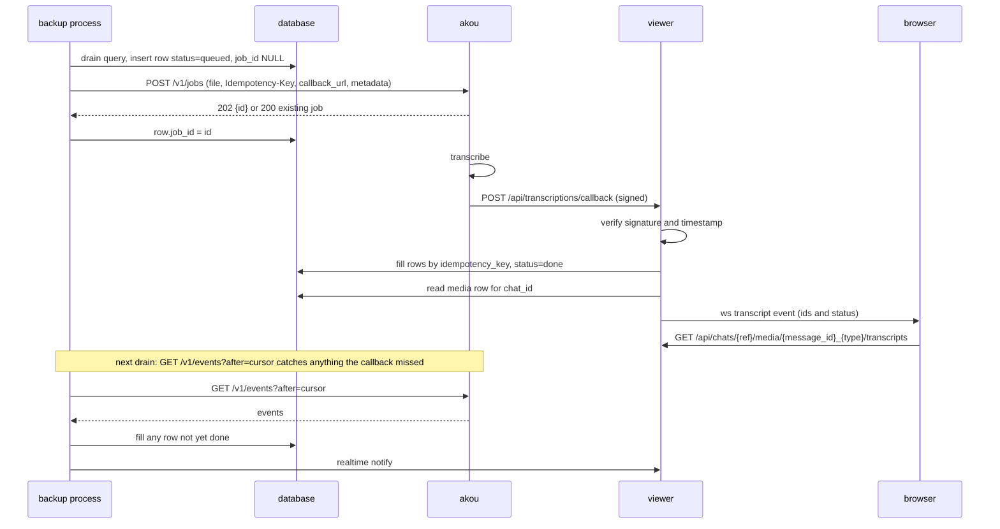

# Automatic voice transcription

Every voice message the archive downloads gets a transcript, written beside the audio and shown inside the bubble. Every other file with sound, round videos, music, videos, and audio or video files sent as documents, gets one when its button is pressed, or ahead of time when the operator lists its type. The engine is [akou](https://github.com/GeiserX/akou), our own speech-to-text server, which can run on the same box or anywhere else. Any server that speaks the OpenAI transcription endpoint works too.

Implemented in this branch, slices 1 to 7 of the rollout section at the end. Where the code deliberately differs from the first design, the text below says what it does.

## The simple version

- On by default. The backup process finds every downloaded voice message without a transcript, plus every file whose button was pressed, and sends it to the configured server. `TRANSCRIPTION_TYPES` adds other types to what goes ahead of time. Until a server is configured the viewer shows a one-line nudge and nothing fails.
- A transcript is a new row in a new table, never a change to the media row. A second transcript with another engine or preset is another row. On its own the feature deletes nothing, and the one value it changes after writing it is a row's `status`, which only moves forward. The operator's flag-gated removal paths take transcripts with their media, as listed under [what this feature deletes](#what-this-feature-deletes-overwrites-and-forgets).
- The viewer shows the official Telegram pattern: a small button beside the waveform that swaps the text in under it. The text is searchable from the chat search box and the global search.
- Only the backup process talks to the server. The viewer never makes an outbound request for this feature; it receives the signed callback and serves rows.
- Results reach the archive three ways and all three write the same row: the callback into the viewer, the server's event feed read on every drain, and a per-job poll for anything left over. An archive behind NAT with no reachable callback URL loses nothing.

## What the user sees

### The bubble

The audio bubble in [src/web/templates/index.html](../src/web/templates/index.html#L1994) keeps its play button and waveform. A rounded square button with the "->A" glyph sits to the right of the waveform on the same row. Pressing it expands the transcript under the duration row. Pressing it again collapses it.

```
+------------------------------------------------------------+
| (>)  |||||||..|||||..||||||||||..|||||                 [->A] |
|      0:42  Now playing                                       |
|                                                              |
|  Hola, te llamo luego por lo del coche, que ahora no         |
|  puedo hablar.                                               |
|  akou · Parakeet v3 · es · 2026-09-25            1 of 2 ▾   |
+------------------------------------------------------------+
```

The text sits at full bubble width in the normal message font, with `dir="auto"` so right-to-left languages read correctly. There is no line cap and no "show more". A long transcript makes the bubble taller.

When a transcript's segments name more than one speaker, which akou returns with `TRANSCRIPTION_DIARIZE` on, the text reads as turns: each run of one speaker starts with "Speaker 1:", "Speaker 2:" and so on, numbered in the order they first speak, in the small bold style of the sender labels. The viewer builds the turns from the stored segments (`turns` in the row it serves), and the text stays escaped. One speaker reads as plain text, as before.

### The states of the button

| State | Button | Under the waveform |
| --- | --- | --- |
| No transcript yet, server configured | "->A" | Nothing. Pressing it inserts a queued row so the next drain sends it first, and shows loading at once |
| Queued or running | "->A" with a stroke looping around the button outline | Nothing |
| Done, collapsed | "->A" | Nothing |
| Done, expanded | The glyph flips to "A->" | The text, then the attribution line |
| Done with no text (silence) | The glyph flips to "A->" | "No speech detected" in small grey text, then the attribution line |
| Failed or skipped | "->A" | Small grey text with the stored reason, for example "Longer than the 30 minute limit" |
| No server configured | "->A" | Pressing it opens the nudge below |

Loading shows for at least 350 ms so a fast result does not flash.

### Attribution and versions

Under the text, in small grey type: the engine name linking to the akou repository, the model, the language and the date. When more than one finished transcript exists for the message, a picker on the right of that line switches between them, newest first. The newest finished row is the default.

### Round videos

A round video keeps its circle. The button sits over the bottom corner of the circle, right for incoming and left for outgoing, and hides while the video plays enlarged. Expanding it turns the circle into the voice bubble above with the text under a placeholder waveform, the same as the official apps do. The round video block is at [index.html](../src/web/templates/index.html#L2066).

### Videos and files

A video carries the same button over the bottom corner of the player, and the text opens under it. An audio file sent as a document already renders as the audio bubble and gets the button beside the waveform. A video sent as a document gets the button beside its file name, with the text under that row.

### Open state and expand all

Open or closed is remembered per message in `localStorage`, for the 500 messages pressed most recently. The chat header menu gains "Expand all transcripts" for the chat, also remembered.

### Search hits

A search that matches inside a transcript returns the message with `matched_in: "transcript"`. The viewer expands that bubble and highlights the matched words. Chat search, which runs through [`get_messages_paginated`](../src/db/adapter.py#L4637) from the [messages route](../src/web/main.py#L2920), and [global search](../src/web/main.py#L1987) both gain this. Without FTS5 in the SQLite build, chat search falls back to an ILIKE on `messages.text` at [adapter.py](../src/db/adapter.py#L4716) and transcripts are not searchable there; the transcript predicate needs the index on both databases.

### The nudge when no server is configured

Transcription is on by default, so a fresh install has it enabled with no server. The first time a voice message is on screen, a dismissible banner at the top of the chat view says:

> Voice messages can be transcribed automatically. Point `TRANSCRIPTION_URL` at an akou server.

"akou" links to the repository. Dismiss is remembered in `localStorage`. The Settings sheet gets a row that shows the same state: "Transcription: on, no server configured", "on, akou 0.2.0 at host", or "off". The server name and version come from an `app_settings` row the backup process writes when it detects the server; the viewer never asks the server itself. Nothing is logged as an error for the unconfigured state.

### Media gallery

The Voice tab of the gallery, `typeMap.voice` in [index.html](../src/web/templates/index.html), shows the first line of the newest transcript under each item. The tab had no filter box, so it gains one: it matches the file name and the text of every finished transcript, case-insensitively, over the items loaded so far, and starts empty when the gallery opens in another chat. Searching every transcript of a chat is the chat search's job.

### Accessibility

The button is a `<button>` with `aria-expanded`, `aria-controls` and a label of "Show transcript" or "Hide transcript". While loading it carries `aria-busy` and a polite live region announces "Transcript ready". The official iOS, macOS and web apps label none of this. We do.

## Configuration

All variables are read in [src/config.py](../src/config.py). B means the backup process reads it, V the viewer.

| Variable | Default | Reads | Meaning |
| --- | --- | --- | --- |
| `TRANSCRIPTION_ENABLED` | `true` | B/V | Master switch. Off means no drain, no button, no nudge |
| `TRANSCRIPTION_URL` | empty | B/V | Base URL of akou or any OpenAI-compatible transcription server. Empty with the feature on is the "no server configured" state. The viewer reads it for display only and never connects to it |
| `TRANSCRIPTION_API_KEY` | empty | B | Bearer key for the server. Treated as a secret, never logged |
| `TRANSCRIPTION_PRESET` | `auto` | B | `lite`, `fast`, `best`, `fusion` or `auto`. Passed through to akou; ignored by other servers |
| `TRANSCRIPTION_TYPES` | `voice` | B | Media types transcribed ahead of time, like the official apps do for voice messages. Also accepts `video_note`, `audio`, `video` and `document`, where `document` means only a document whose stored `mime_type` starts with `audio/` or `video/`. `animation` is never eligible: Telegram's GIF-style clips have no sound. The list does not limit the button: any file with sound can be asked for one at a time |
| `TRANSCRIPTION_MAX_SECONDS` | `1800` | B | Longer media is skipped with a stored reason. The length is the stored `duration`, or ffprobe's when the media row has none |
| `TRANSCRIPTION_MAX_UPLOAD_MB` | `500` | B | Largest upload, in megabytes, measured on what is actually sent (a video's extracted audio track, not the video). A bigger one gets a `skipped` row with reason `too_large`. `0` means no limit; a negative value warns and means the same |
| `TRANSCRIPTION_LANGUAGE` | empty | B | Optional language hint. Empty means the server detects it |
| `TRANSCRIPTION_DIARIZE` | `false` | B | Sends `diarize=true` with each akou job, which then returns segments with speaker labels. The synchronous OpenAI path has no such field and does not diarize |
| `TRANSCRIPTION_CALLBACK_URL` | empty | B | The viewer's public URL plus `/api/transcriptions/callback`, sent to akou with each job. Its host must be on the API key's callback-host allowlist in akou, or every submit is refused with `422 callback_not_allowed`, which the drain logs once per run. Empty means poll only |
| `TRANSCRIPTION_WEBHOOK_SECRET` | empty | V | The `whsec_` secret akou printed for the key. The callback route exists only when this is set. Never logged |
| `TRANSCRIPTION_BACKFILL_PER_RUN` | `50` | B | How many media rows one drain submits, newest first. On the akou job path it is also how many jobs may be open per account: a drain submits only what the open ones leave room for |
| `TRANSCRIPTION_PRIORITY_CHAT_IDS` | empty | B | Comma-separated chat ids, in every account, whose media the drain sends first, in the order listed, after the ask-now rows and within the same per-run and in-flight limits. Order only: eligibility still follows `TRANSCRIPTION_TYPES`. Empty means newest first |

Documented in the README environment table, in `.env.example` next to the event webhook block, and in `docker-compose.yml` as commented lines in the same style as the [event webhook block](../docker-compose.yml#L146) of the backup service. The [viewer service](../docker-compose.yml#L196) gets `TRANSCRIPTION_ENABLED`, `TRANSCRIPTION_URL` and `TRANSCRIPTION_WEBHOOK_SECRET`; the callback URL, the key and the preset stay backup-only. Only `TRANSCRIPTION_ENABLED` and `TRANSCRIPTION_URL` are uncommented, so a new install sees the two that matter.

### Validation

A `_validate_transcription` method next to [`_validate_event_webhook`](../src/config.py#L1241) applies these rules:

- `TRANSCRIPTION_URL` must be `http://` or `https://` with a hostname, or empty. A bad value disables the feature with one warning that names the variable and not the value.
- `TRANSCRIPTION_CALLBACK_URL` must be `http://` or `https://` with a hostname, or empty. A bad value drops the callback with a warning and keeps polling. Polling always works.
- `TRANSCRIPTION_TYPES` accepts only `voice`, `video_note`, `audio`, `video` and `document`. Unknown names are dropped with a warning.
- `TRANSCRIPTION_PRESET` outside the five names falls back to `auto` with a warning.

[`log_summary`](../src/config.py#L1078) prints one line: enabled or not, the URL's scheme and host only, the preset and the types. The key and the secret never appear in logs. The master-only [`/api/admin/settings`](../src/web/main.py#L4341) dumps every `app_settings` row, so the two rows this feature stores there, the event cursor and the detected server name and version, appear in that dump. Neither is a secret.

### Default on with a nudge

The feature defaults to on so that the day a user points it at a server, everything they already archived gets transcribed with no further change. Until then the only visible effect is the banner and the settings row. The drain runs, finds no server and returns at once, with one log line at debug level and none at info.

## Storage

### The `media_transcripts` table

Migration `032` adds one append-only table. It follows [`AvatarHistory`](../src/db/models.py#L313) in shape.

| Column | Type | Notes |
| --- | --- | --- |
| `id` | integer, autoincrement | Primary key |
| `account_id` | integer | Same value as `media.account_id` |
| `media_id` | string | Same string as `media.id`, no foreign key |
| `content_hash` | string(64) | Copied from [`media.content_hash`](../src/db/models.py#L390) when present |
| `idempotency_key` | string(64) | The audio's SHA-256 as sent to the server. Equal to `content_hash` when the media row has one, computed at drain time when it does not. Never written back to `media` |
| `source` | string(16) | `akou`, `openai` or `telegram` |
| `engine_name` | string | For example `akou` |
| `engine_version` | string | |
| `preset` | string(16) | The preset requested |
| `models` | text | JSON list of model ids, stored as text like [`raw_data`](../src/db/models.py#L180) |
| `language` | string(16) | BCP-47, at most 16 characters. Whisper's English names, which OpenAI's endpoint answers (`spanish`), are mapped to their codes. Anything else that is not a tag, akou's OpenAI route answering `unknown` among it, is stored as NULL |
| `language_confidence` | float | Nullable |
| `text` | text | The transcript |
| `words` | text | JSON `[{w, s, e, c}]`, may be empty |
| `segments` | text | JSON `[{s, e, text, speaker}]` |
| `confidence` | float | Nullable |
| `duration_s` | float | |
| `job_id` | string | The server's job id. NULL until submitted, and always NULL for synchronous servers and for `skipped` rows |
| `status` | string(16) | `queued`, `running`, `done`, `failed`, `skipped` |
| `error` | text | Reason for `failed` or `skipped` |
| `requested_at` | datetime | |
| `completed_at` | datetime | Nullable |
| `created_at` | datetime | Row insert time |
| `job_stored_at` | datetime | When `job_id` was first written, nullable. The straggler poll and the retention expiry count from here |
| `copied_from_id` | int | The row this one copies, nullable. Set when the same audio was already transcribed by the same server with the same preset and diarization, in any account, and the answer was reused instead of sent. Left out of both exports: the source row may sit in an account the reader is not entitled to |
| `diarize` | bool | Whether the request asked for speaker labels, written when the row is sent, nullable (NULL on rows from before the column). A copy takes its source's |

Unique index on `(account_id, media_id, job_id)`. A partial unique index on `(account_id, media_id)` where `status IN ('queued', 'running')`, which both databases support, so the ask-now route in the viewer and the drain in the backup can never leave two open rows for one media even when they race across processes. Plain indexes on `(account_id, media_id)`, `idempotency_key` and `status`. `skipped` rows and synchronous-server rows have `job_id` NULL and are outside the first unique index; for them the drain's insert-if-absent is the duplicate guard, and it checks the newest row's status before inserting. The parity snapshot compares columns and uniqueness, so the partial index passes it.

There is no foreign key to `media` on purpose. [`delete_voice_note_audio_twins`](../src/db/adapter.py#L3122) removes media rows, and the [composite cascade on media](../src/db/models.py#L415) is inert on SQLite in any case, so a hard key would either block that cleanup or silently drop transcripts on PostgreSQL. The viewer joins on `(account_id, media_id)` first. A transcript whose media row a twin cleanup removed stays in the table where it is, and the viewer decides where to show it: a media with no transcript rows of its own shows the `done` rows of the same account whose `idempotency_key` is its `content_hash`, which is the same audio under another media row. The bubble, the gallery and the chat-scoped transcripts route read it that way; the drain query skips a media with no rows of its own when its account already holds such a `done` row, so the surviving row is not transcribed again. Nothing is copied or moved. Search, the exports, the changes feed and `GET /api/media/{media_id}/transcripts` still read rows by their own media only, so a removed twin's transcript is not found by a search and is not exported. A media with no `content_hash` has no twin to borrow from.

### Migration rules

`032` follows the conventions of [`031`](../alembic/versions/20260924_031_add_avatar_history.py): inspector guards so that a `create_all()` database and a re-run are both no-ops, the stamping ladder stays frozen at 018, and `downgrade` drops the table and its search objects. For the FTS table it copies the rule of [`028`](../alembic/versions/20260823_028_full_text_search.py): the rebuild that indexes existing rows runs only when this pass created the table.

Two more pieces of code go with the migration, or [`tests/test_schema_parity.py`](../tests/test_schema_parity.py) fails: the DDL constants for the transcript search objects go in [src/db/fts.py](../src/db/fts.py), and [`install_fts_ddl_listener`](../src/db/fts.py#L90), wired at [models.py](../src/db/models.py#L95), creates them on the `create_all()` path too. `KNOWN_DIFFERENCES` in that test is empty and stays empty. A new `tests/test_migration_032.py` proves the upgrade is idempotent and that the triggers exist afterwards.

### Search

The messages table already has full-text search, SQLite FTS5 with triggers and a PostgreSQL stored tsvector, in [src/db/fts.py](../src/db/fts.py). A PostgreSQL generated column cannot read another table, so transcripts get their own objects:

- SQLite: `media_transcripts_fts` over `text`, kept in sync by insert, delete and update triggers like [`messages_fts`](../src/db/fts.py#L22).
- PostgreSQL: a stored generated `text_search` tsvector on `media_transcripts` with a GIN index, built by the same parser as the messages column.

A second probe in the shape of [`_fts_ready`](../src/db/adapter.py#L4586) reports whether the transcript objects exist, so a database migrated to 031 and not yet to 032 keeps searching messages only.

Global search does not OR a transcript `EXISTS` into [`_text_search_predicate`](../src/db/adapter.py#L4614). [`_global_search_hit_count`](../src/db/adapter.py#L4516), [`_global_search_walk`](../src/db/adapter.py#L4526) and [`_global_search_sorted_hits`](../src/db/adapter.py#L4550) page through the GIN index by key, and an `EXISTS` on another table would turn every page into a scan. Instead [`search_messages_global`](../src/db/adapter.py#L4375) builds its hit set as a UNION of two indexed key sets: message keys from the messages index, and message keys reached from transcript hits through `media` on `(account_id, media_id)`. `matched_in` is derived from which side produced the key, and a key on both sides reports `message`. Chat search in [`get_messages_paginated`](../src/db/adapter.py#L4637) uses the same union on its smaller, per-chat set. On the dense-term walk each side walks its own newest `offset + limit + 1` keys, and the page is cut from their union, so paging by key stays exact.

### What this feature deletes, overwrites and forgets

Deletes: nothing on its own. The removal paths that already exist take the transcript rows of the media they remove, the same way they take the media. Each is off by default and gated by a flag, and each README row gains the words "and their transcripts":

- `DELETION_MODE=hard` through [`delete_message`](../src/db/adapter.py#L1723), called from the [listener](../src/listener.py#L702) and the [backup](../src/telegram_backup.py#L2716).
- `EXCLUDE_DELETE_EXISTING` through [`delete_chat_and_related_data`](../src/db/adapter.py#L4026), called at [telegram_backup.py](../src/telegram_backup.py#L1432).
- `YOUTUBE_VIDEOS_DELETE_EXISTING` through [`delete_media_records`](../src/db/adapter.py#L3087) with `with_transcripts=True`, called at [telegram_backup.py](../src/telegram_backup.py#L3591).
- `SKIP_MEDIA_DELETE_EXISTING` through [`delete_media_for_chat`](../src/db/adapter.py#L2998), called at [telegram_backup.py](../src/telegram_backup.py#L3679).

Two cleanups that run on every backup with no flag remove media rows only and leave their transcripts in the table, shown on the surviving row of the same audio as described under the schema: [`delete_voice_note_audio_twins`](../src/db/adapter.py#L3122), and the pending-twin cleanup at [telegram_backup.py](../src/telegram_backup.py#L2111), which calls `delete_media_records` without `with_transcripts`. A later removal path takes the rows of the media it removes, so a transcript whose twin row was already gone before a `DELETION_MODE=hard` delete of its message stays behind; it shows again only on another media row of the same account holding the same audio.

Overwrites: `status` advances. Every other column is written once, when the row is created or when the result arrives into empty columns. A re-transcription with another preset, another engine or a user click is a new row.

Forgets: the audio the server holds. akou deletes the uploaded audio and its copy of the result after its retention window. The archive keeps its own row.

A move from SQLite to PostgreSQL with `scripts/migrate-sqlite-to-postgres.py` copies every transcript row, ids included, and moves the id sequence past them. The scripts that merge two archives are written for schema revision 023 and refuse a database at 032, so they cannot drop transcripts; carrying them is work for the release that moves those scripts forward.

## Flow

### Where media enters

Every lane that stores a media row goes through [`insert_media`](../src/db/adapter.py#L2399): the scheduled backup, the [listener](../src/listener.py#L1433) when `LISTEN_NEW_MESSAGES_MEDIA` is on, and the backfill. We do not hook it. A drain query catches everything, including media downloaded before this feature existed and anything an earlier drain left behind:

```sql
SELECT m.* FROM media m
LEFT JOIN media_transcripts t
       ON t.account_id = m.account_id AND t.media_id = m.id
      AND t.id = (SELECT MAX(id) FROM media_transcripts
                  WHERE account_id = m.account_id AND media_id = m.id)
WHERE m.downloaded = 1
  AND m.type IN (:types)
  AND (t.id IS NULL
       OR (t.status = 'queued' AND t.job_id IS NULL AND t.requested_at < :ten_minutes_ago)
       OR (t.status = 'failed'
           AND (SELECT COUNT(*) FROM media_transcripts
                WHERE account_id = m.account_id AND media_id = m.id
                  AND status = 'failed') < 3))
ORDER BY m.id DESC
LIMIT :per_run
```

A `done` or `skipped` newest row ends the loop for that media. Only a user click adds another row after that.

One exception for speed: when the listener downloads a voice message immediately, it enqueues that single row right after `insert_media` returns, so a live chat gets its transcript within seconds instead of at the next drain. It calls the same function the drain calls. The listener runs inside the backup process; [`schedule`](../src/scheduler.py) runs the backup and the listener in one process and there is no listener-only subcommand in [`__main__.py`](../src/__main__.py#L76).

### The drain

The backup process owns the drain. It runs at the end of [`backup_all`](../src/telegram_backup.py#L1046), right after the [two media sweeps](../src/telegram_backup.py#L1604). One drain does four things in order:

1. Detect the server. `GET {TRANSCRIPTION_URL}/v1/server` once per run. The backup reads `name`, `version` and `capabilities.jobs` and ignores any other field or flag it does not know. `name: "akou"` with `capabilities.jobs` true selects the job path; any other answer or a 404 selects the synchronous path. The name and version go into `app_settings` for the viewer's settings row.
2. Reconcile. On the job path, `GET /v1/events?after=<cursor>`, where the cursor is akou's integer sequence number from the page's `cursor` field, never an event's `msg_` id. It is stored in [`app_settings`](../src/db/models.py#L765) under `transcription.events_cursor`. Every `transcription.completed` or `transcription.failed` event whose row is not yet `done` or `failed` gets written now. A `transcription.cancelled` event stores `failed` with reason `cancelled`, and the drain query retries it. Any event type the backup does not know is skipped and the cursor still advances past it. So is an event akou has scrubbed (`data.deleted` true, which it writes after a delete or at the end of its retention window): its result is gone, so it is never fetched and never read as an empty transcript. This is what makes an unreachable callback URL harmless.
3. Poll stragglers. Rows `queued` or `running` whose `job_id` was stored more than ten minutes ago get `GET /v1/jobs/{id}`, and `GET /v1/jobs/{id}/result` when the status is `done`. The poll stops after the server's retention window; a row still open `retain_days` after its job id was stored is marked `failed` with reason `expired`, and the drain query then retries it. Both ages count from `job_stored_at`, not from the insert, because a row can wait `queued` through an outage before it is submitted. The retry sends the next per-attempt key and gets a new job; if a server ever answered with the job the expired row still holds, the new row stays `queued` without it, since one media cannot hold one job twice.
4. Submit. Run the drain query, insert-if-absent a `queued` row per media with `job_id` NULL, and send. The query returns the ask-now rows first, then the media of `TRANSCRIPTION_PRIORITY_CHAT_IDS` in list order, then the rest newest first. On the job path the run submits at most `TRANSCRIPTION_BACKFILL_PER_RUN` minus the account's rows that still hold an open job, so a server slower than the backlog never grows the open rows or the straggler poll. A refusal about the file (`idempotency_conflict`, or a job akou ran and failed) marks that row `failed` with akou's code, so it counts toward the cap of three failed rows per media. A refusal about the server or its configuration is not about the file and spends nothing: a wrong or rotated key (401, 403), a rate limit (429), a preset akou cannot run yet (409 `preset_unavailable`, which akou also answers while it downloads its models), a callback host off the key's allowlist (422 `callback_not_allowed`), and a 5xx after the client's attempts. The row stays `queued`, the drain logs one warning and ends the run, and the ten-minute branch resubmits it once the cause is fixed. The same answers from the event feed or the straggler poll end the run before the submit step. A process that dies between the insert and the submit leaves the row `queued` with `job_id` NULL; the ten-minute branch of the drain query resubmits on that same row, since nothing was stored for it, and that path has no cap because it adds no rows.

### What counts as transcribable

Two questions, kept apart. Can this file be transcribed at all? One rule, `is_transcribable` in [src/transcription_contract.py](../src/transcription_contract.py), answers: `voice`, `video_note`, `audio` and `video`, and a `document` only when its stored `mime_type` starts with `audio/` or `video/`, which is a `.wav`, `.flac`, `.opus`, `.mkv` or `.avi` sent as a file. `animation` never is. The bubble shows its button on every such file and the ask-now routes accept every such file; the bubble's copy of the rule in the template names it as its source.

Is it transcribed ahead of time? That is `TRANSCRIPTION_TYPES`, `voice` by default, read through the same rule: the drain query's own pick-up and the listener's immediate enqueue take only those types, and a listed `document` still needs an audio or video mime type. A press on any other file with sound inserts the ask-now row, which the drain query reads with no type filter, so the next drain sends that one file.

Before the upload the drain runs `ffprobe` on the stored file, off the event loop, with a fixed argument list, no shell and a 30-second timeout. A voice message with a stored duration skips it, since it has sound and its length is known. A file ffprobe reads and finds no audio stream in, a silent video for example, gets a `skipped` row with reason `no_audio_track` and nothing is sent. A file ffprobe cannot read at all, such as a document whose mime type names a format it does not hold, makes ffprobe fail, and an answer that lists no streams counts the same: the check is unknown, not negative, and the file is sent. When ffprobe is missing or fails, the drain logs one warning per process and sends the file anyway, so a missing ffprobe never blocks transcription. Both images install ffmpeg, which ships ffprobe.

### What is uploaded

Voice messages and music (`audio`) are sent as stored: they are audio already and small. One over `TRANSCRIPTION_MAX_UPLOAD_MB` is extracted like the rest instead of being skipped. Everything else, a video, a round video or a file sent as a document, is sent as its audio track alone. ffmpeg extracts it to a temporary 16 kHz mono Opus file (`-vn -ac 1 -ar 16000 -c:a libopus`, bitexact so the same build writes the same bytes), off the event loop, with a fixed argument list, no shell and a 15-minute timeout, and the file is deleted after the request, on a cancellation too. A 4 GB video becomes tens of megabytes. At most two ffprobe or ffmpeg runs happen at once, shared by the drain and the listener's immediate path, so a burst of videos cannot take every thread of the executor they run in. When ffmpeg is missing or fails, the drain logs one warning per process and sends the stored file instead.

The upload is streamed from disk: the file is never read into memory, and a retry rewinds it. What is sent must fit `TRANSCRIPTION_MAX_UPLOAD_MB` (500 by default, under akou's 512 MiB cap); a bigger upload gets a `skipped` row with reason `too_large` and is never sent, and `0` turns the limit off. The limit reads the bytes actually uploaded, so a large video whose audio track is small goes through. Without it, an upload akou cuts off with a connection reset would read as an outage, be sent again on every drain and hold up everything behind it.

### The same audio in two accounts

Before any ffprobe, extraction or upload, the drain looks for a `done` row, in any account, that this server would give again: its `idempotency_key` is this media's `content_hash`, its preset is the one the drain would send, its `source` and `engine_name` are this server's (`akou` and `akou` on the job path, `openai` and the server's name, or `openai`, on the synchronous one), and its `diarize` matches what the drain would ask for (`TRANSCRIPTION_DIARIZE` on akou's job path; never on the synchronous path; a row from before the column counts as not diarized). The listener's immediate call, which does not know the server yet, asks it only when some row could be copied. When there is one, this media gets its own row, `done`, with that row's text, language, words, segments, models, engine, confidence and duration copied, and `copied_from_id` naming the source; a press waiting on this media is the row that gets filled. Nothing goes to the server, and nothing is deleted or overwritten. A media that already has a `done` row of its own is never copied into, so a press after a done transcript asks the server for a new one, even when the same audio under another media holds a copy of the old one. A `done` row with empty text (silence) is copied like any other. A media without a stored hash is sent as before.

The copy lives under this media's account, so search and the exports find it there. A viewer restricted to one account sees a transcript only through media that account holds: the source row in another account is never shown to it.

Media longer than `TRANSCRIPTION_MAX_SECONDS` gets a `skipped` row with the reason and is never sent. The length is the `duration` the archive already stores, or the one ffprobe reads when the row has none, which is the case for documents and for many videos.

### Submitting to akou

Before the upload the drain needs the stored file's SHA-256. When [`media.content_hash`](../src/db/models.py#L390) is set it is that value. Imported rows have none, so the drain hashes the file, in chunks from disk, and stores the result on the transcript row only. That hash is the row's `idempotency_key` and the job's `metadata.content_hash`, which every outcome is matched on. When the upload is an extracted audio track, the `Idempotency-Key` header derives from the hash of the bytes sent instead, with the same `.<n>` suffix per attempt: akou refuses a key it has seen with another file, and another ffmpeg build may extract other bytes from the same file, so keying on the stored file would turn such a retry into `422 idempotency_conflict`.

```
POST {TRANSCRIPTION_URL}/v1/jobs
Authorization: Bearer <TRANSCRIPTION_API_KEY>
Idempotency-Key: <sha256>, or <sha256>.<n> on a retry
Content-Type: multipart/form-data

file=<the bytes from resolve_stored_media_path>
preset=<TRANSCRIPTION_PRESET>
language=<TRANSCRIPTION_LANGUAGE or auto>
callback_url=<TRANSCRIPTION_CALLBACK_URL, if set>
diarize=true, only with TRANSCRIPTION_DIARIZE on
metadata={"content_hash": "<sha256>"}
```

The file comes from [`resolve_stored_media_path`](../src/web/media_utils.py#L67). akou answers `202 {id, status, links}` for a new job, or `200` with the existing job in whatever state it is when it has seen the same key and the same file before, so a drain that runs twice, or an archive that holds the same audio under two media rows, never pays twice and never sees a conflict. The row stores `job_id` and moves to `running` when the server says so. When the answer is a `200` whose status is already `done`, the completed event is behind the cursor and no callback will come, so the drain fetches `GET /v1/jobs/{id}/result` at once and stores the row. `metadata` carries the hash and nothing else, so the same audio under two media rows shares one job and the callback fills both rows.

akou keeps a key as long as its job, and a failed or cancelled job would come back for the same key on every retry. So the key is the bare hash only on a media's first attempt; when the media already has `n` rows that ended `done` or `failed`, the key is `<sha256>.<n>` and names a new job. `metadata.content_hash` and the `idempotency_key` column stay the bare hash, which is what fills the rows. The key is built in one place, `attempt_key` in [src/transcription_contract.py](../src/transcription_contract.py).

The HTTP client has the same shape as [`EventWebhookSender`](../src/event_webhook.py#L89), httpx with a bounded number of attempts and no redirects, but its own timeouts: that sender is fire-and-forget with three attempts of five seconds each, while the drain awaits an upload with a 120 second timeout and, on the synchronous path, waits up to 600 seconds for the answer. No URL or body is logged.

### The synchronous fallback

When the server is not akou, the drain calls the OpenAI endpoint instead and stores the answer in the same row at once:

```
POST {TRANSCRIPTION_URL}/v1/audio/transcriptions
file=<bytes> model=<the preset when the server is akou, else "whisper-1"> response_format=verbose_json timestamp_granularities[]=word timestamp_granularities[]=segment
```

`verbose_json` carries `text`, `language`, `duration`, `words` and `segments`, which map onto the same columns. Both granularities are asked for because a server that follows OpenAI's rule, akou among them, returns segments only when `segment` is named. `source` is `openai`, `job_id` stays NULL, and no callback or event feed is involved. This is also what a user gets from speaches, LocalAI or whisper.cpp today. Only akou reads a preset name in `model`; a server that validates the field would refuse it for good, so everyone else gets `whisper-1`. A server that answers with a 4xx gets a `failed` row. A 5xx after the client's attempts also gets one, since this server decodes the file inside the request and the file may be the cause, and it ends the run. So does a request the server took and never answered, a read or write timeout: that request is sent once, never retried, because another attempt would wait out the same timeout and hand the server the same work again. A wrong key or a rate limit (401, 403, 429) is not about the file: the row stays `queued` and the run ends. A server that cannot be reached at all is an outage, not an answer: the row stays `queued`, the run ends there, and the ten-minute branch of the drain query resubmits on the same row, so an outage never spends the cap of three failed rows.

### Completion

Three writers, one row:

- The callback. akou posts to `TRANSCRIPTION_CALLBACK_URL`. The viewer route verifies it, fills every `queued` or `running` row whose `idempotency_key` equals `data.metadata.content_hash`, sets `done` or `failed`, and pushes realtime. A body over 256 KB carries `data.result_url` instead of the text; the viewer never calls out, so the route then writes nothing and leaves the row `running` for the backup, whose straggler poll fetches `GET /v1/jobs/{id}/result` for any row the server reports `done`.
- The reconcile step of the next drain, for anything the callback did not deliver.
- The straggler poll.

Writes are idempotent by the row rule: a row already `done` or `failed` for that `job_id` is left alone, so a repeated delivery of the same event changes nothing and needs no separate store of seen ids.

### Realtime push

[`NotificationType`](../src/realtime.py#L140) gains `TRANSCRIPT`. The payload carries ids and status only: `account_id`, `chat_id`, `message_id`, `media_id`, `transcript_id` and `status`, never the text, because pg_notify caps a payload at 8 KB. The backup process sends it from the drain through [`RealtimeNotifier`](../src/realtime.py#L177), which already handles pg_notify on PostgreSQL and the `/internal/push` POST on SQLite. The callback route runs inside the viewer, so it reads the media row for `chat_id` and `account_id`, which [`handle_realtime_notification`](../src/web/main.py#L366) requires, and calls that function in-process. It broadcasts to the chat without the media id, which spells the chat id, and the JS handler adds a `transcript` case next to the [`reaction` case](../src/web/templates/index.html#L5663) that finds the bubble by message id, fetches `GET /api/chats/{ref}/media/{message_id}_{type}/transcripts` and swaps the bubble's state in place. The 3 second polling fallback picks it up when the socket is down.



## Security

### Outbound

The bearer key travels only in the `Authorization` header to `TRANSCRIPTION_URL`, and only from the backup process. The key and the secret are never logged and never appear in `log_summary`. Redirects are not followed. Uploads go to the configured host only; there is no URL in the media row that could redirect them.

### The callback route

`POST /api/transcriptions/callback` on the viewer is the only inbound endpoint this feature adds. It differs from [`/internal/push`](../src/web/main.py#L3573), which trusts private addresses and a shared bearer: akou may be on another network, so this route trusts nothing about the source address and verifies every request:

1. Body size cap of 256 KiB, the size above which akou sends `result_url` instead of the text, enforced twice: a `Content-Length` check before reading, and a cap on the streamed read for chunked bodies with no length.
2. `webhook-id`, `webhook-timestamp` and `webhook-signature` headers must all be present.
3. The timestamp must be within five minutes of now, either direction.
4. Signature: HMAC-SHA256 over `{webhook-id}.{webhook-timestamp}.{raw body}`. The key is the base64-decoded bytes after the `whsec_` prefix of `TRANSCRIPTION_WEBHOOK_SECRET`. The header holds a space-separated list of `v1,<base64>` values; any one matching accepts, which lets the key rotate without downtime. Comparison is constant-time.
5. The body's `data.metadata.content_hash` fills every `queued` or `running` row with that `idempotency_key` whose `job_id` is empty or the event's job. Anything else returns 204 and writes nothing, so a probe learns nothing about which hashes exist. A repeat of an event already applied hits the row rule and also writes nothing.

Auth in the viewer is per route through [`require_auth`](../src/web/main.py#L1361) and this route declares none; there is no login redirect middleware to exempt it from. The only rate limiter today is the [login one](../src/web/main.py#L774), 15 attempts per 5 minutes per IP, and it is not reused: a signed route with a constant-time check needs at most a generous bucket of its own, and none is acceptable. The route is registered only when `TRANSCRIPTION_WEBHOOK_SECRET` is set. The viewer needs no new dependency for it: verification is `hmac` and `hashlib` from the standard library, and the viewer never calls out.

### Logins with downloads disabled

A login whose `no_download` flag is set gets metadata only: the audio bytes are refused with 403 and the bubble says playback is disabled. A transcript is the audio's content in text form, so that login reads none of it. The message, pinned, by-date and gallery routes carry no `transcript` or `transcripts` on its media, `/api/changes` lists no `transcript` kind for it, chat and global search match message text only, and the two transcript routes and the two ask-now routes answer 403 and write nothing. The bubble shows no transcript button for such media.

### What we do not do

We do not send chat titles, sender names, message text or ids to the server. `metadata` carries one hash. The audio itself is the only content that leaves the archive, and only to the host the operator configured.

## Consumers

| Consumer | Change |
| --- | --- |
| `/api/chats/{ref}/messages` at [main.py](../src/web/main.py#L2920) | `media.transcript` with the newest `done` row's `text`, `language`, `engine_name`, `preset`, `confidence` and `completed_at`; `media.transcripts` with every row. Built where the [message media dict](../src/db/adapter.py#L4808) is built |
| `GET /api/media/{media_id}/transcripts` | New. Every row for one media, newest first, every column, for a client that holds the storage id. The browser never calls it: the version picker reads `media.transcripts` and a realtime event fetches the chat route below |
| `/api/chats/{ref}/media` at [main.py](../src/web/main.py#L3147) | The same two fields on each [gallery item](../src/db/adapter.py#L2733) |
| Chat and global search | `matched_in` on each hit |
| `/api/changes` at [main.py](../src/web/main.py#L3046) | A `transcript` kind beside the `deleted` and `edited` kinds, dated by `completed_at` and carrying `text` and `language`, so pollers see new transcripts. Like the other kinds it lists one row per event: two accounts holding one channel list its transcript once, matched by text |
| CLI export in [export_backup.py](../src/export_backup.py#L50) and the viewer export | Every transcript row, all columns, newest first, under `transcripts` on the message whose media it transcribes. Neither export has a media object to put it in, so it sits on the message; the CLI export's `statistics` gains `total_transcripts` |
| `POST /api/chats/{ref}/media/{message_id}_{type}/transcripts` and `POST /api/media/{media_id}/transcripts` | New. The first is what the button calls to ask now, the second the same for a client that holds the storage id. Inserts a `queued` row with `job_id` NULL and no preset if the newest row is not already `queued` or `running`, and returns the row. The next drain submits it first, whatever `TRANSCRIPTION_TYPES` says, since the viewer does not know that list. A media that is not downloaded yet, or that `is_transcribable` refuses (a photo, an animation, a document with no audio or video mime type), is a 409 and gets no row, because the drain would never send it. The viewer makes no request to the server |
| `GET /api/chats/{ref}/media/{message_id}_{type}/transcripts` | New. The bubble's rows, newest first, without the hashes, the job id or the storage media id. What the browser fetches on a realtime event |
| `GET /api/transcription/status` | New. `enabled`, `configured`, and the server name and version from the `app_settings` row, for the button, the nudge and the settings row |
| The MCP server and the n8n node, in their own repositories | No change. Both pass message JSON through, so `media.transcript` arrives as soon as the viewer sends it |

## Rollout

Each slice is one PR, ships on its own, and leaves the archive working if the next one never lands.

1. Config and storage. The env block, the validator, `log_summary`, migration 032 with the FTS objects and the `create_all()` listener, the model, and the adapter methods to insert-if-absent a row, fill a row, list rows for a media id, and run the drain query with its retry rules. Proof: `test_schema_parity`, `test_migration_032`, and unit tests on the validator and on the drain query with the MagicMock truthiness trap in mind: a newest `done` row, a stale `queued` row and a media with three `failed` rows each behave as the query says.
2. The synchronous path. The drain at the end of `backup_all`, the listener's immediate enqueue, server detection with the `app_settings` row, the OpenAI fallback, `skipped` rows for long media, the hash at drain time for rows without one, the realtime `TRANSCRIPT` type and the `/api/media/{media_id}/transcripts` route. Proof: a fake HTTP server in tests that answers `/v1/server` with 404 and `/v1/audio/transcriptions` with a fixed `verbose_json`; the drain stores a `done` row and never resends for the same media; a second drain run after a failure adds a `failed` row and the drain stops at three.
3. The bubble. The button, the six states, the text, attribution, `localStorage` open state, the realtime case that fetches the rows, the insert-only ask-now route, the nudge banner and the settings row. Proof: the viewer test suite renders a message with and without a transcript, the ask-now route inserts exactly one row when called twice, and a browser check of expand, collapse and the loading stroke.
4. The akou job path. `POST /v1/jobs` with the idempotency key and the 200-existing-job answer, the event feed reconcile with its cursor, the straggler poll with its `expired` end. Proof: the fake server gains the job endpoints; a test kills the callback and shows the reconcile fills the row on the next drain; a job past retention becomes `failed` with reason `expired` and is resubmitted.
5. The signed callback. The viewer route with all five checks, registered only with a secret, calling `handle_realtime_notification` in-process. Proof: tests for a valid delivery, a stale timestamp, a wrong secret, a replayed event, an oversized body with and without `Content-Length`, and a hash that matches no open row. Each bad case must fail before its check is added, so the test can go red.
6. Search. The transcript FTS probe, the UNION of key sets in global and chat search on both databases, `matched_in`, highlight in the expanded bubble. Proof: a message whose text does not match but whose transcript does is found on SQLite and on PostgreSQL, and the PostgreSQL plan for global search still uses the GIN index.
7. Consumers and docs. Exports, `/api/changes`, the gallery Voice tab, the version picker, the round video button, the README section with the four amended delete rows, `.env.example`, the compose lines for both services, the commented optional akou service. Proof: the export test fixture gains a transcript and the release pin test still passes.

## Open points

- The contract names two compose files. This repository has one, [docker-compose.yml](../docker-compose.yml), with the PostgreSQL variant as a commented block inside it. The optional akou service goes in as another commented block in that file.
- Listing `audio` or `video` in `TRANSCRIPTION_TYPES` sends every music file or video a chat shares. That is why the default is `voice` and the rest goes one press at a time. A per-chat override would fit the existing chat filtering model but is not in scope.
- The ask-now route and the drain can both insert for the same media from two processes. The partial unique index on open rows makes the second insert fail, and the loser treats that as success. The server's idempotency key makes a double submit return the same job.
- Telegram's own transcription through `messages.transcribeAudio` is not part of this design. It needs a Premium account or the weekly free quota, returns text only, and would be a fourth `source` value with no other change.
