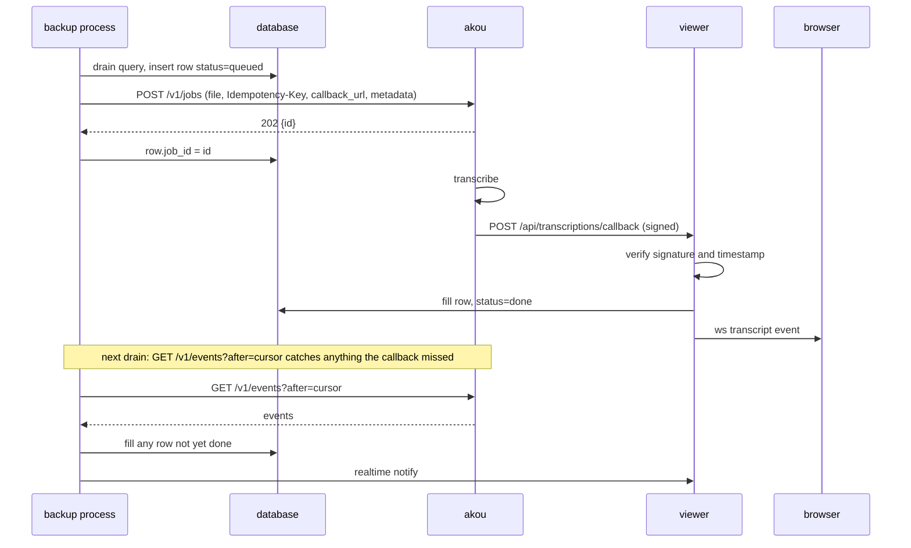

# Automatic voice transcription

Every voice message and round video the archive downloads gets a transcript, written beside the audio and shown inside the bubble. The engine is [akou](https://github.com/GeiserX/akou), our own speech-to-text server, which can run on the same box or anywhere else. Any server that speaks the OpenAI transcription endpoint works too.

This is a design. Nothing here is implemented yet. The rollout section at the end says in which order it lands.

## The simple version

- On by default. The backup process finds every downloaded voice message and round video without a transcript and sends the audio to the configured server. Until a server is configured the viewer shows a one-line nudge and nothing fails.
- A transcript is a new row in a new table, never a change to the media row. A second transcript with another engine or preset is another row. Nothing this feature does deletes or overwrites anything.
- The viewer shows the official Telegram pattern: a small button beside the waveform that swaps the text in under it. The text is searchable from the chat search box and the global search.
- Results reach the archive three ways and all three write the same row: a signed callback into the viewer, the server's event feed read on every drain, and a per-job poll for anything left over. An archive behind NAT with no reachable callback URL loses nothing.
- Telegram-Archive never reads a shared volume with the server and never assumes a shared Docker network. It uploads the bytes and gets JSON back.

## What the user sees

### The bubble

The audio bubble in [src/web/templates/index.html](../src/web/templates/index.html#L1994) keeps its play button and waveform. A rounded square button with the "->A" glyph sits to the right of the waveform on the same row. Pressing it expands the transcript under the duration row. Pressing it again collapses it.

```
+------------------------------------------------------------+
| (>)  |||||||..|||||..||||||||||..|||||                 [->A] |
|      0:42  Now playing                                       |
|                                                              |
|  Hola, te llamo luego por lo del coche, que ahora no         |
|  puedo hablar.                                               |
|  akou · Parakeet v3 · es · 2026-09-25            1 of 2 ▾   |
+------------------------------------------------------------+
```

The text sits at full bubble width in the normal message font, with `dir="auto"` so right-to-left languages read correctly. There is no line cap and no "show more". A long transcript makes the bubble taller.

### The states of the button

| State | Button | Under the waveform |
| --- | --- | --- |
| No transcript yet, server configured | "->A" | Nothing. Pressing it asks for one now instead of waiting for the next drain |
| Queued or running | "->A" with a stroke looping around the button outline | Nothing |
| Done, collapsed | "->A" | Nothing |
| Done, expanded | The glyph flips to "A->" | The text, then the attribution line |
| Failed or skipped | "->A" | Small grey text with the stored reason, for example "Longer than the 30 minute limit" |
| No server configured | "->A" | Pressing it opens the nudge below |

Loading shows for at least 350 ms so a fast result does not flash.

### Attribution and versions

Under the text, in small grey type: the engine name linking to the akou repository, the model, the language and the date. When more than one finished transcript exists for the message, a picker on the right of that line switches between them, newest first. The newest finished row is the default.

### Round videos

A round video keeps its circle. The button sits over the bottom corner of the circle, right for incoming and left for outgoing, and hides while the video plays enlarged. Expanding it turns the circle into the voice bubble above with the text under a placeholder waveform, the same as the official apps do. The round video block is at [index.html](../src/web/templates/index.html#L2066).

### Open state and expand all

Open or closed is remembered per message in `localStorage`. The chat header menu gains "Expand all transcripts" for the chat, also remembered.

### Search hits

A search that matches inside a transcript returns the message with `matched_in: "transcript"`. The viewer expands that bubble and highlights the matched words. Chat search and [global search](../src/web/main.py#L1987) both gain this.

### The nudge when no server is configured

Transcription is on by default, so a fresh install has it enabled with no server. The first time a voice message is on screen, a dismissible banner at the top of the chat view says:

> Voice messages can be transcribed automatically. Point `TRANSCRIPTION_URL` at an akou server.

"akou" links to the repository. Dismiss is remembered in `localStorage`. The Settings sheet gets a row that shows the same state: "Transcription: on, no server configured", "on, akou 0.2.0 at host", or "off". Nothing is logged as an error for the unconfigured state.

### Media gallery

The Voice tab of the gallery, `typeMap.voice` at [index.html](../src/web/templates/index.html#L6091), shows the first line of the newest transcript under each item. Its filter box matches on transcript text as well as the file name.

### Accessibility

The button is a `<button>` with `aria-expanded`, `aria-controls` and a label of "Show transcript" or "Hide transcript". While loading it carries `aria-busy` and a polite live region announces "Transcript ready". The official iOS, macOS and web apps label none of this. We do.

## Configuration

All variables are read in [src/config.py](../src/config.py) by both processes. B means the backup process reads it, V the viewer.

| Variable | Default | Reads | Meaning |
| --- | --- | --- | --- |
| `TRANSCRIPTION_ENABLED` | `true` | B/V | Master switch. Off means no drain, no button, no nudge |
| `TRANSCRIPTION_URL` | empty | B/V | Base URL of akou or any OpenAI-compatible transcription server. Empty with the feature on is the "no server configured" state |
| `TRANSCRIPTION_API_KEY` | empty | B | Bearer key for the server. Treated as a secret, never logged |
| `TRANSCRIPTION_PRESET` | `auto` | B | `lite`, `fast`, `best`, `fusion` or `auto`. Passed through to akou; ignored by other servers |
| `TRANSCRIPTION_TYPES` | `voice,video_note` | B | Media types to transcribe. `audio` and `video` are opt-in because music and long videos are wasted work by default |
| `TRANSCRIPTION_MAX_SECONDS` | `1800` | B | Longer media is skipped with a stored reason |
| `TRANSCRIPTION_LANGUAGE` | empty | B | Optional language hint. Empty means the server detects it |
| `TRANSCRIPTION_CALLBACK_URL` | empty | B/V | The viewer's public URL plus `/api/transcriptions/callback`. Empty means poll only |
| `TRANSCRIPTION_WEBHOOK_SECRET` | empty | V | The `whsec_` secret akou printed for the key. Required when the callback URL is set. Never logged |
| `TRANSCRIPTION_BACKFILL_PER_RUN` | `50` | B | How many media rows one drain enqueues, newest first |

Documented in the README environment table, in `.env.example` next to the event webhook block, and in `docker-compose.yml` as commented lines in the same style as the [event webhook block](../docker-compose.yml#L146). Only `TRANSCRIPTION_ENABLED` and `TRANSCRIPTION_URL` are uncommented in the compose file, so a new install sees the two that matter.

### Validation

A `_validate_transcription` method next to [`_validate_event_webhook`](../src/config.py#L1241) applies these rules:

- `TRANSCRIPTION_URL` must be `http://` or `https://` with a hostname, or empty. A bad value disables the feature with one warning that names the variable and not the value.
- `TRANSCRIPTION_CALLBACK_URL` set without `TRANSCRIPTION_WEBHOOK_SECRET` disables the callback with a warning and keeps polling. Polling always works.
- `TRANSCRIPTION_TYPES` accepts only `voice`, `video_note`, `audio` and `video`. Unknown names are dropped with a warning.
- `TRANSCRIPTION_PRESET` outside the five names falls back to `auto` with a warning.

[`log_summary`](../src/config.py#L1078) prints one line: enabled or not, the URL's scheme and host only, the preset and the types. The key and the secret never appear anywhere in logs, and the viewer's `/api/settings` reports only whether they are set.

### Default on with a nudge

The feature defaults to on so that the day a user points it at a server, everything they already archived gets transcribed with no further change. Until then the only visible effect is the banner and the settings row. The drain runs, finds no server and returns at once, with one log line at debug level and none at info.

## Storage

### The `media_transcripts` table

Migration `032` adds one append-only table. It follows [`AvatarHistory`](../src/db/models.py#L313) in shape.

| Column | Type | Notes |
| --- | --- | --- |
| `id` | integer, autoincrement | Primary key |
| `account_id` | integer | Same value as `media.account_id` |
| `media_id` | string | Same string as `media.id`, no foreign key |
| `content_hash` | string(64) | SHA-256 of the audio, copied from [`media.content_hash`](../src/db/models.py#L390) |
| `source` | string(16) | `akou`, `openai` or `telegram` |
| `engine_name` | string | For example `akou` |
| `engine_version` | string | |
| `preset` | string(16) | The preset requested |
| `models` | JSON | Model ids the engine used |
| `language` | string(16) | BCP-47 |
| `language_confidence` | float | Nullable |
| `text` | text | The transcript |
| `words` | JSON | `[{w, s, e, c}]`, may be empty |
| `segments` | JSON | `[{s, e, text, speaker}]` |
| `confidence` | float | Nullable |
| `duration_s` | float | |
| `job_id` | string | The server's job id, nullable for synchronous servers |
| `idempotency_key` | string | The `content_hash` we sent |
| `status` | string(16) | `queued`, `running`, `done`, `failed`, `skipped` |
| `error` | text | Reason for `failed` or `skipped` |
| `requested_at` | datetime | |
| `completed_at` | datetime | Nullable |
| `created_at` | datetime | Row insert time |

Unique index on `(account_id, media_id, job_id)`. Plain indexes on `(account_id, media_id)`, `content_hash` and `status`.

There is no foreign key to `media` on purpose. [`delete_voice_note_audio_twins`](../src/db/adapter.py#L2957) removes media rows, and the [composite cascade on media](../src/db/models.py#L415) is inert on SQLite in any case, so a hard key would either block that cleanup or silently drop transcripts on PostgreSQL. The viewer joins on `(account_id, media_id)` first and falls back to `content_hash`, so a transcript whose media row was replaced by its twin reattaches to the surviving row.

### Migration rules

`032` follows the conventions of [`031`](../alembic/versions/20260924_031_add_avatar_history.py): inspector guards so that a `create_all()` database and a re-run are both no-ops, the stamping ladder stays frozen at 018, and `downgrade` drops the table and its search objects. [`tests/test_schema_parity.py`](../tests/test_schema_parity.py) proves the ORM and the migration land on the same schema on both databases, and a new `tests/test_migration_032.py` proves the upgrade is idempotent and that FTS triggers exist afterwards.

### Search

The messages table already has full-text search, SQLite FTS5 with triggers and a PostgreSQL stored tsvector, in [src/db/fts.py](../src/db/fts.py). A PostgreSQL generated column cannot read another table, so transcripts get their own objects:

- SQLite: `media_transcripts_fts` over `text`, kept in sync by insert, delete and update triggers like [`messages_fts`](../src/db/fts.py#L22).
- PostgreSQL: a stored generated `text_search` tsvector on `media_transcripts` with a GIN index, built by the same parser as the messages column.

[`_text_search_predicate`](../src/db/adapter.py#L4614) gains a second branch that returns the messages predicate OR'd with "message has a `done` transcript matching the query". Both [chat search](../src/web/main.py#L1987) and [`search_messages_global`](../src/db/adapter.py#L4375) use it unchanged, and the result rows gain `matched_in`.

### What this feature deletes, overwrites and forgets

Deletes: nothing on its own. The user-initiated removal paths that already exist, [`delete_message`](../src/db/adapter.py#L1723), [`delete_media_for_chat`](../src/db/adapter.py#L2848), [`delete_media_records`](../src/db/adapter.py#L2936) and [`delete_chat_and_related_data`](../src/db/adapter.py#L4026), take the transcript rows of the media they remove, the same way they take the media. [`delete_voice_note_audio_twins`](../src/db/adapter.py#L2957) removes media rows only; the transcripts stay and reattach by `content_hash`.

Overwrites: nothing. A status change from `queued` to `done` on the same job is the one in-place update, and it only ever fills empty columns on a row this feature created. A re-transcription with another preset, another engine or a user click is a new row with a new `job_id`.

Forgets: the audio the server holds. akou deletes the uploaded audio and its copy of the result after its retention window. The archive keeps its own row forever.

## Flow

### Where media enters

Every lane that stores a media row goes through [`insert_media`](../src/db/adapter.py#L2399): the scheduled backup, the [listener](../src/listener.py#L1433) when `LISTEN_NEW_MESSAGES_MEDIA` is on, and the backfill. We do not hook it. A drain query catches everything, including media downloaded before this feature existed:

```sql
SELECT m.* FROM media m
WHERE m.downloaded = 1
  AND m.type IN (:types)
  AND NOT EXISTS (SELECT 1 FROM media_transcripts t
                  WHERE t.account_id = m.account_id AND t.media_id = m.id)
ORDER BY m.id DESC
LIMIT :per_run
```

One exception for speed: when the listener downloads a voice message immediately, it enqueues that single row right after `insert_media` returns, so a live chat gets its transcript within seconds instead of at the next drain. It calls the same function the drain calls.

### The drain

The backup process owns the drain. It runs in the scheduler right after the two media sweeps at [telegram_backup.py](../src/telegram_backup.py#L1604), and on the listener's timer when the scheduled backup is off. One drain does four things in order:

1. Detect the server. `GET {TRANSCRIPTION_URL}/v1/server` once per process start, cached. A JSON body with `name: "akou"` selects the job path; any other answer or a 404 selects the synchronous path.
2. Reconcile. On the job path, `GET /v1/events?after=<cursor>` with the cursor stored in [`app_settings`](../src/db/models.py#L765) under `transcription.events_cursor`. Every `transcription.completed` or `transcription.failed` event whose row is not yet `done` or `failed` gets written now. This is what makes an unreachable callback URL harmless.
3. Poll stragglers. Rows still `queued` or `running` after ten minutes get `GET /v1/jobs/{id}` and are written or left alone.
4. Enqueue. Run the drain query, insert a `queued` row per media, and submit.

Media longer than `TRANSCRIPTION_MAX_SECONDS`, by the `duration` the archive already stores, gets a `skipped` row with the reason and is never sent.

### Submitting to akou

```
POST {TRANSCRIPTION_URL}/v1/jobs
Authorization: Bearer <TRANSCRIPTION_API_KEY>
Idempotency-Key: <content_hash>
Content-Type: multipart/form-data

file=<the bytes from resolve_stored_media_path>
preset=<TRANSCRIPTION_PRESET>
language=<TRANSCRIPTION_LANGUAGE or auto>
callback_url=<TRANSCRIPTION_CALLBACK_URL, if set>
metadata={"account_id": ..., "media_id": "...", "content_hash": "..."}
```

The file comes from [`resolve_stored_media_path`](../src/web/media_utils.py#L67). akou answers `202 {id, status, links}` and the row stores `job_id`. The `Idempotency-Key` is the content hash, so a drain that runs twice, or an archive that holds the same audio under two media rows, never pays for the same transcription twice.

The HTTP client copies [`EventWebhookSender`](../src/event_webhook.py#L89): httpx, three attempts with backoff, no URL or body in logs.

### The synchronous fallback

When the server is not akou, the drain calls the OpenAI endpoint instead and stores the answer in the same row at once:

```
POST {TRANSCRIPTION_URL}/v1/audio/transcriptions
file=<bytes> model=<preset or "whisper-1"> response_format=verbose_json timestamp_granularities[]=word
```

`verbose_json` carries `text`, `language`, `duration`, `words` and `segments`, which map onto the same columns. `source` is `openai`, `job_id` is null, and no callback or event feed is involved. This is also what a user gets from speaches, LocalAI or whisper.cpp today.

### Completion

Three writers, one row:

- The callback. akou posts to `TRANSCRIPTION_CALLBACK_URL`. The viewer route verifies it, finds the row by `job_id` and the `metadata` we sent, fills the result columns, sets `done` and pushes realtime.
- The reconcile step of the next drain, for anything the callback did not deliver.
- The straggler poll.

Writes are idempotent: a row already `done` is left alone, and a second delivery of the same `webhook-id` returns 200 and does nothing.

### Realtime push

[`NotificationType`](../src/realtime.py#L140) gains `TRANSCRIPT`. The backup process sends it from the drain and the viewer sends it from the callback route, both through [`RealtimeNotifier`](../src/realtime.py#L177), which already handles pg_notify on PostgreSQL and the `/internal/push` POST on SQLite. [`handle_realtime_notification`](../src/web/main.py#L366) broadcasts it to the chat, and the JS handler adds a `transcript` case next to the [`reaction` case](../src/web/templates/index.html#L5663) that swaps the bubble's state in place. The 3 second polling fallback picks it up when the socket is down.



## Security

### Outbound

The bearer key travels only in the `Authorization` header to `TRANSCRIPTION_URL`. The key and the secret are never logged, never returned by `/api/settings`, and never appear in `log_summary`. Redirects are not followed. Uploads go to the configured host only; there is no URL in the media row that could redirect them.

### The callback route

`POST /api/transcriptions/callback` on the viewer is the only inbound endpoint this feature adds. It differs from [`/internal/push`](../src/web/main.py#L3573), which trusts private addresses and a shared bearer: akou may be on another network, so this route trusts nothing about the source address and verifies every request:

1. Body size cap of 1 MiB. Larger bodies are rejected before reading.
2. `webhook-id`, `webhook-timestamp` and `webhook-signature` headers must all be present.
3. The timestamp must be within five minutes of now, either direction.
4. Signature: HMAC-SHA256 with the `whsec_` secret over `{webhook-id}.{webhook-timestamp}.{raw body}`. The header holds a space-separated list of `v1,<base64>` values; any one matching accepts, which lets the key rotate without downtime. Comparison is constant-time.
5. `webhook-id` is the idempotency key. A repeat returns 200 and writes nothing. Seen ids are kept for 24 hours in `app_settings`.
6. The body's `data.metadata` must name an `account_id` and `media_id` whose `queued` or `running` row has the same `job_id`. Anything else returns 202 and writes nothing, so a probe learns nothing about which ids exist.

The route needs no viewer session, is rate-limited per source address, and is exempt from the login redirect. It is registered only when `TRANSCRIPTION_WEBHOOK_SECRET` is set. The viewer needs no new dependency for it: verification is `hmac` and `hashlib` from the standard library, and the viewer never calls out.

### What we do not do

We do not send chat titles, sender names or message text to the server. `metadata` carries three ids. The audio itself is the only content that leaves the archive, and only to the host the operator configured.

## Consumers

| Consumer | Change |
| --- | --- |
| `/api/chats/{ref}/messages` at [main.py](../src/web/main.py#L2920) | `media.transcript` with the newest `done` row's `text`, `language`, `engine_name`, `preset`, `confidence` and `completed_at`; `media.transcripts` with every row. The dict is built where the media dict is built in [adapter.py](../src/db/adapter.py#L2733) and its siblings |
| `/api/chats/{ref}/media` at [main.py](../src/web/main.py#L3147) | Same two fields per item |
| Chat and global search | `matched_in` on each hit |
| `/api/changes` at [main.py](../src/web/main.py#L3046) | A `transcript` change kind with the row, so pollers see new transcripts |
| CLI export in [export_backup.py](../src/export_backup.py#L50) and the viewer export | Every transcript row inside the message's media object |
| `POST /api/chats/{ref}/messages/{id}/transcribe` | New. What the button calls to ask now. Inserts a `queued` row and submits, or returns 409 while one is in flight |
| The MCP server and the n8n node, in their own repositories | No change. Both pass message JSON through, so `media.transcript` arrives as soon as the viewer sends it |

## Rollout

Each slice is one PR, ships on its own, and leaves the archive working if the next one never lands.

1. Config and storage. The env block, the validator, `log_summary`, migration 032, the model, the FTS objects, and the adapter methods to insert a row, fill a row, list rows for a media id, and run the drain query. Proof: `test_schema_parity`, `test_migration_032`, and unit tests on the validator with the MagicMock truthiness trap in mind.
2. The synchronous path. The drain in the scheduler, server detection, the OpenAI fallback, `skipped` rows for long media, the realtime `TRANSCRIPT` type. Proof: a fake HTTP server in tests that answers `/v1/server` with 404 and `/v1/audio/transcriptions` with a fixed `verbose_json`; the drain stores a `done` row and never resends for the same media.
3. The bubble. The button, the six states, the text, attribution, `localStorage` open state, the realtime case, the ask-now route, the nudge banner and the settings row. Proof: the viewer test suite renders a message with and without a transcript, and a browser check of expand, collapse and the loading stroke.
4. The akou job path. `POST /v1/jobs` with the idempotency key, the event feed reconcile with its cursor, the straggler poll. Proof: the fake server gains the job endpoints; a test kills the callback and shows the reconcile fills the row on the next drain.
5. The signed callback. The viewer route with all six checks, registered only with a secret. Proof: tests for a valid delivery, a stale timestamp, a wrong secret, a replayed id, an oversized body and a metadata mismatch. Each of the five bad cases must fail before the check is added, so the test can go red.
6. Search. The transcript predicate in both databases, `matched_in`, highlight in the expanded bubble. Proof: a message whose text does not match but whose transcript does is found on SQLite and on PostgreSQL.
7. Consumers and docs. Exports, `/api/changes`, the gallery Voice tab, the version picker, the round video button, the README section, `.env.example`, the compose lines, the commented optional akou service. Proof: the export test fixture gains a transcript and the release pin test still passes.

## Open points

- The contract names two compose files. This repository has one, [docker-compose.yml](../docker-compose.yml), with the PostgreSQL variant as a commented block inside it. The optional akou service goes in as another commented block in that file.
- Whether the listener should enqueue immediately when the scheduled backup is on as well. The design says yes for live chats; the cost is one extra HTTP call per voice message.
- `TRANSCRIPTION_TYPES` including `audio` sends every music file a chat shares. The default excludes it. A per-chat override would fit the existing chat filtering model but is not in scope.
- The ask-now route and the drain can race on the same media. The unique index on `(account_id, media_id, job_id)` and the server's idempotency key make the outcome one row either way; the second submitter gets the existing job id back.
- Telegram's own transcription through `messages.transcribeAudio` is not part of this design. It needs a Premium account or the weekly free quota, returns text only, and would be a fourth `source` value with no other change.
