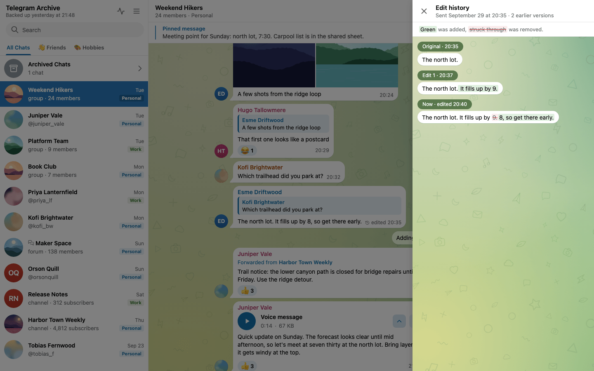

# Real-time listener

## What it is

A scheduled backup only sees Telegram when it runs. The listener keeps each account connected between runs and writes changes into the archive as they happen.

`ENABLE_LISTENER` turns the listener on. It defaults to `false`.

```ini
ENABLE_LISTENER=true
```

The supported way to run the listener is the `schedule` command. The shipped compose file runs that command in the backup container. The scheduler starts one listener per configured account, on that account's shared Telegram connection. A one-shot `telegram-archive backup` never starts it.

A watchdog checks the listeners once a second and restarts a dead one after a 5-second pause. Healthy accounts are left alone.

!!! warning "Standalone entry point"
    `python -m telegram_archive.listener` starts a second Telegram client per account. Use `schedule` with `ENABLE_LISTENER=true` instead. See [One client per session](../getting-started/telegram-login.md#one-client-per-session).

## Settings

The `LISTEN_*` switches and `REACTION_DEBOUNCE_SECONDS` take effect only when `ENABLE_LISTENER=true`. Boolean values accept `1`, `true`, `yes` or `on` to turn a setting on, and `0`, `false`, `no` or `off` to turn it off. Any other value stops startup with an error that names the variable.

| Variable | Default | What it does |
|----------|---------|--------------|
| `LISTEN_NEW_MESSAGES` | `true` | Save new messages as they arrive. |
| `LISTEN_NEW_MESSAGES_MEDIA` | `false` | Download the media of new messages at once instead of at the next backup run. |
| `LISTEN_EDITS` | `true` | Apply text edits and keep the previous text as a version. |
| `LISTEN_DELETIONS` | `false` | Process deletions. When off, deletions are only counted. |
| `DELETION_MODE` | `soft` | `soft` marks a message deleted and keeps it. `hard` removes it. Also governs the `SYNC_DELETIONS_EDITS` pass of the scheduled backup. |
| `LISTEN_CHAT_ACTIONS` | `true` | Save service messages such as joins, leaves, title and photo changes. |
| `LISTEN_REACTIONS` | `false` | Capture per-emoji reaction counts live. |
| `REACTION_DEBOUNCE_SECONDS` | `1.5` | How often buffered reaction updates are written. Values below `0.1` are raised to `0.1`. |

For the rate-limit settings, see [Mass-operation protection](#mass-operation-protection).

## Which chats it follows

The listener keeps a set of tracked chats. It loads the set when it connects and reloads it after every scheduled backup. If a reload fails, the previous set stays in use.

A chat already in the archive stays tracked even if you later exclude it. The filters below decide only for chats the archive has not seen. To stop capturing an archived chat, remove its rows with `EXCLUDE_DELETE_EXISTING`.

For new messages and edits, the listener accepts a first event from an unseen chat when the backup's chat filter would accept it. That filter covers the exclude lists, the include lists and `CHAT_TYPES`. See [Choosing chats](choosing-chats.md). A first message from a bot is judged as a private chat until the next backup run classifies it.

Deletions, pins, reactions and chat actions carry no chat type. For a chat that is not tracked yet, the listener processes them only when the chat is in an explicit include list or include folder.

When `CHAT_IDS` is set, the listener processes only those chats, plus supergroups adopted through `FOLLOW_CHAT_MIGRATIONS`.

The listener skips forum topics listed in `SKIP_TOPIC_IDS`. That covers their new messages, edits, chat actions and reactions.

## New messages

With `LISTEN_NEW_MESSAGES=true`, the listener saves each new message as it arrives. It stores the text, the sender, the chat, the album id, the link preview, the forward origin and the formatting.

Media waits for the next scheduled backup by default. With `LISTEN_NEW_MESSAGES_MEDIA=true` the listener downloads it at once. It applies the same rules as the backup: the `DOWNLOAD_MEDIA` switch, the size cap, media types, document MIME types, YouTube previews, `SKIP_MEDIA_CHAT_IDS` and deduplication. See [Media downloads](media.md).

## Edits

The listener applies an edit only when the text or the formatting changed and the edit is not older than the stored version. An edit that carries no date is applied only when the message was never edited before. An edit to a message that is not in the archive yet stores the message, with its current text and edit time, the way a new message is stored. It is stored quietly: the message is not new, so the viewer gets no new row and no notification or Web Push is sent. That needs `LISTEN_NEW_MESSAGES`, and the text from before the edit is not known unless a backup run read it at the same time, in which case it is kept as an earlier version.

When an edit is applied, the previous text and its formatting are saved as a version, named as seen by the listener. The viewer marks the message with a pencil and the number of saved versions, says when the last edit was, and lets you open the earlier texts. See [Reactions, edits and deletions](../viewer/using-the-viewer.md#reactions-edits-and-deletions).



Telegram moves a message's edit time when only its reactions change, and flags that edit as one not to show. The archive keeps the flag beside the edit time, and the viewer does not mark or count such a message as edited unless it kept an earlier text.

An edit that replaces the photo or file is an edit too, even with the same caption. The old media stays in the archive, as a version beside the earlier text, and the new one is downloaded by the same rules as a new message's media: `LISTEN_NEW_MESSAGES_MEDIA`, `SKIP_MEDIA_CHAT_IDS`, `MAX_MEDIA_SIZE_MB` and the media type filters. A file the listener does not fetch waits for the backup's pending downloads. The sync (`SYNC_DELETIONS_EDITS`) does the same for edits it finds. Only an edit Telegram shows replaces media: a reaction, which Telegram sends as a hidden edit, never does. Media the archive cannot identify, from a Telegram Desktop import or an older file name that does not start with Telegram's id, is not compared. Nor is a link preview's card picture, which Telegram can change for a message nobody edited.

An edit that changes only the formatting, such as a word made bold, is an edit too: it saves a version with the old formatting, moves the edit time and fires the webhook, with the same old and new text. It needs an edit time newer than the stored one, since every edit moves it. The edit time counts whole seconds, and a bot can edit twice within one, so a live edit with other formatting at the stored edit time is applied too. The block tree of a Rich Text Editor message is formatting as well, and its old tree is kept in the version. An edit Telegram hides replaces no formatting. It only fills the formatting of a message archived before the archive kept formatting.

## Deletions

Deletions are ignored unless `LISTEN_DELETIONS=true`. `DELETION_MODE` then decides what happens:

| Mode | Effect |
|------|--------|
| `soft` (default) | The listener marks the message deleted, keeps it, and records the first deletion time. The viewer keeps its text and marks it with a faint wash and `deleted` before its time, and lists it in **What changed**. |
| `hard` | The message row is removed, together with its saved versions, its media rows, their transcripts and its reactions. |

!!! tip "Keep evidence with soft mode"
    If the archive exists to keep a record of what was said, use `soft`. A hard deletion cannot be undone.

For private chats and basic groups, Telegram reports a deletion without a chat id. The listener then searches that account's archive for the message id. It skips channels and supergroups in this search. It applies the deletion only when exactly one chat holds that id. When no chat or several chats match, the deletion is skipped.

!!! warning "Only soft or hard"
    `DELETION_MODE` accepts only `soft` or `hard`. Any other value stops both the backup and the viewer at startup.

## Chat actions and pins

With `LISTEN_CHAT_ACTIONS=true`, a service message is written with its real Telegram id and date. A title or photo change also refreshes the chat row, and a new photo downloads the new avatar. Events that come without a service message are skipped.

Pins and unpins are always captured while the listener runs. No setting turns them off. They are not rate-limited and not filtered by topic.

## Reactions

With `LISTEN_REACTIONS=true`, the listener stores per-emoji counts. It never stores who reacted. Updates are buffered per message and written every `REACTION_DEBOUNCE_SECONDS`, so a burst of changes becomes one write. When an emoji disappears, the listener marks it removed and keeps the row. Reactions on messages that are not in the archive are skipped.

The listener can miss some reaction changes. Telegram does not reliably push reactions that you add from another device. The listener narrows the gap by also reading the reactions carried on edits and on new messages. It skips partial reaction objects (Telegram flags them `min`), because those can leave out your own reaction. That includes live reaction updates: a partial one is not written and the viewer gets no live change for it, so the reactions catch up at the next full snapshot, from a backup or the re-sweep. To correct counts on older messages, set `REACTION_RESWEEP_DAYS` so each scheduled backup re-checks recent days. See [Schedule and backup tuning](schedule.md).

## Mass-operation protection

A burst of deletions, such as someone clearing a whole chat, could remove large parts of the archive. The listener guards against this with a rate limiter on deletions.

Edits are not limited. An edit keeps the earlier text and its formatting as a version, so nothing is lost. Telegram also sends many reaction changes as edit events, so a limit on edits would let a burst of reactions block real edits.

| Variable | Default | What it does |
|----------|---------|--------------|
| `MASS_OPERATION_THRESHOLD` | `10` | Most deletions the listener applies per chat within one window. |
| `MASS_OPERATION_WINDOW_SECONDS` | `30` | Length of the sliding window. It is also how long a chat stays blocked once it goes over the limit. |

Each chat has one sliding window, and only deletions count against it, so edits never use up the budget. With the defaults, the first 10 deletions inside 30 seconds are applied. The 11th goes over the limit. The listener then blocks that chat's deletions for one more window. Edits in that chat are still applied.

The listener drops blocked deletions. It does not queue them, update the viewer or fire a webhook. It keeps every deletion it applied before the chat went over the limit. The counters live in memory and reset when the process restarts.

The limiter covers the listener only. The `SYNC_DELETIONS_EDITS` pass of the scheduled backup has no such limit.

!!! warning "Checked at startup, even with the listener off"
    Both values must be at least `1`. The backup and the viewer refuse to start otherwise.

!!! note "Retired setting"
    `MASS_OPERATION_BUFFER_DELAY` no longer does anything. Remove it. While it stays set, it must be a number or startup stops.

## Checking that it runs

In the viewer, the sidebar header shows **Live**, with a green dot and the last backup time, under the archive's name while a listener is active. For the master login, the **Live sync** section of Archive status shows one row per account. See [Archive status](../viewer/using-the-viewer.md#archive-status).

When a listener stops, it logs counters for edits, deletions, new messages and the rate limiter.

## How changes reach the viewer

New messages, edits, deletions, pins and reaction changes the listener applies are passed to the viewer. Service messages saved from chat actions appear after a reload. On PostgreSQL this goes through the database. On SQLite the backup container calls the viewer over HTTP.

The viewer then updates open browsers over a WebSocket, so an open chat shows new messages, edits, deletions, pins and reactions without a reload. Browser and Web Push notifications also depend on the new messages the listener captures. For setup, ports and notification modes, see [Live updates and notifications](../viewer/live-updates.md).

## Related pages

- A voice message the listener downloads can be transcribed right away. See [Voice transcription](transcription.md).
- To send an HTTP request to another system each time the listener applies an edit or a deletion, see [Event webhook](event-webhook.md).
