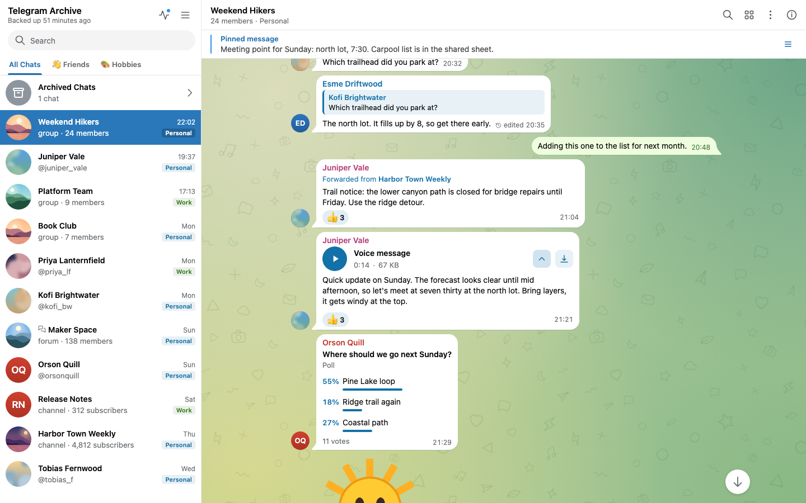

# Voice transcription

The archive can send voice messages and other audio to a transcription server and store the text it returns. The text is searchable and shows under each message in the viewer.

## Overview and privacy

Transcription is on by default, but it does nothing until `TRANSCRIPTION_URL` is set. Until then the viewer shows a dismissible banner above voice messages: "Voice messages can be transcribed automatically. Point TRANSCRIPTION_URL at an akou server."

Only the backup container talks to the transcription server. The viewer never contacts it. The viewer only reports whether a URL is set.

Every upload carries the audio. The table lists what else each server gets. No chat titles, names, message text or ids are sent.

| Server | Also sent |
|---|---|
| akou | File name, content hash, preset, language, speaker-label option, callback URL if set |
| OpenAI endpoint | File name, model, language, hotwords |
| Deepgram | Model, language or a request to detect it, `smart_format=true`, and the speaker-label option with `diarize_model=latest` when it is on |
| AssemblyAI | Model if `TRANSCRIPTION_MODEL` is set, language or a request to detect it, speaker-label option |
| ElevenLabs | File name, model, language if you set one, speaker-label option, `timestamps_granularity=word` |

When the audio track is sent, the file name ends in `.ogg`.

Every result is stored as a new transcript row. The media row is never changed.



## Availability

!!! note "Added in 8.17.0"
    `TRANSCRIPTION_PROVIDER`, `TRANSCRIPTION_MODEL`, `TRANSCRIPTION_HOTWORDS` and the Deepgram, AssemblyAI and ElevenLabs adapters were added in 8.17.0. Older versions detect akou or an OpenAI-compatible endpoint by themselves from `TRANSCRIPTION_URL`.

## Choosing a server

A drain is the step that sends queued files to the server. It runs after each backup run.

With `TRANSCRIPTION_PROVIDER=auto`, the default, each drain checks which kind of server `TRANSCRIPTION_URL` points at. An akou server with jobs gets the job API. Anything else gets the OpenAI endpoint.

Set the variables below on the backup container. The key goes in `TRANSCRIPTION_API_KEY`. The archive puts it in the header each server expects, and never logs it.

=== "akou"

    [akou](https://github.com/GeiserX/akou) is the default. The archive talks to it through its job API and asks it for a preset instead of a model.

    ```bash
    TRANSCRIPTION_URL=http://akou:8476
    TRANSCRIPTION_API_KEY=your-akou-key
    # lite, fast, best, fusion or auto
    TRANSCRIPTION_PRESET=auto
    ```

    The stock `docker-compose.yml` has a commented `akou` service block. It pins `drumsergio/akou:0.5.1` and makes akou reachable as `http://akou:8476`. Before you uncomment it:

    1. The image runs as uid 1000. Create its data and models folders and give them to that user:

        ```bash
        mkdir -p akou/data akou/models && chown -R 1000:1000 akou
        ```

    2. Pull the models once before the first start:

        ```bash
        docker run --rm -v ./akou/data:/data -v ./akou/models:/models drumsergio/akou:0.5.1 models pull fast
        ```

    3. In a container, akou must accept connections from other containers. It only does that when its settings say it runs behind a proxy. Set `server.behind_proxy` to `true` in akou's settings.

    akou can also run on another host. Point `TRANSCRIPTION_URL` at wherever it runs.

=== "OpenAI-compatible"

    Any server with the OpenAI transcription endpoint works, hosted or self-hosted.

    ```bash
    TRANSCRIPTION_URL=https://api.openai.com
    TRANSCRIPTION_API_KEY=sk-your-key
    TRANSCRIPTION_PROVIDER=openai
    # Default: whisper-1
    TRANSCRIPTION_MODEL=whisper-1
    # Sent as the prompt, joined with ", "
    TRANSCRIPTION_HOTWORDS=Kubernetes,Grafana
    # Raise the 25 MB OpenAI cap for self-hosted servers
    TRANSCRIPTION_MAX_UPLOAD_MB=500
    ```

    The URL has no `/v1` suffix. The archive appends `/v1/audio/transcriptions` itself.

=== "Deepgram"

    ```bash
    TRANSCRIPTION_URL=https://api.deepgram.com
    TRANSCRIPTION_API_KEY=your-deepgram-key
    TRANSCRIPTION_PROVIDER=deepgram
    # Default: nova-3
    TRANSCRIPTION_MODEL=nova-3
    ```

    The key is sent as `Authorization: Token <key>`.

=== "AssemblyAI"

    ```bash
    # Or https://api.eu.assemblyai.com for the EU region
    TRANSCRIPTION_URL=https://api.assemblyai.com
    TRANSCRIPTION_API_KEY=your-assemblyai-key
    TRANSCRIPTION_PROVIDER=assemblyai
    # Empty lets AssemblyAI choose the model
    TRANSCRIPTION_MODEL=
    ```

    The key is sent as the raw `Authorization` header, without `Bearer`. The archive uploads the file, then polls every 3 seconds. If the whole call takes more than 600 seconds, the file fails with reason `timeout`. The archive keeps no AssemblyAI job id to resume, so a retry uploads the file again as a new job. AssemblyAI bills that job again if it completes.

=== "ElevenLabs"

    ```bash
    TRANSCRIPTION_URL=https://api.elevenlabs.io
    TRANSCRIPTION_API_KEY=your-elevenlabs-key
    TRANSCRIPTION_PROVIDER=elevenlabs
    # Default: scribe_v2
    TRANSCRIPTION_MODEL=scribe_v2
    ```

    The key is sent in the `xi-api-key` header.

### Speaker labels and language

`TRANSCRIPTION_DIARIZE=true` asks for speaker labels. It works on akou's job API and on the Deepgram, AssemblyAI and ElevenLabs adapters. The OpenAI endpoint never labels speakers.

`TRANSCRIPTION_LANGUAGE` is a language hint, such as `es`. Leave it empty to let the server detect the language.

## What gets transcribed and when

These media types can be transcribed:

- voice messages
- round videos
- audio files
- videos
- documents whose MIME type starts with `audio/` or `video/`

GIFs are never transcribed.

Only downloaded files are transcribed. A chat or media type whose downloads are off is never transcribed. See [Media downloads](media.md).

`TRANSCRIPTION_TYPES` limits what is picked up automatically. The default is `voice`. Valid names are `voice`, `video_note`, `audio`, `video` and `document`. The transcript button in the viewer works for any transcribable type, whatever this list says.

### When files are sent

- The drain runs at the end of every backup run that finishes without an exception. A drain error is logged as a warning and never fails the backup.
- When the [real-time listener](listener.md) downloads a file itself, it sends that file at once. This needs `LISTEN_NEW_MESSAGES_MEDIA=true` and the file's type in `TRANSCRIPTION_TYPES`. Otherwise the file waits for the next drain.
- Pressing the button only queues the file. The next drain sends it.

### Drain order and limits

Each drain sends files in this order:

1. files whose button was pressed
2. files from `TRANSCRIPTION_PRIORITY_CHAT_IDS`, in list order
3. everything else, newest download first

One drain handles at most `TRANSCRIPTION_BACKFILL_PER_RUN` files per account. The default is 50, and pressed files count inside that number. With akou, jobs still open on the server count against it too. If open jobs fill the cap, even pressed files wait for a later drain.

### Retries

- A file is retried automatically until it has 3 failed attempts. After that only a press retries it.
- A press always gets one more attempt, whatever happened before.
- A queued file that never got a job is sent again after 10 minutes.
- An unreachable server spends no retry. The file stays queued.
- Changing the language, preset, speaker labels or server means files are sent again instead of reusing earlier results. On the OpenAI endpoint the model and the hotwords count too. On Deepgram, AssemblyAI and ElevenLabs the model counts and the hotwords do not.
- The same audio already transcribed with the same settings, in this account or another, is copied instead of sent.

## Limits and audio handling

`TRANSCRIPTION_MAX_SECONDS` skips any file longer than this many seconds. The default is 1800, which is 30 minutes. It has no "off" value: `0` skips every file with a known duration.

`TRANSCRIPTION_MAX_UPLOAD_MB` caps what is actually sent. The default is 500, or 25 when it is unset and `TRANSCRIPTION_PROVIDER=openai`. `0` means no limit. A bigger upload is skipped as `too_large`.

Before sending, the backup checks the file with ffprobe, except a voice message whose length is already stored. A file with no audio track is skipped as `no_audio_track` and never sent.

Voice messages and audio files are sent as stored. Everything else is sent as its audio track, extracted with ffmpeg to 16 kHz mono Opus. A voice or audio file over the upload limit is extracted too. At most 2 ffprobe or ffmpeg processes run at once.

If the server answers `413 Payload Too Large`, the backup sends that file once more as its audio track. If the track is still refused, the file is skipped as `too_large`. Only that file is affected.

Both Docker images include ffmpeg and ffprobe. On a [PyPI install](../getting-started/pip.md) without ffmpeg and ffprobe, the backup skips the audio check and sends the stored file instead of its audio track. Each missing tool logs one warning per process.

## Callbacks with akou

By default the archive collects akou's results on the next drain. It reads akou's event feed and asks about any job still open after ten minutes. With a signed callback, akou delivers each result to the viewer as soon as it is ready.

Set the callback URL on the **backup** container. It is the viewer's public URL plus `/api/transcriptions/callback`:

```bash
TRANSCRIPTION_CALLBACK_URL=https://archive.example.com/api/transcriptions/callback
```

Set the secret on the **viewer** container. It is the `whsec_` secret from akou:

```bash
TRANSCRIPTION_WEBHOOK_SECRET=whsec_your-secret
```

In the stock `docker-compose.yml`, `TRANSCRIPTION_WEBHOOK_SECRET` is commented out in the viewer's `environment` block. The viewer has no `env_file`, so uncomment that line or the secret never reaches it.

The viewer accepts callbacks only when transcription is enabled on it and `TRANSCRIPTION_WEBHOOK_SECRET` holds a valid `whsec_` secret. The viewer checks the signature and answers `204` to every genuine delivery.

!!! warning "Allowlist the callback host"
    The callback host must be on the akou key's callback allowlist. Otherwise akou refuses every submit with `callback_not_allowed` and nothing is sent. Add the host on akou's side, or unset `TRANSCRIPTION_CALLBACK_URL`.

The callback URL must be reachable from akou. See [Exposing the viewer safely](../viewer/exposing.md).

## In the viewer

### The button

Each transcribable file gets a small rounded button with a waveform-and-lines glyph, tinted in the bubble's link colour. The tint deepens while the text is open.

| Media | Where the button sits |
|---|---|
| Voice and audio | Right after the duration |
| Round videos | Over the bottom corner, right for incoming and left for outgoing. Opening the text turns the round video into a voice-style bubble. |
| Videos | Over the bottom corner of the player |
| Videos sent as a file | Beside the file name |

The button has five states:

| State | What you see |
|---|---|
| Loading | A stroke loops around the button while the file is queued or being transcribed. |
| Done | The button is ready. Pressing it opens the text. |
| Error | A grey reason shows under the media. |
| None | A server is configured, but this file has no transcript yet. Pressing queues it. |
| Unconfigured | No server is set. Pressing opens the banner instead. |

Presses are limited, because an open viewer (`ALLOW_ANONYMOUS_VIEWER=true`) lets anyone press. One client may press `TRANSCRIPTION_ASK_RATE_LIMIT` times in 10 minutes, 30 by default. A client is its login session, the proxy user name, or, in an open viewer, the client IP. Separately, once `TRANSCRIPTION_ASK_MAX_OPEN` pressed files (50 by default) wait for the backup, presses from anyone but the master are refused until the next backup run picks some up. Only asks from the last 24 hours on downloaded files count, so asks no backup run will pick up, such as those in an account no backup runs for, stop counting after a day. They stay in the archive. Pressing a file that is already queued returns that request and counts against neither limit. A refused press leaves the button as it was and a short message says why.

### Error texts

| Reason | Text shown |
|---|---|
| `file_missing` | The audio file is missing |
| `expired` | The server dropped the job before it finished |
| `cancelled` | Cancelled on the transcription server |
| `not_found` | The transcription server no longer knows this job |
| `no_audio_track` | This file has no sound |
| `too_large` | Too large to send to the transcription server |
| Longer than `TRANSCRIPTION_MAX_SECONDS` | Longer than the N minute limit, with N from `TRANSCRIPTION_MAX_SECONDS`. In seconds when the limit is not a whole number of minutes |
| any other reason | The reason in sentence case |
| no reason, skipped | Not transcribed |
| no reason, failed | Transcription failed |

### The text

An open transcript shows the full text straight under the player, in the message's own size and colour, with no heading, as Telegram shows it. When the server returned no words it says "No speech detected". Point at the text to see the engine, the model, the language and the date. The message's details in the info panel show the same. The transcript button shows an arrow while the text is open, and a small dot when the last attempt failed; the reason then shows under the player, in the time colour.

When a file has more than one finished transcript, a small "1 of N" at the end of the text steps to the next one, newest first.

With more than one speaker, the text reads as turns: "Speaker 1:", "Speaker 2:", numbered in order of first speech.

The viewer remembers per message whether a transcript is open. **Expand all transcripts**, in the chat header's **More actions** menu (in the info panel on a phone), opens every transcript in the chat. It then reads "Collapse all transcripts" and closes them. The viewer remembers that choice per chat.

### Status, search and exports

Archive status, which only the master login sees, has a Voice transcripts row. See [Archive status](../viewer/using-the-viewer.md#archive-status).

| Value | Meaning |
|---|---|
| Off | `TRANSCRIPTION_ENABLED=false` |
| No server set | `TRANSCRIPTION_URL` is empty. The row links to this page. |
| Server not found yet | No drain has reached the server yet |
| `<name> <version>` | The server the last drain detected. For akou it links to the engine's page. |

Chat search and global search find messages by their transcripts. The viewer marks these results as found in the transcript and opens the transcript at the match. On SQLite this needs FTS5. See [SQLite and PostgreSQL](database.md).

Transcripts also appear in:

- the Voice tab of the media gallery, whose filter box matches file names and transcript text
- the What changed feed
- the viewer's chat export and the command line export

No-download logins see no transcript button, no transcript text and no transcript search hits. See [No-download logins](../viewer/access.md#no-download-logins).

To turn transcription off on the viewer only, see [Turning it off](#turning-it-off).

## Turning it off

Set `TRANSCRIPTION_ENABLED=false` on both the backup and the viewer container. The archive stops sending files. The button, the banner and the callback endpoint disappear. Existing transcripts stay in search and exports.

With `TRANSCRIPTION_ENABLED=false` on the viewer only, bubbles hide transcripts. Search, the What changed feed and the exports still include the existing ones.

## Deletion

Transcripts are removed only when their media is removed. Which settings delete media is covered in [Media downloads](media.md) and [Environment variables](../reference/environment-variables.md).

The SQLite to PostgreSQL mover copies transcripts with everything else.

## Settings

All settings except `TRANSCRIPTION_ENABLED`, `TRANSCRIPTION_URL`, `TRANSCRIPTION_WEBHOOK_SECRET` and the two `TRANSCRIPTION_ASK_*` limits matter on the backup container only. "Stops startup" means a bad value aborts the process with an error. "Warns" means one warning is logged and the setting falls back as described. The number settings are checked only while transcription is enabled.

| Variable | Default | Read by | Bad value |
|---|---|---|---|
| `TRANSCRIPTION_ENABLED` | `true` | backup, viewer | Stops startup |
| `TRANSCRIPTION_URL` | empty | backup; viewer checks only whether it is set | Warns and turns transcription off. Must be `http` or `https` with a host |
| `TRANSCRIPTION_API_KEY` | empty | backup | Not checked |
| `TRANSCRIPTION_PROVIDER` | `auto` | backup | Warns and uses `auto`. Values: `auto`, `akou`, `openai`, `deepgram`, `assemblyai`, `elevenlabs` |
| `TRANSCRIPTION_MODEL` | empty, the provider's default | backup | Not checked |
| `TRANSCRIPTION_HOTWORDS` | empty | backup | Not checked. OpenAI endpoint only |
| `TRANSCRIPTION_PRESET` | `auto` | backup | Warns and uses `auto`. Values: `lite`, `fast`, `best`, `fusion`, `auto`. akou only |
| `TRANSCRIPTION_TYPES` | `voice` | backup | Warns and drops unknown names. If none remain, `voice` |
| `TRANSCRIPTION_MAX_SECONDS` | `1800` | backup | Stops startup |
| `TRANSCRIPTION_MAX_UPLOAD_MB` | `500`, or `25` when unset and `TRANSCRIPTION_PROVIDER=openai` | backup | Stops startup. A negative value warns and means no limit |
| `TRANSCRIPTION_LANGUAGE` | empty, the server detects | backup | Not checked |
| `TRANSCRIPTION_DIARIZE` | `false` | backup | Stops startup |
| `TRANSCRIPTION_CALLBACK_URL` | empty | backup | Warns and drops it. Results then arrive on the next drain |
| `TRANSCRIPTION_WEBHOOK_SECRET` | empty | viewer | Warns and ignores a value without the `whsec_` prefix |
| `TRANSCRIPTION_BACKFILL_PER_RUN` | `50` | backup | Stops startup. Values below 1 become 1 |
| `TRANSCRIPTION_PRIORITY_CHAT_IDS` | empty | backup | Stops startup on a non-integer id |
| `TRANSCRIPTION_ASK_RATE_LIMIT` | `30` | viewer | Stops startup. `0` or less means no limit |
| `TRANSCRIPTION_ASK_MAX_OPEN` | `50` | viewer | Stops startup. `0` or less means no limit |

The full list of variables is in [Environment variables](../reference/environment-variables.md).

## Troubleshooting

Transcription logs never contain the key, media ids, file names or transcript text. The startup line names the server's scheme and host only. The path, port and query of `TRANSCRIPTION_URL` are never logged.

| What you see | What it means |
|---|---|
| `Transcription drain: N done, N copied, N failed, N skipped, N submitted, N refused, N unreachable of N media; N filled from the event feed, N from the poll` | The INFO summary each drain logs. With no server set, the drain logs only at debug level. |
| `TRANSCRIPTION_PROVIDER=akou but the server did not answer as akou with jobs; nothing sent, the media stays queued` | The URL does not reach an akou server with the job API. Check the URL, or use `auto` or `openai`. |
| Files stay queued and every drain ends early on an OpenAI-compatible server | The server answers `404`. Check that `TRANSCRIPTION_URL` has no `/v1` suffix and that the model exists. |
| A warning to check `TRANSCRIPTION_MODEL` and `TRANSCRIPTION_LANGUAGE` | Two files were refused with a 4xx error and none succeeded. The model or language is usually wrong for this provider. |
| `callback_not_allowed` | The callback host is not on the akou key's callback allowlist. Add it on akou's side, or unset `TRANSCRIPTION_CALLBACK_URL`. |
| Archive status says "On, server not found yet" | No drain has reached the server yet. It fills after the next backup run. |

For general log and health checks, see [Monitoring and troubleshooting](../operations/troubleshooting.md).
