# Deleted messages: eight ways to show them

> **Decision.** We chose **F, folded by default**: a deleted message is a one-line pill in its place. **Show** opens it as **A**, with "Deleted · 21:59" at the head of the bubble, under a stronger red tint than the pictures below. The finder from **H** lives in the chat's **More actions** menu, as "Deleted messages", and opens the chat search in a "Deleted only" mode; there is no chip in the header. [Deleted messages](../viewer/using-the-viewer.md#deleted-messages) describes what shipped.

When the archive keeps a message that was deleted in Telegram, the viewer shows it with a faint red wash on the bubble and a trash icon with "deleted" beside the time. It is calm and readable, but easy to miss. In a long chat the wash is close to invisible, and the word sits in the smallest text of the bubble. This document shows eight other ways to mark a deleted message, rendered on the real viewer, so we can pick one.

Every variant is an override stylesheet in its folder, loaded into the viewer after its own styles. A, C, F and H also need an element the viewer does not draw yet: A, F and H each add a small script, and C reuses A's. We changed no template or app code for the pictures. [`rig/shoot.mjs`](rig/shoot.mjs) took them against the demo archive from [`scripts/generate_dummy_db.py`](../../scripts/generate_dummy_db.py), which has fake chats and people and two deleted messages in one group: a text and a photo with a caption. Desktop pictures are 1440 by 900, cropped to the message column; phone pictures are 390 by 844 at 2x, kept whole. Each variant is shown in Telegram Day and Telegram Night.

| Variant | In one line |
| --- | --- |
| [Today](#today) | A faint wash and "deleted HH:MM" in the meta row. |
| [A. Header](#a-header) | "Deleted · 08:38" at the head of the bubble, where the sender's name sits. |
| [B. Hatch](#b-hatch) | The wash becomes a faint diagonal hatch, visible in grayscale too. |
| [C. Header and hatch](#c-header-and-hatch) | A and B together: a word and a texture. |
| [D. Edge bar](#d-edge-bar) | A bar in the deleted colour along the bubble's leading edge. |
| [E. Ghost](#e-ghost) | A dashed outline, a see-through fill and quieter text. |
| [F. Collapsed](#f-collapsed) | The bubble folds into a one-line pill that opens on click. |
| [G. Gutter](#g-gutter) | A trash mark in the avatar column, next to the bubble. |
| [H. Find](#h-find) | Not a style: a header chip that steps through deletions, and a "Deleted only" search filter. |

In short, we recommend C for the mark and H for finding the marked messages. [The recommendation](#recommendation) has the reasons.

## How the archive knows a message was deleted

Two paths can tell the archive that a message is gone. Both are off by default; the [settings reference](../reference/environment-variables.md#listen_deletions) has every flag named here.

- **The listener** (`LISTEN_DELETIONS=true`). While it runs, Telegram sends it an event for each deletion. In private chats and basic groups the event carries only message ids, not the chat, so the archive looks each id up in the account's chats and skips it when the id is in more than one. A mass-operation guard caps each chat at 10 deletions in 30 seconds (`MASS_OPERATION_THRESHOLD`, `MASS_OPERATION_WINDOW_SECONDS`): past that, the chat's deletions are dropped for the next 30 seconds.
- **The sync** (`SYNC_DELETIONS_EDITS=true`). During a backup run it asks Telegram for every archived message of a chat, 100 at a time. A message Telegram no longer returns is marked deleted. When Telegram's answer does not line up with the ids asked for, the batch marks nothing and the next run tries again.

With `DELETION_MODE=soft`, the default, the row stays: `is_deleted` becomes 1 and `deleted_at` records the time. With `hard` the row is removed and there is nothing left to mark.

`deleted_at` is when the archive noticed, not when the message was deleted. The listener notices within seconds. The sync notices at the next backup run, which can be days later. If both notice, the first time stays.

What the archive cannot know:

- Who deleted the message: its sender, an admin, or the archived account.
- Whether it was deleted for everyone or only on this account. Both look the same from here.
- That a message without a mark is still there. With both paths off, the listener stopped, the guard tripped or an id ambiguous, a deleted message looks live.

So the mark can say "deleted in Telegram, noticed at 08:38", and nothing more. Its tooltip should say "noticed", not "deleted on".

## What we want from the mark

- **Readable.** The text is what the archive exists to keep. It keeps its colour and holds 4.5:1 against whatever sits behind it, in every variant.
- **Clearly different at a glance.** Scrolling fast, a deleted message should catch the eye from the side of the screen, without reading the meta row.
- **Not alarming.** A deletion is a fact the archive kept, not an error. No danger red, no warning sign, no strikethrough.
- **Every theme, and colour-blind readers.** The difference cannot rest on hue alone: a word, a shape or a texture has to carry it, so it survives grayscale and a red-green deficiency.
- **Follows the tail.** Whatever marks the bubble marks its tail too, or drops the tail on purpose.

## All eight at a glance

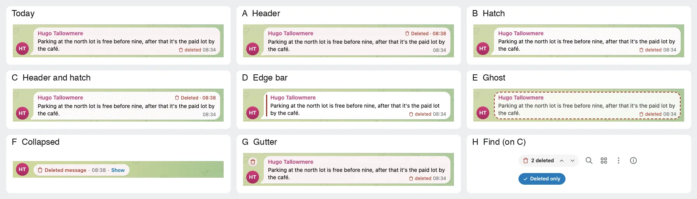

The deleted text message in each variant, Telegram Day. H is shown by its two controls, the header chip and the search filter; its bubbles are C's.

## The variants

Contrast figures are computed from each theme's token values, for the incoming side unless an outgoing figure is given. "On a stripe" means against the stripe colour itself, the worst case under a letter.

### Today

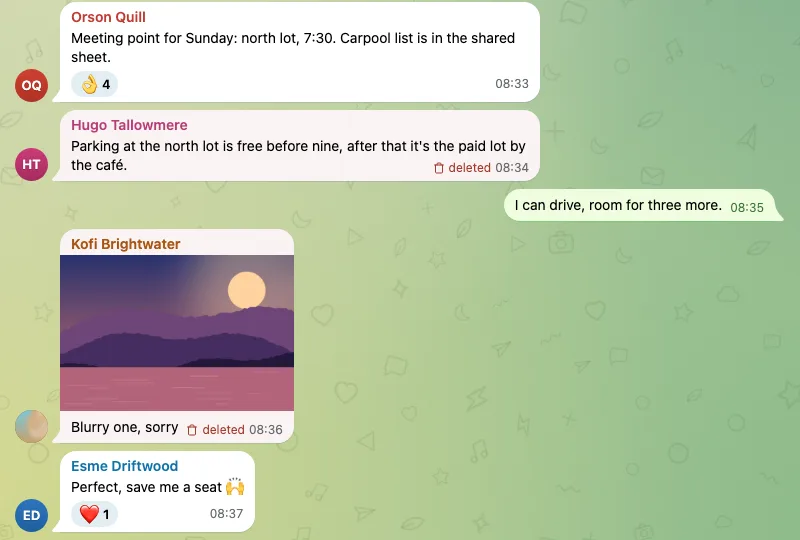

Telegram Day. The wash is the deleted colour at 6% and hard to see on white. The only words are "deleted 08:34" in the meta row, and 08:34 is the send time.

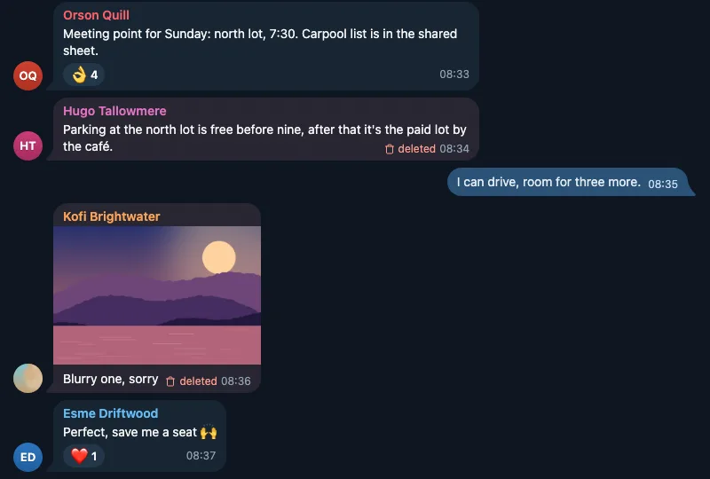

Telegram Night. The wash turns the bubble a little warmer; the photo bubble is almost unmarked.


Phone, Telegram Day. [Night phone](deleted-messages/00-current/night-phone.webp).

- **Contrast.** "deleted" 5.99:1 on Day and 7.24:1 on Night, the time 4.78:1 and 5.45:1.
- **What is missing.** The mark is small, it sits where the eye reads last, and it shows no deletion time.

### A. Header

The mark moves from the meta row to the head of the bubble, on the sender's line at its far end, where Telegram puts "admin": a trash and "Deleted · 08:38" in the deleted colour, with the time the archive noticed the deletion. The meta row goes back to the plain send time, and the faint wash stays.

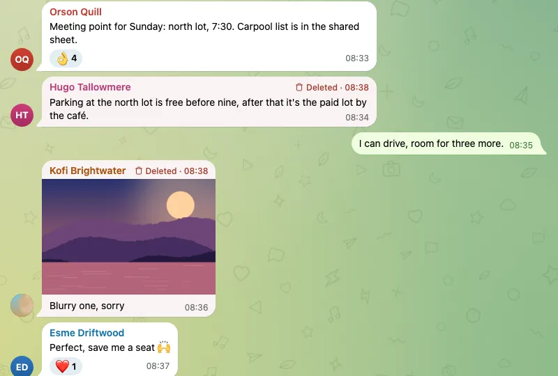

Telegram Day. The first thing read in the bubble is now the state and its time.

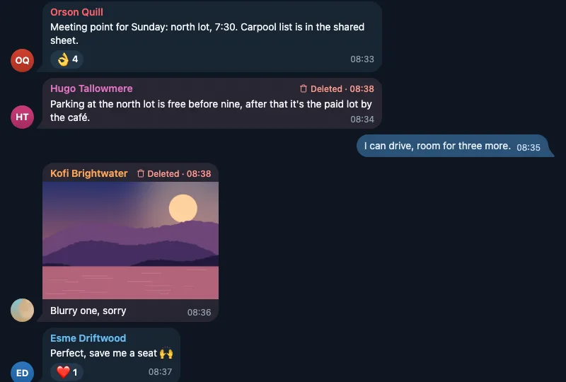

Telegram Night.

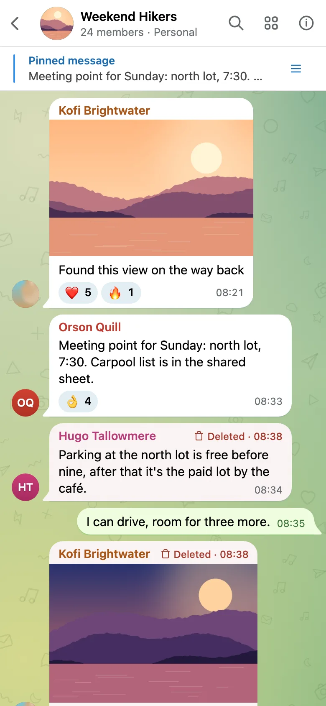

Phone, Telegram Day. On a narrow bubble the name truncates before the header does. [Night phone](deleted-messages/A-header/night-phone.webp).

- **Cost.** A template change. The header renders from `msg.deleted_at`; the meta mark goes. A bubble with no name line, as in a private chat, an outgoing message or the middle of a run, gets a line of its own, and a photo with nothing else gets a pill in its top corner. When the deletion was noticed on a later day, the header says so: "Deleted Oct 2 · 21:59". The mockup does all of this with a script, [`A-header/override.js`](deleted-messages/A-header/override.js).
- **Accessibility.** The header is 12px medium in the side's deleted colour: 5.99:1 on Day and 7.24:1 on Night on the washed bubble, 5.64:1 and 5.77:1 outgoing. It is a word, so it does not rest on colour.
- **Pros.** Says what happened and when, in the place read first; frees the meta row; costs no contrast.
- **Cons.** A word needs reading, so at a glance and from the side of the screen it is not much stronger than today; the wash alone still carries that part. Every deleted bubble gains up to a line.

### B. Hatch

The wash becomes a faint diagonal hatch in the deleted colour, so the bubble reads as a different material, in colour and in grayscale. The meta label stays as it is.


Telegram Day. The hatch runs on into the tail without a seam.

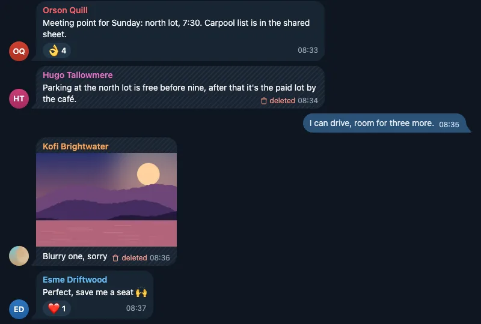

Telegram Night.


Phone, Telegram Day. [Night phone](deleted-messages/B-hatch/night-phone.webp).

- **Cost.** CSS only. An 8px tile of two stripes anchored at the bubble's bottom corner on the tail's side; the tail draws the same tile anchored 0.5px past its own edge, so the stripes line up. The tinted boxes inside, such as the reply quote, the link card and the reactions, stay on the plain fill, as they do today.
- **Accessibility.** The stripes are as strong as the text allows. On Day they are the deleted colour at 9%: on a stripe the time is 4.56:1 and the palest sender name 4.61:1, and at 11% both would fall under 4.5:1. On Night they are the light deleted colour at 7%: the time is 5.05:1 and the palest name 4.59:1, and at 8% that name is exactly 4.50:1. The texture is a shape, so it survives grayscale and colour-blindness.
- **Pros.** Visible from the side of the screen without reading; works in grayscale; follows the tail; CSS only.
- **Cons.** The contrast budget keeps it faint, strongest at 100% zoom and on a good screen; on a low-contrast display it can vanish. It says nothing about when.

### C. Header and hatch

A and B together: the hatch makes a deleted bubble stand out while scrolling, and the header says what happened and when as soon as you look. This is the combination we recommend testing.

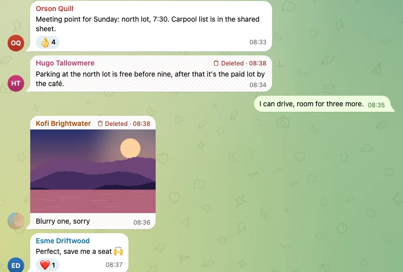

Telegram Day.

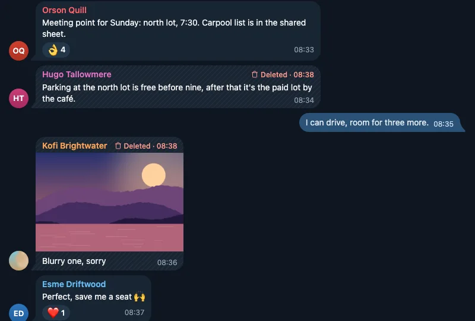

Telegram Night.

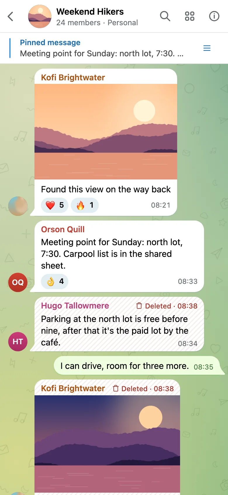

Phone, Telegram Day. [Night phone](deleted-messages/C-header-hatch/night-phone.webp).

- **Cost.** A's template change and B's CSS. The pictures load both stylesheets, A's script and [`C-header-hatch/override.css`](deleted-messages/C-header-hatch/override.css), which only records the combination.
- **Accessibility.** The header on a stripe is 5.71:1 on Day and 6.72:1 on Night, 5.39:1 and 4.95:1 outgoing. The time and names keep B's figures. A word and a texture, so neither colour nor reading alone carries it.
- **Pros.** The best of both, at the cost of one template change. The hatch covers "at a glance", the header covers "what and when".
- **Cons.** A's extra line per deleted bubble; B's faintness on poor screens, where the header still carries the mark.

### D. Edge bar

A 3px bar in the deleted colour along the bubble's leading inner edge, in the shape of a reply quote's bar, from top to bottom. The wash goes; the meta label stays.

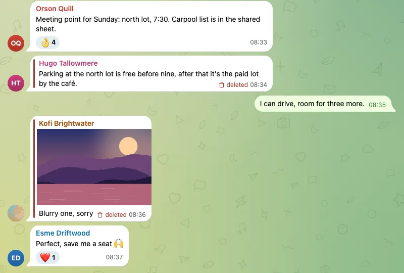

Telegram Day. The photo gives up a strip on its left so the bar runs the whole height.

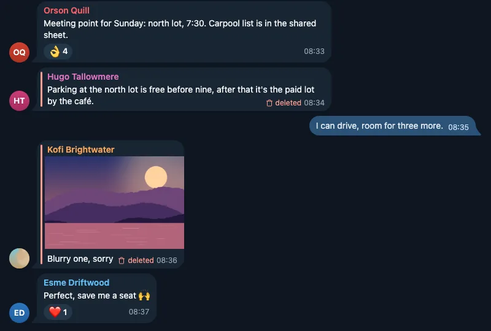

Telegram Night.

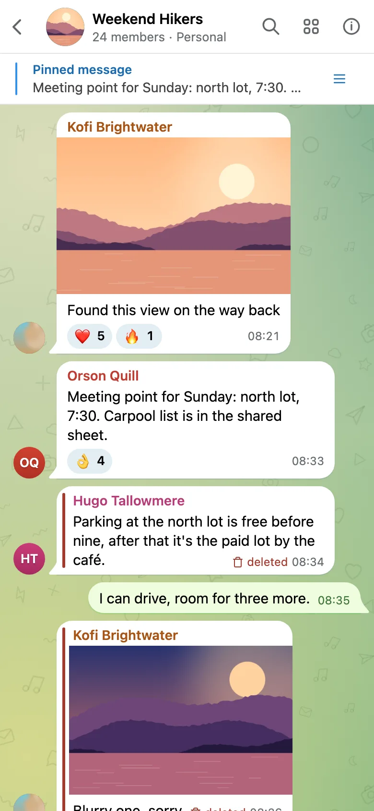

Phone, Telegram Day. [Night phone](deleted-messages/D-edge-bar/night-phone.webp).

- **Cost.** CSS only: a `::before` bar and 6px more padding on the start side. A photo with nothing else gets the bar over its edge in a thin dark sleeve.
- **Accessibility.** The bar is 6.56:1 against the Day bubble and 7.60:1 on Night, well over the 3:1 a mark that is not text needs. With no wash, "deleted" is 6.56:1 and 7.60:1, the time 5.23:1 and 5.72:1. A bar is a shape, so it survives grayscale.
- **Pros.** Strong at a glance and from the side of the screen; a single clean line; frees the bubble fill.
- **Cons.** It borrows the reply quote's shape, so a reader can take the bubble for a quote or a reply; it shifts the content 6px and pulls the photo off the edge. Heavier than the others in red.

### E. Ghost

The bubble loses its body: a dashed outline in the deleted colour, a fill that lets the wallpaper through, no shadow, no tail, and text a step quieter than a live message. The meta label stays.

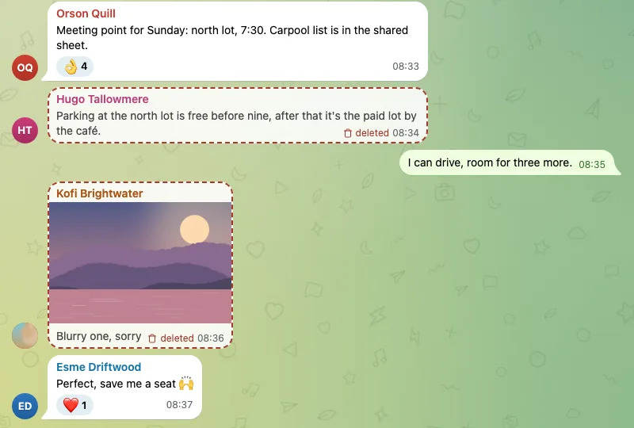

Telegram Day.

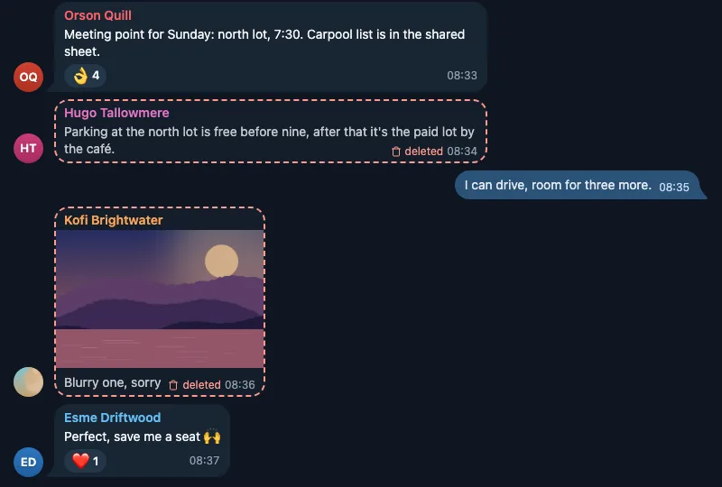

Telegram Night.

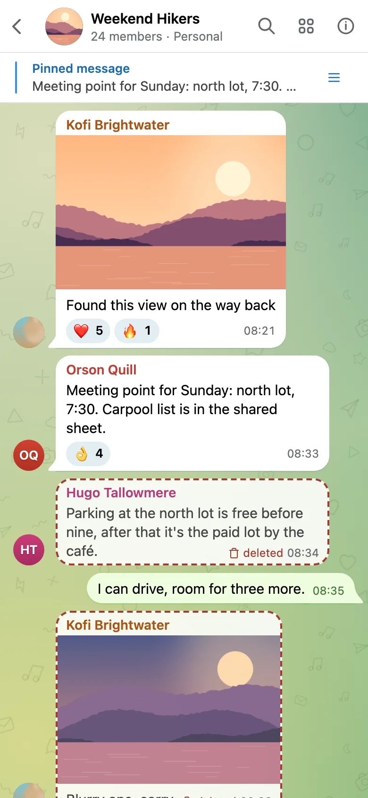

Phone, Telegram Day. [Night phone](deleted-messages/E-ghost/night-phone.webp).

- **Cost.** CSS only. A dashed line cannot follow the tail's curve, because a border draws a box and the tail is a masked shape. So the ghost drops the tail and rounds that corner.
- **Accessibility, measured.** The ghost stays above 4.5:1 only because we held it back. On Day the fill has to keep 86% of the bubble colour: over the darkest wallpaper pixel the time is then 4.57:1, the palest name 4.62:1, the dark grey body text 8.25:1 and "deleted" 5.73:1. At 80% the time drops to 4.30:1. Text as faint as a real ghost, black at 50%, would be 3.95:1 on white. On Night, with a plain pane instead of a wallpaper, the fill can drop to 45%: body 10.14:1, time 6.27:1. The dashed line against the darkest wallpaper is 2.12:1, under the 3:1 a mark should have, though it is 5.7:1 against the ghost's own fill.
- **Pros.** The strongest "no longer there" of all; clear at a glance; the dashes are a shape, so it works without colour.
- **Cons.** The see-through fill is barely visible at the strength contrast allows; muting the text works against keeping it, which is the point of the archive; it loses the tail, so a run looks broken; a dashed outline reads as a drop target or a selection in many apps.

### F. Collapsed

The deleted message folds into a one-line pill in its place, "Deleted message · 08:38 · Show", in the bubble's own fill. Show opens the bubble as it is today, and Hide on the opened bubble folds it again. It can sit on top of any other variant, which then styles the opened bubble.

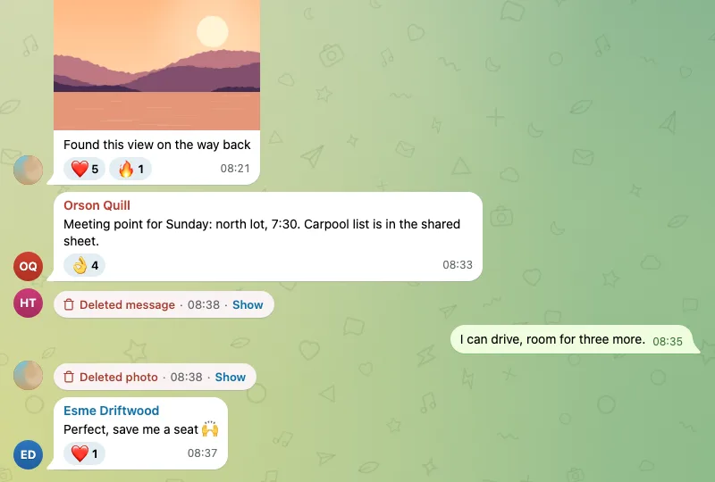

Telegram Day, folded. The photo says "Deleted photo".

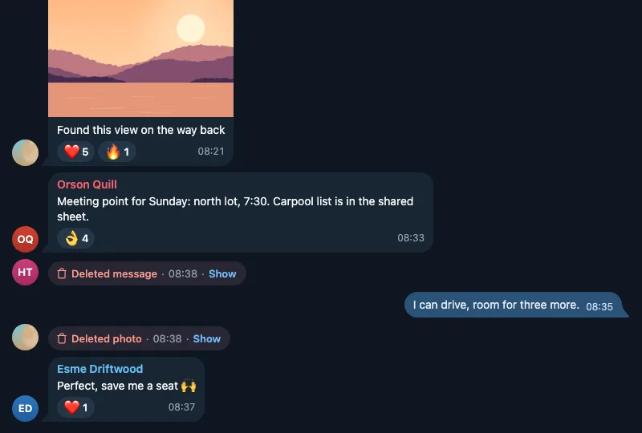

Telegram Night, folded.

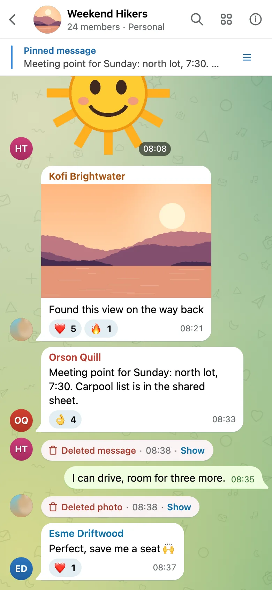

Phone, Telegram Day, folded. [Night phone](deleted-messages/F-collapsed/night-phone.webp).

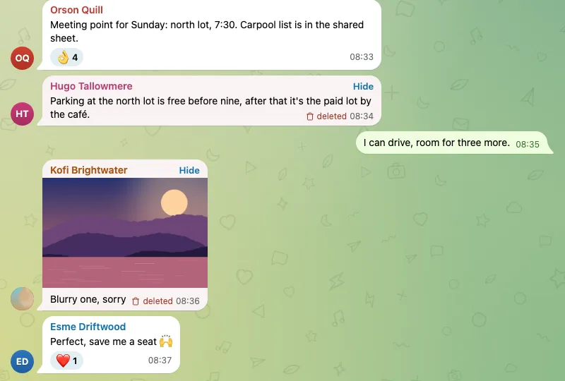

Telegram Day, opened: today's bubble with Hide on its first line. [Night](deleted-messages/F-collapsed/night-desktop-open.webp), [Day phone](deleted-messages/F-collapsed/day-phone-open.webp), [Night phone](deleted-messages/F-collapsed/night-phone-open.webp).

- **Cost.** A template change and a little state: the pill and the Hide button render from the row, and the opened messages live in a set per chat. The mockup builds both with [`F-collapsed/override.js`](deleted-messages/F-collapsed/override.js).
- **Accessibility.** The pill is a button with `aria-expanded` and a label that names the sender, the kind, the send time and the deletion time. "Deleted message" is 5.99:1 on Day and 7.24:1 on Night, the time 4.78:1 and 5.45:1, "Show" 4.85:1 and 7.13:1; outgoing 5.64:1, 4.75:1 and 4.84:1 on Day. Hide is the side's link colour on the washed bubble, the same figures as Show.
- **Pros.** Unmistakable at a glance; a chat with many deletions stays short; the reader decides what to look at.
- **Cons.** It hides by default what the archive exists to keep, one click per message; the pill has no sender name, so in the middle of a run, with no avatar beside it, it does not say who wrote it; no tail. Better as an option, say "Fold deleted messages" in the chat menu, than as the default.

### G. Gutter

The bubble stays as it is today, and a small trash mark sits in the avatar column next to it, level with its first line. Scrolling, the deletions line up as a column of marks at the left edge, where the eye already runs down the avatars.


Telegram Day.

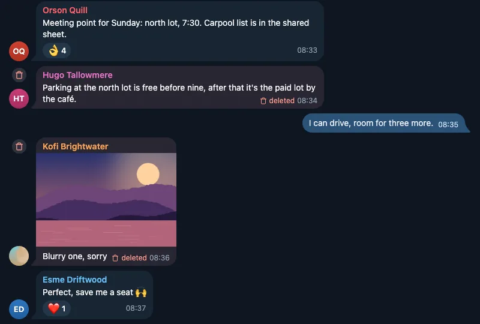

Telegram Night.

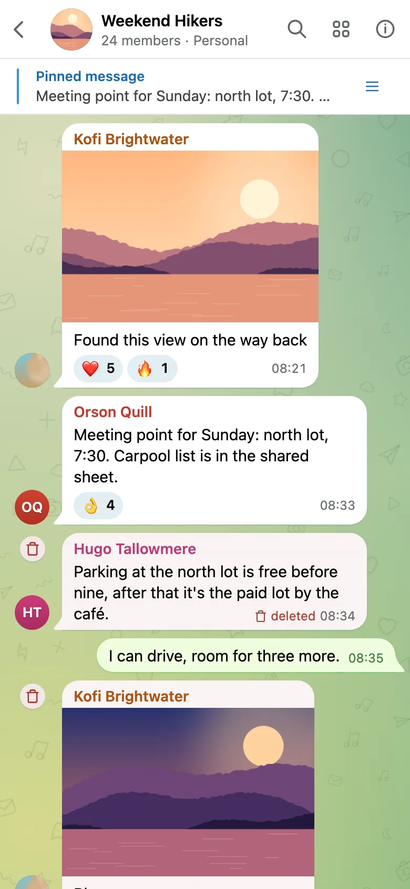

Phone, Telegram Day. [Night phone](deleted-messages/G-gutter/night-phone.webp).

- **Cost.** CSS only: the bubble's `::before`, placed in the gutter, a 24px disc in the bubble's fill tinted with the deleted colour, with the trash in the deleted colour. An outgoing bubble has no gutter, so its mark sits in the same place on the right.
- **Accessibility.** The trash on its disc is 5.45:1 on Day and 6.33:1 on Night, 5.14:1 and 4.76:1 outgoing. The text keeps today's figures. The mark is an icon in a place of its own, so it does not rest on colour.
- **Pros.** The best for scanning a long chat; leaves the bubble alone; CSS only.
- **Cons.** Only groups have an avatar column. In a private chat the mark hangs in the chat's margin, which is narrow on a phone. A one-line message at the end of a run is shorter than the mark and the avatar together, so the two touch. A trash beside the bubble can read as a delete button.

### H. Find

Not a bubble style but a way to reach the deleted messages, drawn here on top of C. A "2 deleted" chip in the chat header steps through them, and a "Deleted only" chip in the chat search narrows the chat to them. It works with any of the other variants.

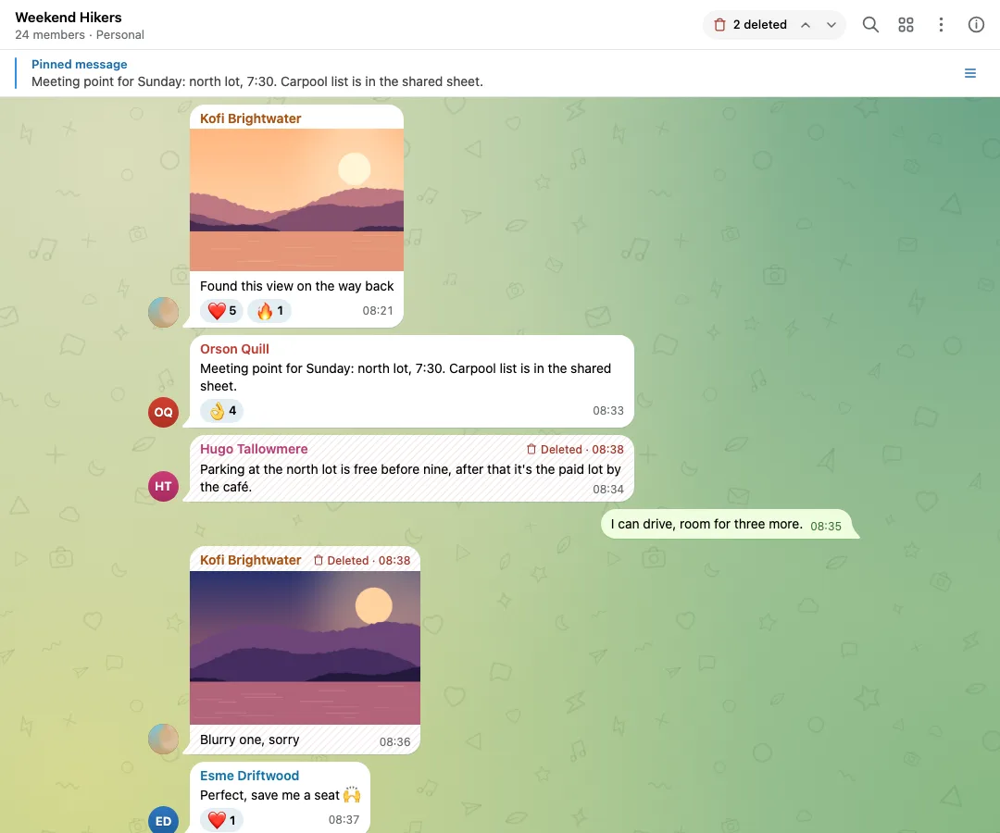

Telegram Day. The chip sits before the search icon: the label or the down arrow goes to the next deleted message, the up arrow to the one before. Once used it reads "1 of 2 deleted" and the message flashes once.

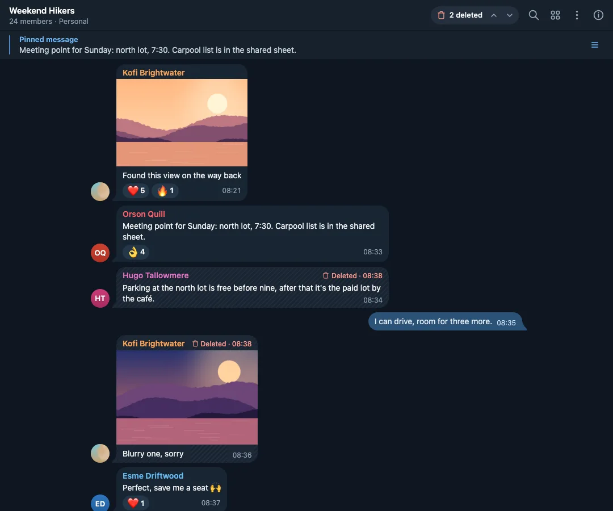

Telegram Night.

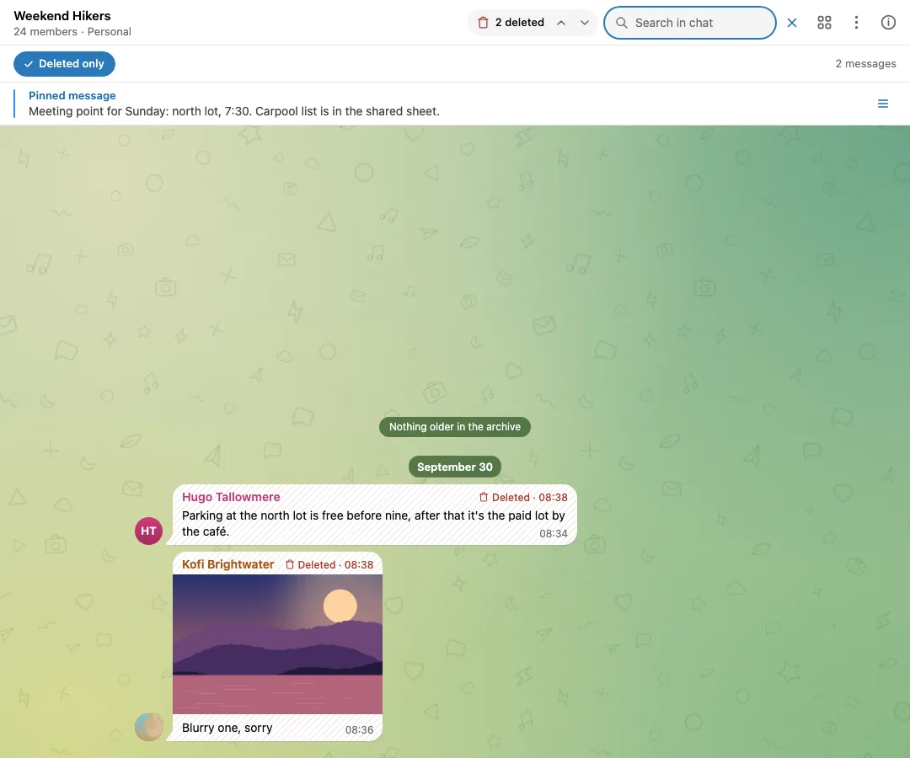

Telegram Day, chat search open with "Deleted only" pressed: the chat shows only its deleted messages and the days they belong to. [Night](deleted-messages/H-find/night-desktop-search.webp).

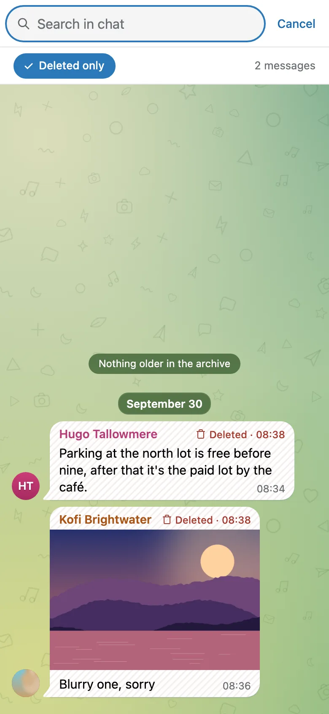

Phone, Telegram Day, search open. The header chip is for wide screens only: on a phone it would cut the chat's name to a few letters, so there the filter does the job. [Night phone search](deleted-messages/H-find/night-phone-search.webp), [Day phone](deleted-messages/H-find/day-phone.webp), [Night phone](deleted-messages/H-find/night-phone.webp).

- **Cost.** Template, script and server. The count already exists (`chatStats.deleted_messages`, shown in the info panel). Stepping needs "the next deleted message before or after this one" from the server, because the loaded page holds only part of the chat. The filter needs a `deleted_only` parameter on the chat's message query. The mockup counts the bubbles on the page and hides the other rows, in [`H-find/override.js`](deleted-messages/H-find/override.js).
- **Accessibility.** The chip is a group of three labelled buttons, such as "Previous deleted message" and "Next deleted message". Its text is 19.11:1 on Day and 13.56:1 on Night. The pressed filter chip is white on the accent, 4.67:1 and 5.39:1, and shows a check as well as the fill, so its state does not rest on colour. The count beside it is 5.08:1 and 5.78:1.
- **Pros.** Answers "what was deleted here?" in one click, which no bubble style can; the chip hides itself in chats with no deletions.
- **Cons.** The most work of all, including a server change; one more control in the header.

## Recommendation

We recommend **C + H**.

- C marks the bubble in two ways that do not depend on each other: the hatch is seen without reading and survives grayscale, and the header says "Deleted · 08:38" where the eye starts. It keeps every text at 4.5:1, follows the tail and needs one template change.
- H answers the question a reader of an archive actually has, "what was deleted in this chat?", which no style can answer.
- The tooltip on the header should say what the time is: "The archive noticed this deletion on September 30, 2026 at 08:38. Telegram does not say who deleted it."
- F is worth keeping as an option, not a default. D, E and G each solve one goal and cost another: D looks like a quote, E trades contrast and the tail for its metaphor, and G only works where there is an avatar column.

## How to choose

Reply with a letter or a combination, for example "C + H", "A", or "D + F". A tweak is fine too, for example "C, with the hatch only on Night". The chosen variant then moves from its override file into the viewer, with the template changes its section lists.

## How the pictures were made

Seed the demo archive with `scripts/generate_dummy_db.py`, run the viewer on it, then run the rig once per variant and theme, for example:

```bash
node docs/design/rig/shoot.mjs --only 15 --port 8111 --out /tmp/c-day \
    --theme telegram --scheme light \
    --css docs/design/deleted-messages/A-header/override.css,docs/design/deleted-messages/B-hatch/override.css,docs/design/deleted-messages/C-header-hatch/override.css \
    --js docs/design/deleted-messages/A-header/override.js
```

`--css` and `--js` take a comma-separated list. Night is `--theme night --scheme dark`. F's opened pictures add `F-collapsed/expanded.js` before `F-collapsed/override.js`, and H's search pictures add `H-find/search.js` before `H-find/override.js`. The viewer allows 15 logins in 5 minutes and every rig run logs in twice, so a long session needs a restart of the viewer now and then.
