# Edited messages: how they look today, and options to choose from

> **Decision: A + C + E + F.** The meta row shows a pencil and the number of earlier versions kept (A), and its name and tooltip give the time of the last edit ("Edited at 08:57, 2 earlier versions kept"), which folds G's point into A. Hovering, focusing or long-pressing the pencil peeks at the text before the last edit (C). A click opens the history as a panel beside the chat, or a bottom sheet on a phone, with the versions on a timeline (E). "Edited messages", under "Deleted messages" in the chat menu, opens the chat search in an "Edited only" mode backed by a read-only `edited_only` filter (F). A message counts as edited when Telegram marks it or the archive kept an earlier version, so the chat's count, the list and the pencils agree. The removed words take the darker neutral n300, which keeps 4.5:1 on the cards in every theme (the n400 of the E mockup did not on Minimal, AMOLED, Forest and Paper). The capture changes below are not part of it. What follows is the proposal as it was written.

When the archive keeps an earlier version of a message, the viewer marks the bubble with a small "edited" beside the time. A click on it opens the edit history, a drawer that shows every kept text with its changes marked. It works, but it is easy to miss: the mark is the smallest text in the bubble, it does not say how many edits there were, and the time next to it is the send time, not the edit time. This document says what the archive can and cannot know about an edit, shows the current look, and shows seven options rendered on the real viewer, so we can pick.

Every option is an override stylesheet in its folder under [`edited-messages/`](edited-messages/), loaded into the viewer after its own styles, with a small script where the option needs an element the viewer does not draw yet. The scripts share [`edited-messages/shared.js`](edited-messages/shared.js), which reads the app's own message list and calls the versions endpoint the viewer already uses. We changed no template or app code for the pictures. [`rig/shoot.mjs`](rig/shoot.mjs) took them against the demo archive from [`scripts/generate_dummy_db.py`](../../scripts/generate_dummy_db.py), which has fake chats and people. The edited message is a reply in a group, sent at 08:52 and edited at 08:54 and 08:57, so it has two earlier versions. Desktop pictures are 1440 by 900, cropped to the message column; phone pictures are 390 by 844 at 2x, kept whole. Each option is shown in Telegram Day and Telegram Night.

| Option | In one line |
| --- | --- |
| [Today](#the-current-look) | "edited" and the send time in the meta row; a click opens a drawer over the chat. |
| [A. Count](#a-count) | A pencil and the number of edits seen, with the edit time in the tooltip. |
| [B. Switcher](#b-switcher) | "‹ 3/3 ›" in the meta row flips the bubble between its versions in place. |
| [C. Peek](#c-peek) | Hover, focus or long press shows the text before the last edit in a popover. |
| [D. Inline diff](#d-inline-diff) | A click turns the bubble's text into the diff of its last edit. |
| [E. Panel](#e-panel) | The history opens beside the chat on a wide screen and as a bottom sheet on a phone, as a timeline. |
| [F. Finder](#f-finder) | "Edited messages" in the chat menu opens the chat search in an "Edited" mode. |
| [G. Edit time](#g-edit-time) | The meta row reads "08:52 · edited 08:57". |

In short, we recommend A with G's tooltip wording for the mark, C for a quick look, E for the history and F for finding edits, and three changes to capture so the archive keeps more of each edit. [The recommendation](#recommendation) has the reasons.

## How the archive learns about an edit

Two paths can tell the archive that a message changed. Both are off by default, so a default install records no edit to a message it has already archived.

- **The listener** (`ENABLE_LISTENER=true`, with `LISTEN_EDITS=true`, which is the default once the listener runs). Telegram sends it an event for each edit while it is connected. `on_message_edited` in [`listener.py`](../../telegram_archive/listener.py) reads the new text and Telegram's `edit_date` and hands them to `update_message_text` in [`db/adapter.py`](../../telegram_archive/db/adapter.py).
- **The sync** (`SYNC_DELETIONS_EDITS=true`). During a backup run, `_sync_deletions_and_edits` in [`telegram_backup.py`](../../telegram_archive/telegram_backup.py) asks Telegram for every archived message, 100 at a time, and calls the same `update_message_text` for each one whose `edit_date` differs from the stored one.

A third, smaller path exists: a backup, gap fill or import that reads a message the archive already holds applies a changed text when its `edit_date` is the same as or newer than the stored one (`_should_apply_upsert_text`). Equal counts on purpose: the listener and the backup can deliver the same edit. A normal backup run never reads old messages again, so in practice this only matters for imports and gap fills.

## What it stores

- **Every earlier text it saw.** Before the row changes, the text it held goes into `message_versions` (`_record_message_version`). The message row then holds the new text and Telegram's `edit_date`. Nothing is overwritten without a copy.
- **Each version's time is Telegram's time.** A version's `date` is the time that text became current: the send time for the original, and Telegram's `edit_date` for each later one (`_message_version_date`). The row's `edit_date` is Telegram's time of the latest edit, not the time the archive noticed it. That is why the history can say "Edit 1 · 08:54" correctly even when the sync noticed it days later.
- **When the archive noticed, and how.** Each version row also has `captured_at`, the archive's own clock, and since migration 035 `source`, the path that wrote it: `listener`, `sync`, `backup` or `import`. The versions endpoint returns both.
- **The formatting of each version.** Since migration 035 a version keeps its formatting in `entities`, the list that was in `raw_data["entities"]` when it was current. An edit moves the old list into the version it supersedes, then writes the new one. Any other write keeps the archived formatting and only fills a key the row never had. A Rich Text Editor message's block tree (`raw_data["rich_message"]`) goes into the version's `rich_message` the same way, and an edit of the tree alone is an edit too.

### A replaced photo or file

Telegram lets a sender replace the photo or file of a message on edit. The `media` row always holds the message's current media; the media it replaced goes into `media_versions`, beside it.

- **What the media is.** Telegram gives every photo and document an id. Since migration 036 the media row keeps it in `telegram_file_id`. Rows from before keep NULL, and their id is read from the file name, which the sweep and the listener start with it (`<id>.jpg`, `<id>_holiday.jpg`). Only a leading number of 15 to 20 digits counts, since Telegram's ids are random 64-bit numbers. The first releases named files after the message id, a timestamp or the sender's own name as it was (`<message_id>_<name>`, `<message_id>_<YYYYmmdd_HHMMSS>.jpg`, `<YYYYmmdd_HHMMSS>_<message_id>.jpg`, `1704067200000.jpg`, `20240101123045_scan.pdf`), and media without an id gets `<message_id>_<type>.<ext>`. A sender's name can start with a millisecond timestamp (13 digits) or a date and time (14 digits), which is why shorter numbers do not count. Those names, an imported row (`import_…`) and a row with no file name stay unknown, and unknown is never treated as a change. A longer number that matches by chance changes nothing by itself: a replacement also needs an edit Telegram shows.
- **Where the change is seen.** `reconcile_media_row` in [`db/adapter.py`](../../telegram_archive/db/adapter.py) is the step every writer already takes before it downloads: the sweep, the pending-download retry, `VERIFY_MEDIA` and the listener. Given the id the message carries now, it compares it with the row's. The listener's `on_message_edited` and the sync call it for every edit before the text is applied. A link preview's card picture is not compared when the row holds a preview too: Telegram crawls the page again and can serve another picture for a message nobody edited, and a new preview comes with a new link, which is an edit of the text.
- **What a change does.** One transaction, under the message's row lock: the text shown beside the old media becomes a `message_versions` row (a no-op when that version is already there), the media row's file and what is known about it are copied to a `media_versions` row (type, file id, path, name, size, MIME type, dimensions, duration, content hash, download state and date, skip reason, and its `created_at` as `first_seen`; not its download attempt count), and the media row takes a new id (`{chat}_{message}_{type}_v{n}`) and the new media's id, with every file value cleared, `downloaded=0` and `created_at` set to the time of the replacement. Nothing is removed. Then the caller downloads the new file into that row by the usual rules: nothing for a chat in `SKIP_MEDIA_CHAT_IDS`, and `MAX_MEDIA_SIZE_MB`, `DOWNLOAD_MEDIA_TYPES` and the YouTube rule as for any download. A file that is not fetched leaves the row as a pending or skipped download, never the old file. The new id is the lowest `_v{n}` above every one in use in `media` and `media_versions`.
- **Only an edit Telegram shows replaces.** Telegram moves the edit date when a photo or file is swapped, and shows that edit. The caller passes the edit date and `edit_hide` of the message it read, and under the lock the media is replaced only when the read has an edit date, the edit is not hidden, and it is not older than the archived `edit_date` (the same second counts, since a bot can edit twice within one second). A read with no edit date, such as `VERIFY_MEDIA` or the pending-download retry reading a message nobody edited, and a hidden edit, which is a reaction, replace nothing whatever id they carry. A stale read replaces nothing either: the sync fetches a batch and processes it later, so the listener can apply a newer edit in between, and without this the older media would come back as current and the newer one would be filed as earlier. Such a row, and one that could not be kept (a key already taken), comes back marked `superseded`, and no caller downloads into it.
- **The write checks the file again.** A download takes time, and an edit can replace the media meanwhile. `insert_media` takes the message lock and writes a file only where it belongs: into the row under its id when that row still holds this file, into the `media_versions` row of that id when the edit kept it without its file, and never as a second current row. When another writer stored other media for the message first (the listener stored an edit while a backup batch that read the message earlier was still downloading), the downloaded file is kept as an earlier media, dated by the read, so no file the archive read is forgotten. In the listener, the new-message handler and the edit handler of one message also take turns (`_message_media_lock`), so an edit that arrives while the first file is still downloading finds its row and keeps it.
- **Why the row gets a new id.** Transcripts point at a media id. The old id stays with the old media in `media_versions.media_id`, so its transcripts stay with the audio they describe, and the new media starts with none. The viewer's transcript route, both exports and the chat and global search reach them through either table.
- **Why `VERIFY_MEDIA` cannot fill an old row.** The re-download goes through the same comparison. When the message now carries other media, the row is kept as a version with the file it names, which is not set aside or replaced, and the new media gets the new row.
- **Pairing with the text.** A media version's `date` is when that media became current, the same value the text version beside it gets from `_message_version_date`. The versions endpoint attaches each earlier media to the text version with the same `date`, and the edit history shows it there. Its URL key is `{message_id}_v{n}`, `n` its place among the message's earlier media, so a URL names no archive-wide row id. The current media's URL gets `?v={n}` from its re-keyed id, so a browser never reuses cached bytes of the media it replaced. An edit that replaced the media and kept the caption is an edit: `update_message_text` takes `media_changed`, keeps the version and moves `edit_date`. Every path that finds a replacement moves it, `VERIFY_MEDIA` and the pending-download retry included, and so does a backup read whose new media is not downloaded (a declined YouTube preview video).
- **Removals.** Only the removals the operator already asks for take earlier media: `DELETION_MODE=hard` (`delete_message`) and deleting a chat take the message's or the chat's `media_versions` rows and their transcripts, and `SKIP_MEDIA_DELETE_EXISTING` also removes their files. A soft deletion keeps them. `telegram-archive merge` copies the rows and their files, and the move to PostgreSQL copies the rows.

## What it cannot know or keep

The archive loses these today. Each proposal adds data beside what exists; none replaces it.

- **Edits made while nothing listened.** With the listener off or disconnected and the sync off, an edit never reaches the archive. The bubble keeps the old text with no mark, and the reader has no way to tell. Turning the sync on later catches up to the current text, but not the steps in between.
- **Several edits between two syncs.** The sync sees only the text at the moment it asks. Three edits between two runs arrive as one, and the two middle texts are never seen. Since migration 035 each version names the path that wrote it, and the edit history says "at least 3 edits" when a version came from the sync, a backup or an import, or has no source because it predates the column. The listener's own versions are exact only while it runs: after time away, Telegram hands it the latest state of an edited message, and the edits in between leave no version.
- **Edits before the message was archived.** A message first captured after it was edited arrives with its final text and its `edit_date` set, so it shows "edited" with no history. The same happens when the listener gets an edit for a message the backup has not stored yet: it stores the message then, with its current text and `edit_date`, through the new-message path. Once the archive keeps a later text as well, the edit history labels the first one "First seen, already edited" and says "at least".
- **A mark that may not mean a text edit.** Telegram bumps `edit_date` when only reactions change (issue #219), and sets the message's `edit_hide` flag to say the edit is not to be shown. Later bumps are ignored when the text did not change. The first capture stores the `edit_date` Telegram sends and, since migration 034, its `edit_hide` beside it, and a message whose flag is set and which has no kept version is not edited anywhere. Rows captured before the flag was kept have none and read as edited until a backup read of the same edit (same `edit_date`) fills the flag. The fill writes only a NULL flag and nothing else.
- **Formatting-only edits.** Done in migration 035: bold, links or spoilers changed with the same words make a version with the old formatting and move `edit_date`, when Telegram shows the edit and its `edit_date` is newer than the stored one. A live listener event with other entities at the stored `edit_date` counts too, since the date has one-second resolution and a bot can edit twice within one second; a block tree alone does not, since it carries file references Telegram refreshes. Two such edits in one second leave versions with the same text and date, which the frozen hash would give one identity, so the second is kept under a hash that adds its entities. An edit Telegram hides is a reaction and makes none. Only formatting the archive knows is compared: a message archived before formatting was captured has no `entities` key, and an edit date that moved with the same text fills the key instead of making a version, since the earlier formatting is unknown.
- **Earlier formatting of any edit.** Done in migration 035, for the entities and for a Rich Text Editor message's block tree.
- **Captions.** A caption is the message's text, so caption edits are versioned like any text edit.
- **A replaced photo or file.** Done in migration 036, described under [A replaced photo or file](#a-replaced-photo-or-file) above. What is still not kept: the media of an edit made while nothing listened and the sync was off, as for text, and a replacement of media the archive cannot identify. A row imported from a Telegram Desktop export, or one whose file name carries no Telegram id, has no known identity, so a later swap of its media is not seen.
- **Polls and link previews.** Done in migration 038. `raw_data` keeps a poll and a preview as first captured, and a later state is added to `message_snapshots` when it differs from the newest kept one: from the listener's edit events and poll updates, and from the sync's and the backup's reads. What is still not kept: states between two reads, as for text; a preview Telegram resolves only through a page update with no edit of the message, until the next read; and the card's picture, which is not compared, so a picture Telegram serves anew for the same link is not kept as a change.
- **Live locations.** These live in `raw_data` as first captured. Their later positions are never seen. A live location can move every few seconds for hours, so following it needs a throttle first.
- **Reactions.** Kept on their own path with `removed_at` tombstones, not as versions. Some reaction changes reach the listener as edit events; they are harvested there before any text check.

So an "edited" mark can honestly say: "edited at 08:57 by Telegram's clock, and these are the earlier texts the archive saw". It cannot say how many edits there really were, or that an unmarked message was never edited.

## The current look

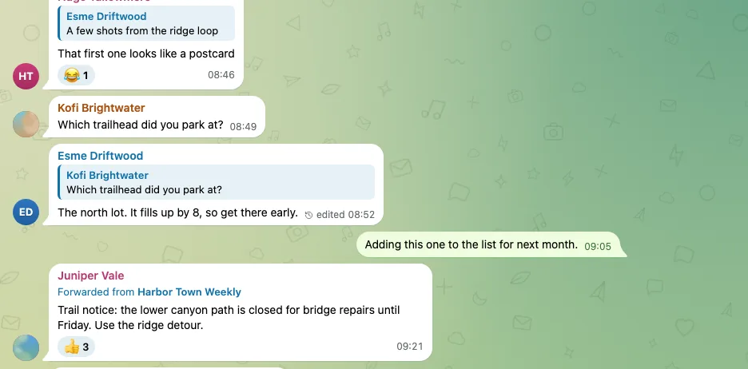

Telegram Day. "edited" with a small history arrow, then 08:52, which is the send time. The edit was at 08:57.

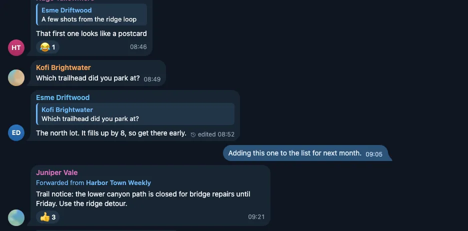

Telegram Night.

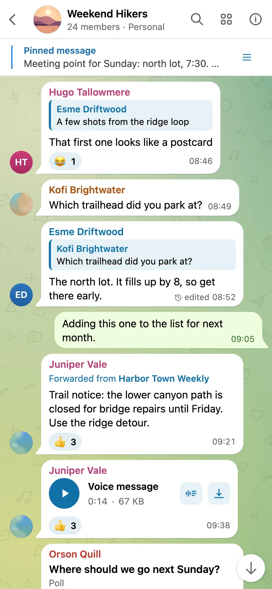

Phone, Telegram Day. [Night phone](edited-messages/00-current/night-phone.webp).

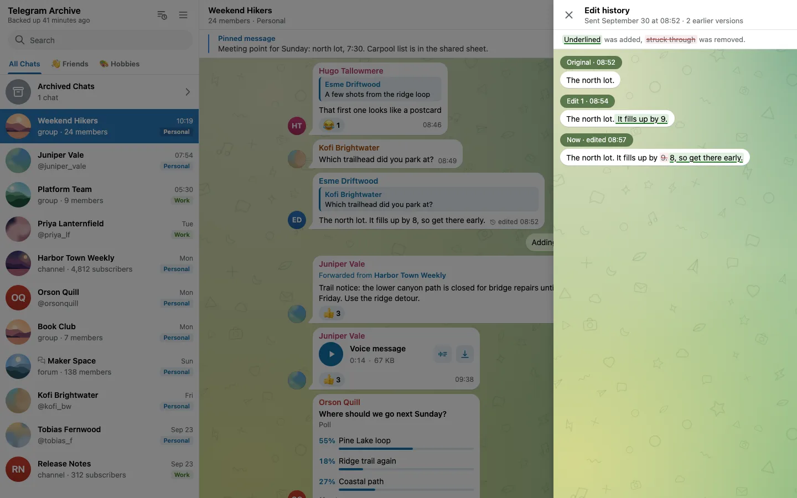

The edit history on a wide screen: a 440px drawer over a dimmed chat, "Original · 08:52", "Edit 1 · 08:54" and "Now · edited 08:57" as bubbles on the wallpaper, each later one with its changes underlined or struck. [Night](edited-messages/00-current/night-history-desktop.webp).

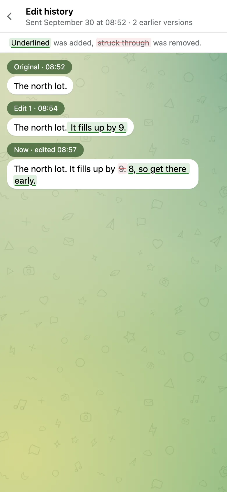

On a phone it is a full page with a back arrow; the chat is gone while it is open. [Night phone](edited-messages/00-current/night-history-phone.webp).

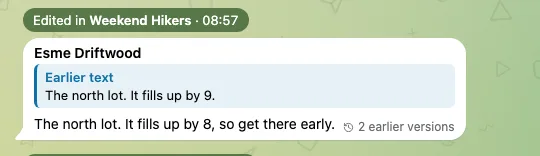

What changed lists each edit as a card with the text before it as a quote, and "2 earlier versions" opens the same history. [Night](edited-messages/00-current/night-feed-desktop.webp), [Day phone](edited-messages/00-current/day-feed-phone.webp), [Night phone](edited-messages/00-current/night-feed-phone.webp).

How a reader finds out today: they notice the word "edited" in the meta row. To see the earlier text they click it, or read "Earlier text" in What changed. The chat's info panel counts "Edited messages", but the count leads nowhere.

What is weak about it:

- **Discoverability.** The mark is 12px meta text at the end of the bubble, the last place the eye reads. Nothing on screen says that it is a button.
- **"edited 08:52" misleads.** The time is the send time, as in Telegram's own apps, but beside the word "edited" it reads as the edit time. The edit time is only in the tooltip, which a phone cannot show.
- **How many edits.** The count is only in the tooltip and the aria label. "edited" looks the same for one edit and for twenty, and for a message with no kept history at all.
- **Where the history opens.** On a wide screen it covers a third of the chat and dims the rest, so the message it belongs to is hard to see beside it. On a phone it replaces the chat.
- **Keyboard.** The mark is a real button: Tab reaches it, Enter opens the drawer, focus moves to Close and returns on close. A message with no history gets a plain "edited" span that Tab skips, so its tooltip is out of reach from a keyboard or a screen reader.
- **Finding edits.** There is no way to list a chat's edited messages except scrolling or the global What changed feed.

## All seven at a glance

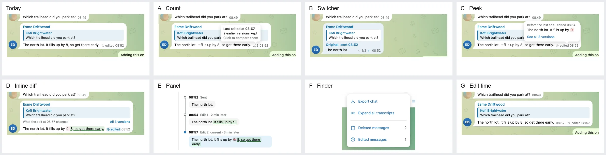

The edited message in each option, Telegram Day. E is shown by its timeline and F by its menu.

## The options

Contrast figures are computed from each theme's token values for the incoming bubble, where the demo's edited message sits, against the surface the text actually sits on, with tints blended over it. Today's meta text is 5.23:1 on Day and 5.72:1 on Night.

### A. Count

The meta row shows a pencil and the number of edits the archive saw, here "2", where it shows "edited" today. Hovering says when the last edit was and how many earlier texts are kept; a click still opens the history. A message with no kept history shows the pencil alone.

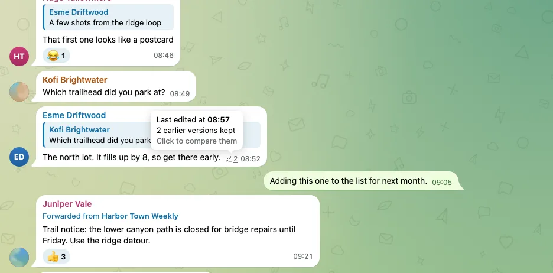

Telegram Day, with the tooltip as under a resting pointer.

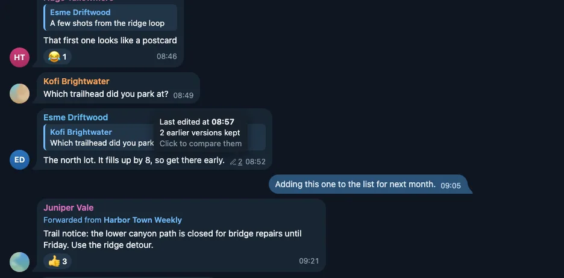

Telegram Night.


Phone, Telegram Day. A tap opens the history, as today. [Night phone](edited-messages/A-count/night-phone.webp).

- **Cost.** Template only. `msg.version_count` already comes with each message. The tooltip should be a real element, not a `title`, so it can hold two lines and open on focus. The mockup is [`A-count/override.js`](edited-messages/A-count/override.js).
- **Contrast.** The pencil and count use the meta colour: 5.23:1 on Day, 5.72:1 on Night. Tooltip text 21:1 and 14.94:1, its hint 5.08:1 and 5.78:1.
- **Pros.** Says "how many" at a glance, takes less room than the word, and the pencil is a familiar sign that also works without reading English.
- **Cons.** The count is the edits the archive saw, which can be fewer than the real ones (see the sync above). A bare number is less self-explanatory than a word, so it leans on the tooltip and the aria label. The pencil is small at 12px.
- **Combines with.** Everything. With G, the tooltip can drop the time, since the row shows it.

### B. Switcher

"‹ 3/3 ›" in the meta row flips the bubble's text between its versions in place. On an earlier version a line at the top of the bubble names it, "Original, sent 08:52", and the bubble takes the side's quote tint, so an old text is never taken for the current one.

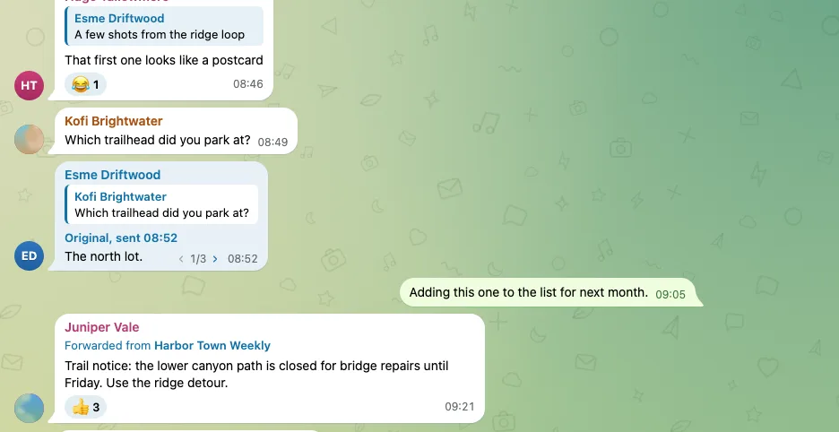

Telegram Day, flipped back to the original.

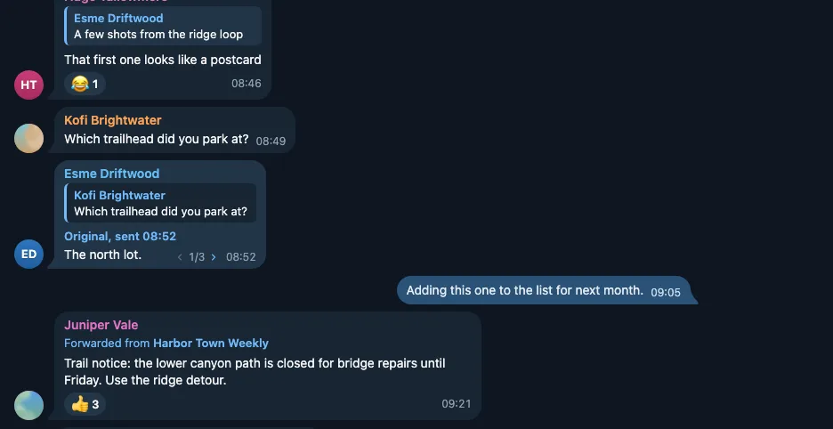

Telegram Night.

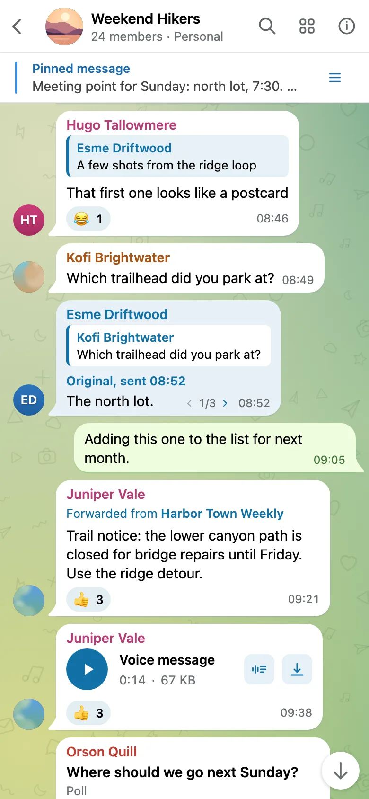

Phone, Telegram Day. [Night phone](edited-messages/B-switcher/night-phone.webp).

- **Cost.** Template and script: the switcher, per-row state, and the versions loaded on the first press through the existing `loadMessageVersions`. No backend change. Mockup: [`B-switcher/override.js`](edited-messages/B-switcher/override.js).
- **Contrast.** On the tinted bubble the arrows and the label are 4.63:1 on Day and 6.14:1 on Night, the meta text 4.56:1 and 4.69:1, the body text 18.31:1 and 11.70:1. The Day figures are close to the line, so the tint cannot get stronger. A disabled arrow is dimmed and also has `disabled`, so it does not rest on colour.
- **Pros.** Every version is one press away without leaving the chat, and the old text reads in its own bubble, as it looked.
- **Cons.** The bubble changes width and height as the reader steps through, and the list jumps. It shows no diff, so small changes are hard to spot. On a phone the arrows need 40px touch areas, which the meta row barely has. An old text in the chat's place can end up in a screenshot without its context.
- **Combines with.** A (the count becomes the "3" of "3/3"), E.

### C. Peek

Hovering the mark for half a second, focusing it, or a long press on a phone shows the text before the last edit in a small popover, with the words that edit removed marked, and "See all 3 versions" to open the history.

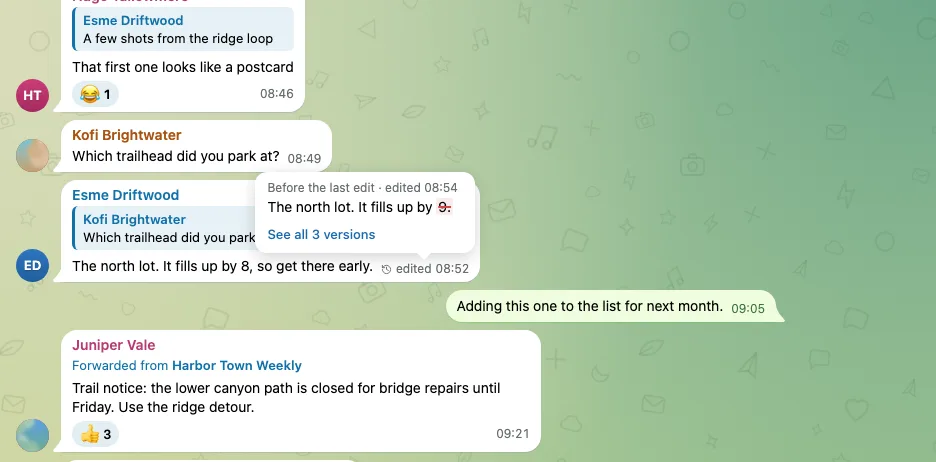

Telegram Day. The popover sits over the mark.

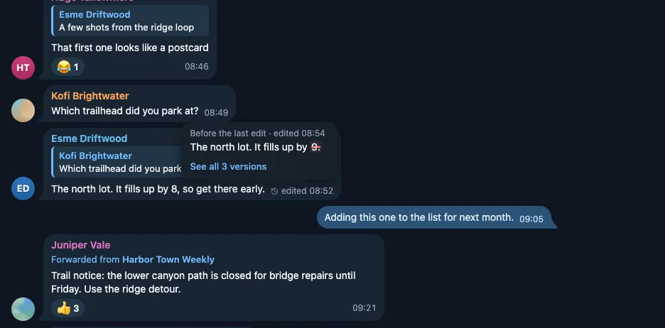

Telegram Night.

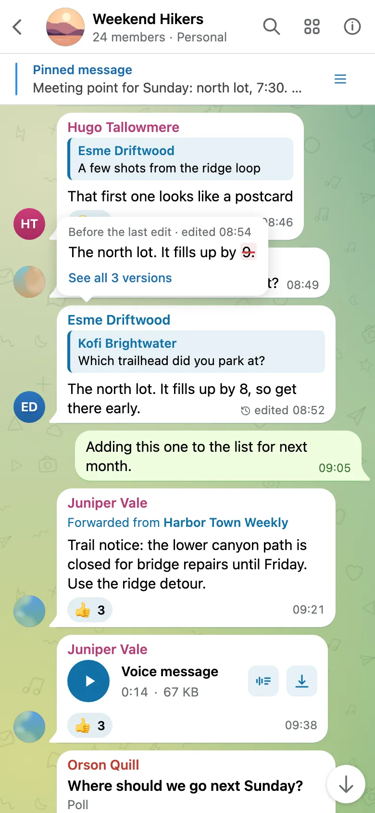

Phone, Telegram Day, after a long press. The popover sits above the bubble, so the finger and the popover leave the current text in view. [Night phone](edited-messages/C-peek/night-phone.webp).

- **Cost.** Template and script: a popover with a hover delay, focus, long press and Escape, and the versions loaded on the first peek. No backend change. Mockup: [`C-peek/override.js`](edited-messages/C-peek/override.js).
- **Contrast.** The popover uses the panel colour. Its heading is 5.08:1 on Day and 5.78:1 on Night, the text 21:1 and 14.94:1, a removed word on its red tint 18.27:1 and 12.62:1 (struck through as well, so it does not rest on colour), the link 5.59:1 and 7.84:1.
- **Pros.** Answers the usual question, "what did it say before?", in one gesture and without leaving the chat. Adds nothing to the bubble when idle.
- **Cons.** Hover is invisible until tried, and long press on a phone competes with text selection. Shows only one step back. On Night the popover's panel colour is close to the bubble's, so it leans on its shadow.
- **Combines with.** A or G for the mark, E for "See all".

### D. Inline diff

A click on "edited" turns the bubble's own text into the diff of its last edit: added words underlined on a green tint, removed ones struck on a red tint, under a line "What the edit at 08:57 changed" with "All 3 versions". The pressed mark takes the quote tint; a second click turns it back.

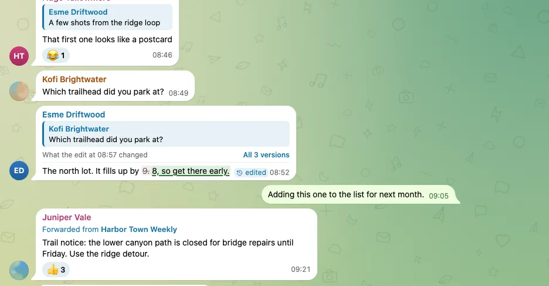

Telegram Day, turned on.

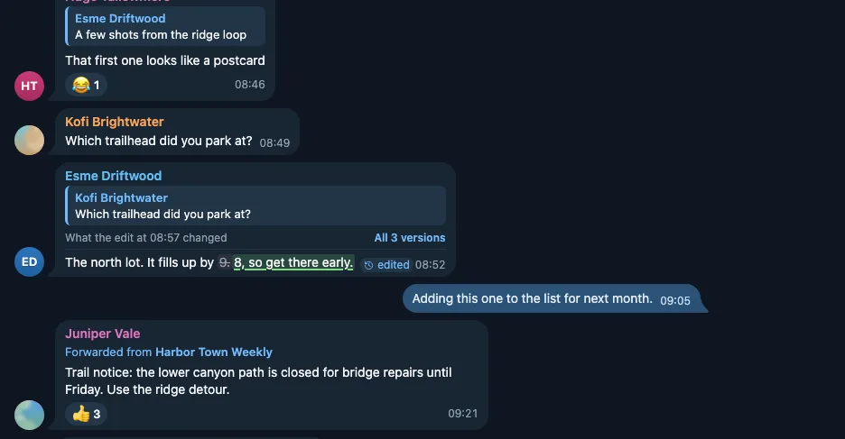

Telegram Night.

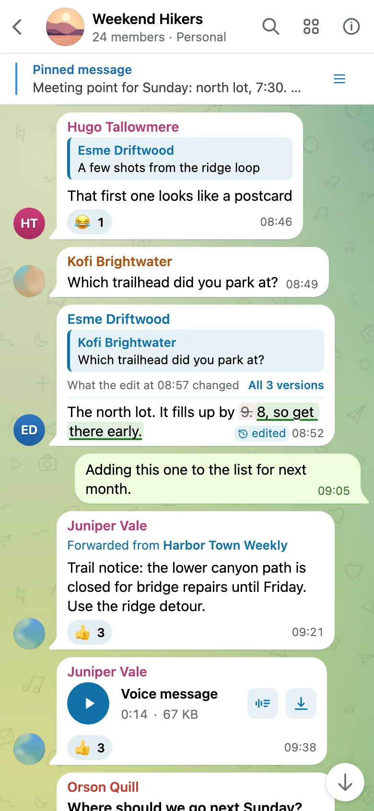

Phone, Telegram Day. [Night phone](edited-messages/D-diff/night-phone.webp).

- **Cost.** Template and script: a toggle, a set of open rows, and the viewer's own `diffWords`, with versions loaded on the first press. No backend change. Mockup: [`D-diff/override.js`](edited-messages/D-diff/override.js).
- **Contrast.** The heading line 5.23:1 on Day and 5.72:1 on Night, "All 3 versions" 5.31:1 and 7.48:1, added text 17.67:1 and 9.04:1, removed words 4.55:1 and 4.86:1, the pressed mark 4.63:1 and 6.14:1. Added words are underlined and removed ones struck, so neither rests on colour.
- **Pros.** The change itself, in place, with the same marks as the history. The best for small edits such as a number or a date.
- **Cons.** The mark changes meaning from "open the history" to "show changes", so the history moves to a second click. The bubble grows a line and its text becomes harder to read while on. Only the last edit.
- **Combines with.** E. It replaces C rather than sitting beside it, since both answer "what changed".

### E. Panel

The edit history opens beside the chat on a wide screen, with no scrim: the chat moves over to make room and stays readable, and the message the panel is about is highlighted. On a phone it opens as a bottom sheet sized to its content, with the message visible above it. The versions run down a timeline: "08:52 Sent", "08:54 Edit 1 · 2 min later", "08:57 Edit 2, current · 3 min later", as cards on the panel's surface instead of bubbles on the wallpaper.

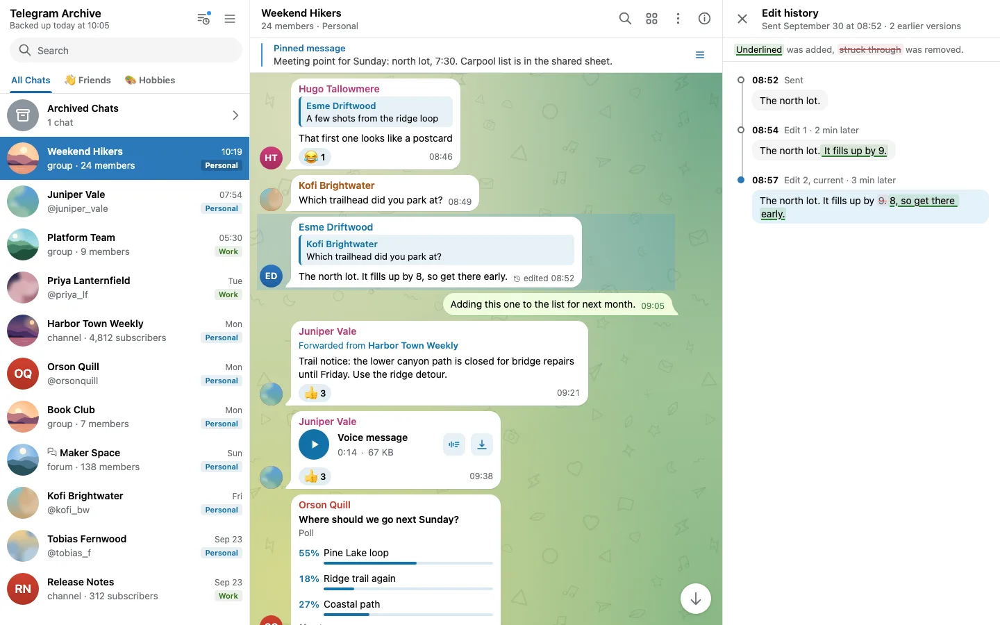

Telegram Day.

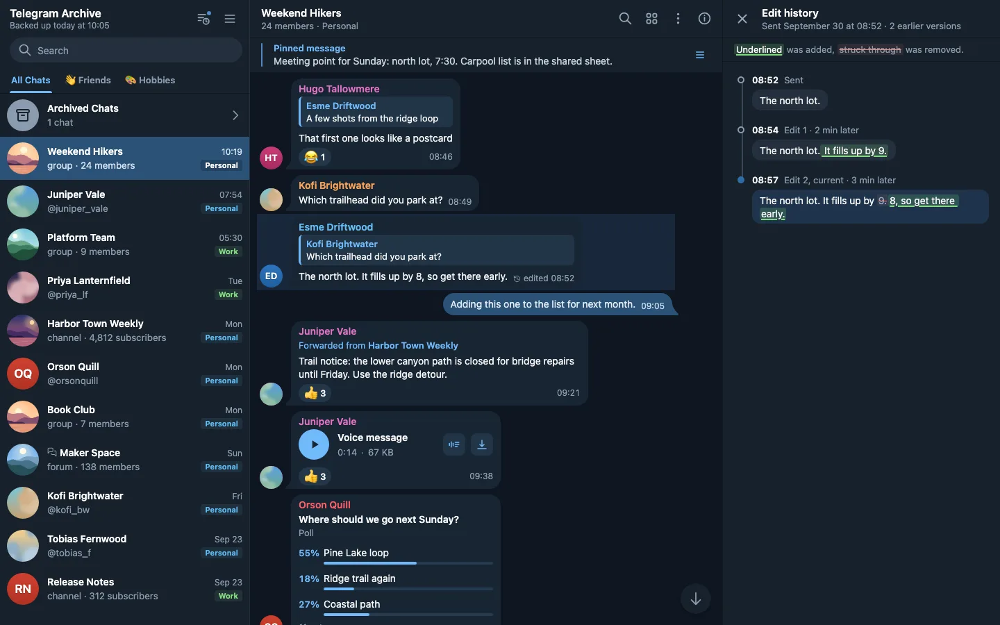

Telegram Night.

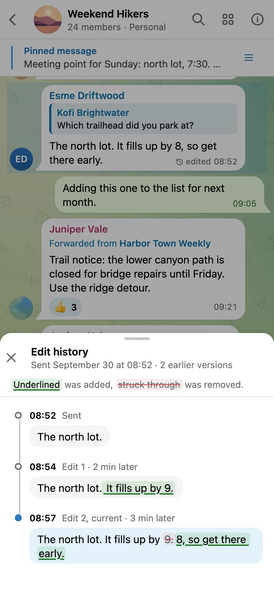

Phone, Telegram Day. A cross closes the sheet, where the page had a back arrow. [Night phone](edited-messages/E-panel/night-phone.webp).

- **Cost.** Mostly CSS, plus a little template and script: the side layout (the chat column narrows while the panel is open), the highlight on the source row, and the timeline labels from `versionEntries`. No backend change. Mockup: [`E-panel/override.css`](edited-messages/E-panel/override.css) and [`E-panel/override.js`](edited-messages/E-panel/override.js). A side panel with no scrim is not modal, so focus handling changes: focus still moves to the panel and back, but Tab may leave it, and Escape closes it.
- **Contrast.** Card text 19.11:1 on Day and 12.44:1 on Night, the current card 18.39:1 and 11.67:1, labels 5.08:1 and 5.78:1, added text 16.27:1 and 7.97:1. Removed words take the darker neutral on the grey card, 4.69:1 and 4.82:1; the time colour would be 4.16:1 and 4.23:1 there.
- **Pros.** The message and its history side by side; the times say what happened and how long after. The phone keeps the chat in view.
- **Cons.** The chat column gets narrower on medium screens. The cards lose the bubble look that says "this is how it appeared".
- **Combines with.** Every other option, since each of them still needs a full history.

### F. Finder

"Edited messages" in the chat's "More actions" menu, beside the "Deleted messages" row of the deletions design, opens the chat search in an "Edited" mode: the list narrows to the edited messages and the days they belong to, read from the top, with the count on the right. The "Edited" and "Deleted" chips switch between the two modes. On a phone, where the menu's actions live in the info panel, the "Edited messages" and "Deleted messages" figures of "In the archive" become rows that do the same.

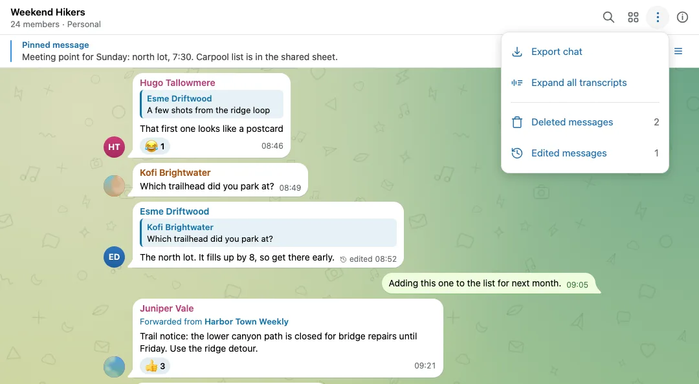

Telegram Day, the menu. [Night](edited-messages/F-finder/night-desktop-menu.webp).

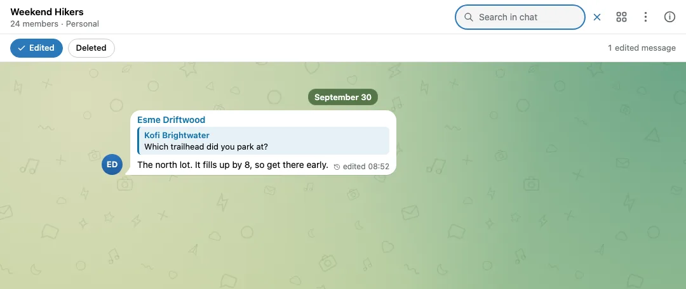

Telegram Day, the "Edited" mode. [Night](edited-messages/F-finder/night-desktop-search.webp).

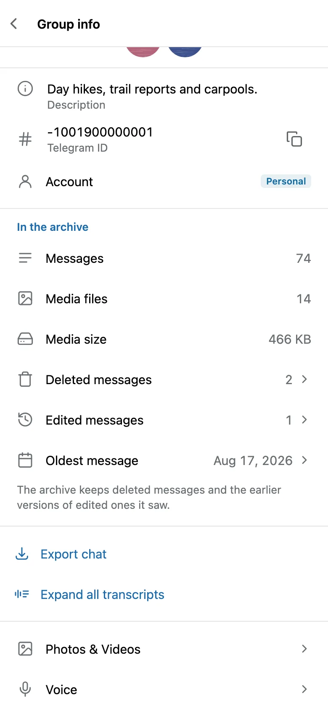

Phone, the info panel rows with a chevron. [Night](edited-messages/F-finder/night-phone-menu.webp).

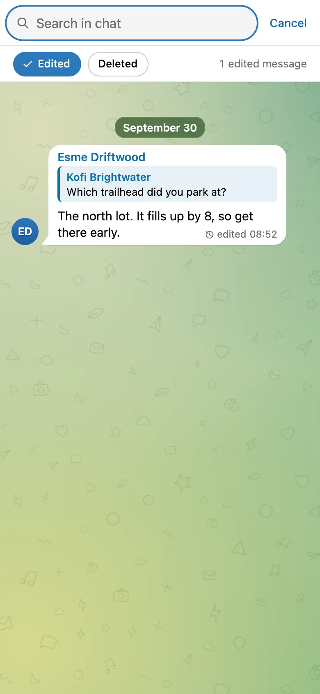

Phone, the "Edited" mode. [Night](edited-messages/F-finder/night-phone-search.webp).

- **Cost.** Template, script and backend. The count exists (`chatStats.edited_messages`, messages with an `edit_date`). The mode needs an `edited_only` parameter on the chat's message query, working with the search text, on SQLite and PostgreSQL, and within a viewer's account restrictions; the deletions finder needs the same shape with `deleted_only`, so both should land together. The mockup hides the other rows, in [`F-finder/override.js`](edited-messages/F-finder/override.js).
- **Contrast.** Menu rows 5.59:1 on Day and 7.84:1 on Night, their counts 5.08:1 and 5.78:1. The pressed chip is white on the accent, 4.67:1 and 5.39:1, with a check as well as the fill; an unpressed chip is 21:1 and 16.29:1.
- **Pros.** Answers "what was edited in this chat?" in two clicks, which no bubble style can, and matches the deletions design, so a reader learns one pattern for both.
- **Cons.** The most work, including a server change. The count includes messages that only show "edited" with no history.
- **Combines with.** Everything. It does not mark bubbles.

### G. Edit time

The meta row says when the message was edited, not only that it was: the send time first, as on every bubble, then "edited 08:57". An edit on a later day shows the day, "edited Oct 1".

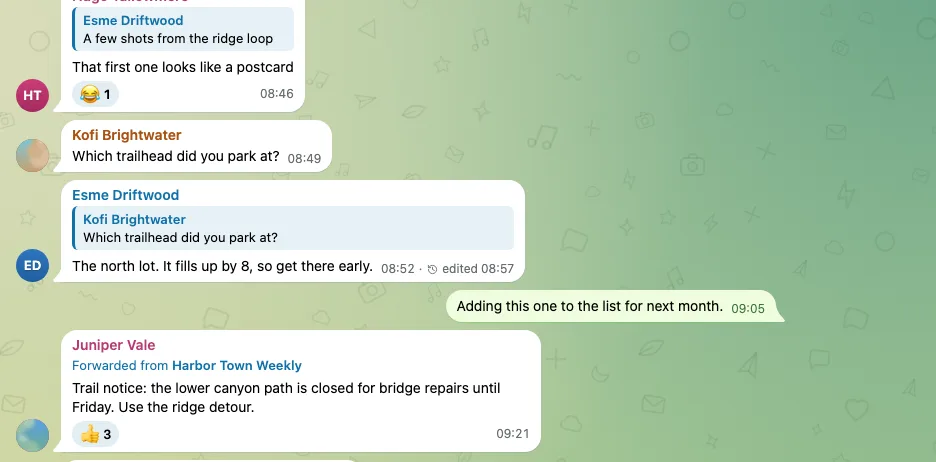

Telegram Day.

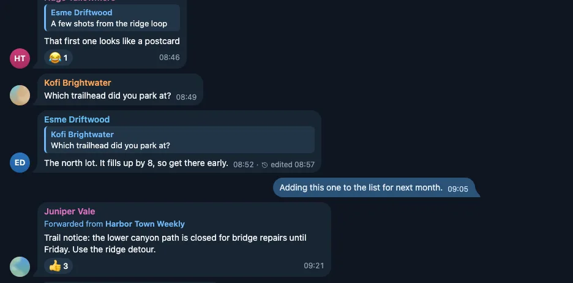

Telegram Night.

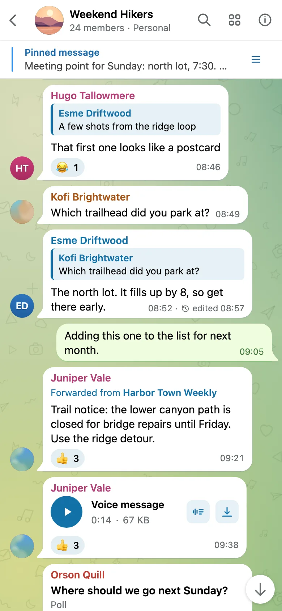

Phone, Telegram Day. [Night phone](edited-messages/G-edit-time/night-phone.webp).

- **Cost.** Template only, from `msg.edit_date`. Mockup: [`G-edit-time/override.js`](edited-messages/G-edit-time/override.js).
- **Contrast.** The meta colour, 5.23:1 on Day and 5.72:1 on Night.
- **Pros.** Removes the misreading of "edited 08:52", and gives phones the edit time, which today only a tooltip has.
- **Cons.** The widest meta row of all, so short messages wrap the meta onto its own line more often. It breaks from Telegram's own "edited 08:52".
- **Combines with.** A: the send time, then the pencil with its count and "08:57", is short enough, with the rest in the tooltip.

## Recommendation

We recommend **A + C + E + F**, with G's honesty folded into A's tooltip, and the capture changes below.

- **A** makes an edit visible and says how many edits the archive saw, at no backend cost. Its tooltip, and its aria label, say the edit time, so "08:52" beside it stops reading as the edit time. G is the alternative if the maintainer wants the edit time visible without hovering, at the cost of a wider meta row.
- **C** answers the most common question, the text before, without opening anything. It sits on the same mark as A: hover or focus peeks, a click opens the history.
- **E** fixes where the history opens: beside the chat on a wide screen and as a sheet on a phone, with the times on a timeline.
- **F** matches the deletions finder the maintainer chose and should ship in the same change, with one `edited_only` and `deleted_only` query.
- B and D solve the same problem as C at more cost and more movement in the list. D is the better of the two if a click-to-diff is preferred over a hover peek.
- A message with "edited" and no kept history should say so where every reader can reach it, including on a phone: the pencil without a count is a button that opens the history with "The archive did not see the earlier text".

For capture, in order of value, all beside existing data:

1. Done: the listener no longer rate-limits edits, so a burst of reactions cannot block real text edits. See [Mass-operation protection](../configuration/listener.md#mass-operation-protection).
2. Done: download a replaced photo or file as a new media row, keeping the old one. See [A replaced photo or file](#a-replaced-photo-or-file).
3. Done: keep formatting with each version, and version formatting-only edits.
4. Done: record the source of each version and return `captured_at`, so the viewer can say "at least N edits" for versions the sync found.

## How to choose

Reply with letters, for example "A + C + E + F", "G + E", or "A + D + E + F". A tweak is fine too, for example "A, with the word edited kept beside the count". Say which capture changes to take as well, by number. The chosen options then move from their override files into the viewer, with the template, script and backend changes their sections list.

## How the pictures were made

Seed the demo archive with `scripts/generate_dummy_db.py`, run the viewer on it, then run the rig once per option and theme, for example:

```bash
node docs/design/rig/shoot.mjs --only 31 --port 8112 --out /tmp/c-day \
    --theme telegram --scheme light \
    --css docs/design/edited-messages/C-peek/override.css \
    --js docs/design/edited-messages/shared.js,docs/design/edited-messages/C-peek/open.js,docs/design/edited-messages/C-peek/override.js
```

View 31 is the edited message in its chat, cropped on a wide screen to the message column around it; E uses view 12, the edit history. Night is `--theme night --scheme dark`. The state scripts (`A-count/hover.js`, `B-switcher/original.js`, `C-peek/open.js`, `D-diff/on.js`, `F-finder/menu.js`, `F-finder/search.js`) load before the option's `override.js` and put it in the state the picture shows. `--base http://host:port`, `VIEWER_BASE_URL` or `VIEWER_PORT` can stand in for `--port`. The viewer allows 15 logins in 5 minutes and every rig run logs in twice, so a long session needs a restart of the viewer now and then.
