# Open questions from the fix lanes

> **Decided 2026-10-01: `1C 2A 3B 4C 5C 6A 7C 8.1B 8.2A 8.3A 8.4C 8.5A 9C 10C`.** Everything targets 9.0. 7C drops the flat `message_versions` list from both exports in 9.0 instead of deprecating it first. 3B extends the backfill command the location and contact work adds, so the archive has one command that reads messages again from Telegram. 8.2, 8.3 and 8.5 keep today's behaviour.

The fix lanes merged as [#517](https://github.com/GeiserX/Telegram-Archive/pull/517) to [#522](https://github.com/GeiserX/Telegram-Archive/pull/522) left decisions only the owner can make. This page lists them, each with what happens today, the options and a recommendation. Ten questions remain after checking each candidate against the code on `main`. [Dropped candidates](#dropped) lists the ones the code or the roadmap already answers.

The pictures are the real viewer on the demo archive, with a small script per option that puts a demo message in the state the question is about. [How the pictures were made](#how-the-pictures-were-made) has the commands.

## 1. Earlier media in the exports

**Today.** Neither export lists media at all, current or earlier. The viewer's **Export chat** never passes `include_media` to `get_messages_for_export` in [`db/adapter.py`](../../telegram_archive/db/adapter.py). `telegram-archive export` writes `_message_to_dict`, which dropped media in 6.0. Each message's `versions` holds `text`, `date` and `captured_at` only. Transcripts of a replaced audio do stay in search and in both exports, as the [changelog](../CHANGELOG.md) says, through `_transcribed_media_owners`.

A voice note whose audio was replaced, with a transcript of each audio, as `telegram-archive export` writes it:

```json
{
  "id": 1270,
  "text": "",
  "edit_date": "2026-10-01T10:40:00",
  "versions": [
    { "text": "", "date": "2026-10-01T10:38:00", "captured_at": "2026-10-01T10:40:00" }
  ],
  "transcripts": [
    { "media_id": "-1001900000001_1270_voice_v1", "text": "Meet at seven thirty at the north lot." },
    { "media_id": "-1001900000001_1270_voice", "text": "Meet at eight at the south lot." }
  ]
}
```

Nothing else in the file names either `media_id`, so the reader cannot tell which transcript belongs to the audio a listener hears today.

**Options.**

- **A. Leave it.** The exports carry the text history, and the files stay in the archive.
- **B. Earlier media under its version.** Each version gains `media` with its `media_id`, type, file name, size, MIME type, dimensions and duration, with no file path. A transcript then matches an earlier media by id. One more read per message in both exports.
- **C. B, plus the current media on each message.** Each message gains `media` with the same fields, so every transcript matches a media listed in the same file. It costs one more join, and the files themselves stay out of the export.

```json
{
  "id": 1270,
  "media": { "media_id": "-1001900000001_1270_voice_v1", "type": "voice", "duration": 9, "mime_type": "audio/ogg" },
  "versions": [
    {
      "text": "",
      "date": "2026-10-01T10:38:00",
      "captured_at": "2026-10-01T10:40:00",
      "media": [ { "media_id": "-1001900000001_1270_voice", "type": "voice", "duration": 7, "mime_type": "audio/ogg" } ]
    }
  ],
  "transcripts": [ "...as today..." ]
}
```

**Recommendation: C.** A transcript that points at a media the file never lists is a dangling reference, and an export should explain itself.

## 2. A replaced photo in an open chat

**Today.** The listener's `edit` frame carries the text, the edit time, the hide flag and the formatting, not the media. The viewer moves the pencil at once and keeps the photo it had. For a message among the newest 50, the 3 second refresh brings the new photo. The refresh pauses while a search, a filter or the pinned window is open. So for an older message, or with one of those open, the earlier photo stays until a reload.


**Options.**

- **A. The frame carries the media.** The listener already awaits the new download before it sends the frame, and the `new_message` frame already carries a nested `media` dict of the same shape. Backend and viewer, small.
- **B. The viewer reads the message again.** On an `edit` frame for a row in view, it asks the messages endpoint for that one message with the paging parameters it already has. Viewer only, one request per edit.
- **C. Leave it.** The newest 50 rows catch up within 3 seconds; older rows need a reload.


**Recommendation: A.** The listener holds the new media row when it sends the frame, so carrying it costs one field and no extra request.

## 3. The pencil on rows archived before migration 034

**Today.** Telegram moves a message's edit time when only its reactions change and flags that edit as hidden. Since migration 034 the archive keeps the flag in `edit_hide`. Rows archived before it have no flag, so a reaction-bumped row shows a pencil with no count, and its tooltip says "The archive did not see the earlier text". A backup read of the same edit fills the flag through `get_unflagged_edit_ids`. That read is a re-scan, a gap fill or a `SYNC_DELETIONS_EDITS` pass, and a chat nothing reads again keeps its pencils. `raw_data` keeps no copy of the flag, so it can only come from Telegram.

In the pictures, "That first one looks like a postcard" had its edit time moved by a reaction. "Which trailhead did you park at?" was really edited before the archive first read it. Both were archived before 034.


**Options.**

- **A. Leave it.** Rows heal as backups read them again. A chat that is never re-read keeps a pencil on every reaction-bumped message.
- **B. A one-off backfill command.** It reads from Telegram the rows with an edit time, no flag and no kept version, 100 per request, and fills the flag with the same write the sync uses. It costs Telegram calls in proportion to those rows, once.
- **C. Hide the pencil when the flag is empty and no version is kept.** Viewer only, no Telegram calls. A message really edited before the archive first read it loses its pencil too, and that is a common case.

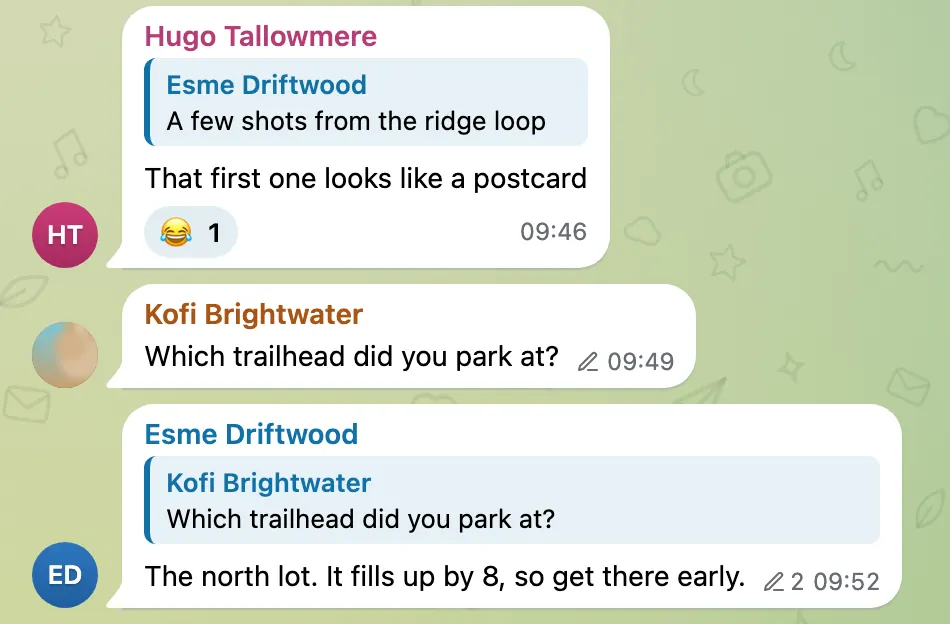

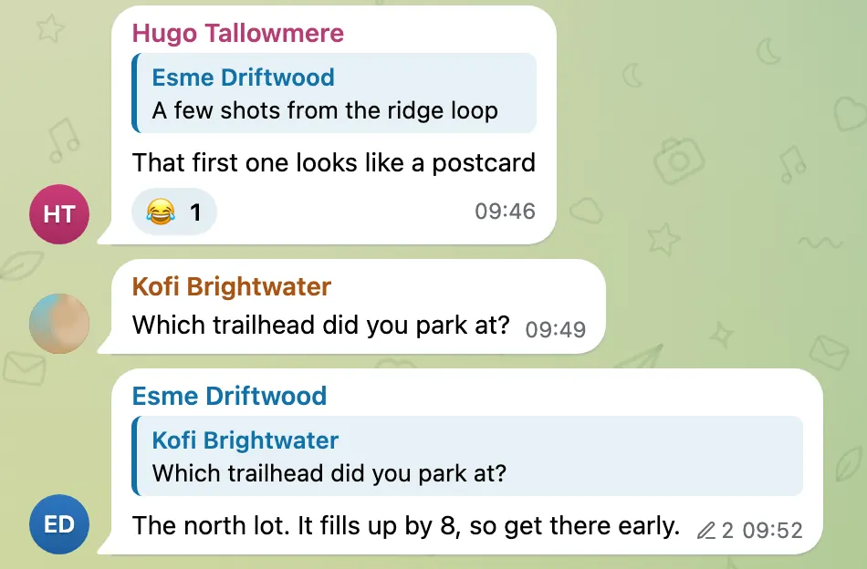

**Recommendation: B.** It is the only option that is right for both rows, and it runs once.

## 4. Reaction history is overwritten

**Today.** `reconcile_reactions` keeps one row per emoji. When a count drops without reaching zero, say from 7 to 5, it writes the new count over the old one. When a taken-back emoji comes back, it clears `removed_at` on the same row. Both earlier states are lost, against the archive principle. Bead `Telegram-Archive-50y` tracks it. The viewer's list of reactions taken back shows only emojis that went to zero and stayed there.

In the pictures, seven hearts dropped to five, and the surprised face was taken back and given again.


**Options.**

- **A. Leave it.** The docs already say these two cases are not kept.
- **B. Keep a history, viewer unchanged.** A reaction history table, one row per observed state with `observed_at`, from an idempotent migration on both engines. The messages endpoint and the exports return it, under every viewer restriction. Nothing new on screen.
- **C. B, and the list of reactions taken back shows it.** A partial drop reads "2 of 7", and a reaction that came back reads "back 11:12".

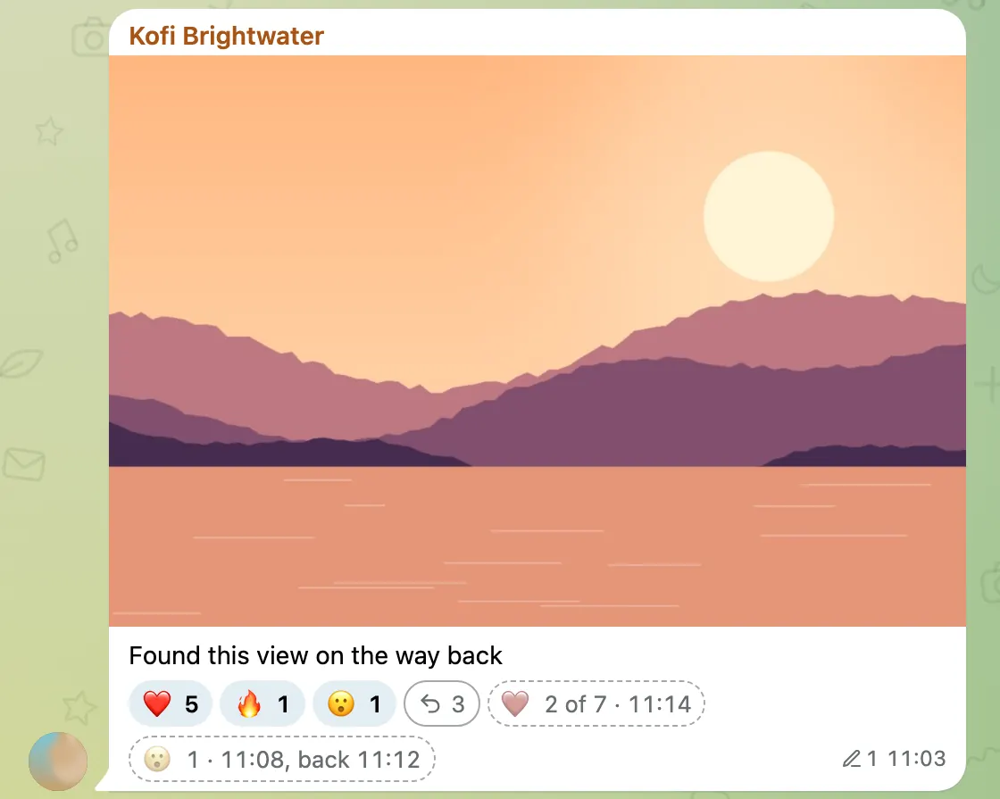

**Recommendation: C**, with the capture in its own pull request first. Every day without the table loses history that no later change can recover. The list is the cheap half.

## 5. Reactions taken back in What changed

**Today.** What changed lists deletions, edits and transcripts, from `get_recent_changes`. A reaction taken back shows only in its bubble.

**Options.**

- **A. Leave it.** The bubble's list stays the only place.
- **B. A "Reaction taken back" card per tombstone, on by default.** The filter gains a "Reactions taken back" kind. The cards read from `removed_at`, and also from the history of question 4 if that lands.
- **C. B, off by default.** The same cards and kind, unticked until the reader asks.

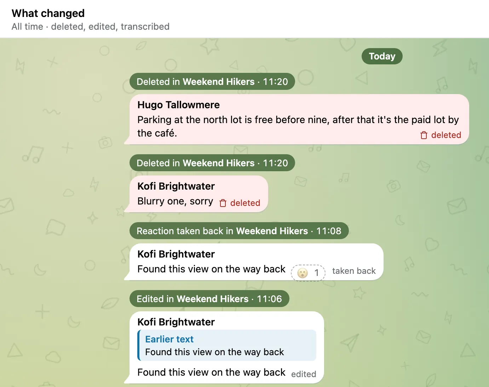

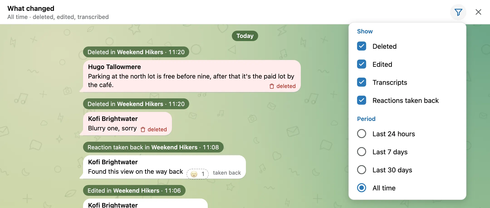

**Recommendation: C.** Reactions come and go far more often than deletions and edits, and on by default they would bury them.

## 6. The period of What changed for one chat

**Today.** What changed for one chat uses the period remembered for the whole feed, `changesPeriod` in the browser's local storage. A period picked inside the chat's feed is written back as the whole feed's period too. In the picture the reader had looked at the last 24 hours across every chat. The book club's feed then opens on "Last 24 hours" and shows one of its four edits.

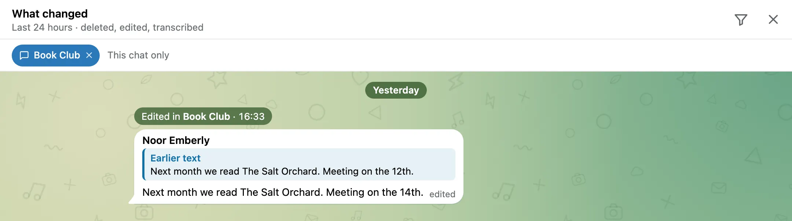

**Options.**

- **A. The chat's feed opens on All time, and its period is not remembered.** A chat's own feed is short, so All time fits. Picking a period there no longer changes the whole feed's.
- **B. Each chat remembers its own period.** It needs one more stored key per chat, and the reader has to learn that each chat keeps its own.
- **C. Keep the shared period, and say so.** A line beside the chip: "Last 24 hours, as in What changed for every chat", with **Show all time**.

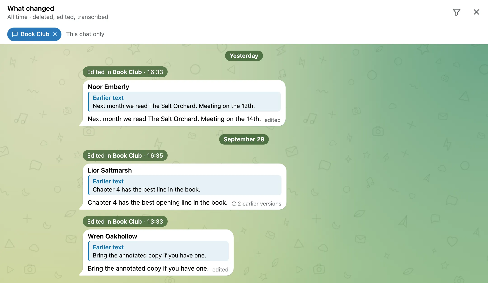

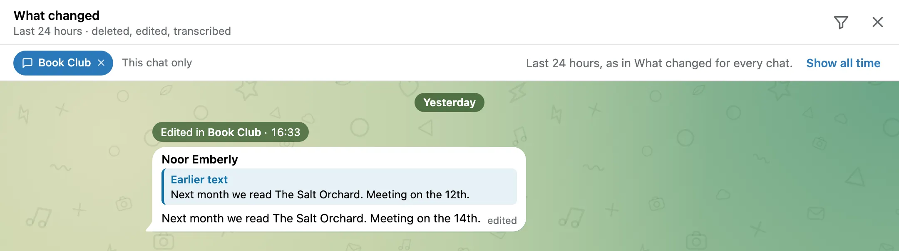

**Recommendation: A.** Nothing to remember and nothing to explain.

## 7. The flat `message_versions` list in the exports

**Today.** Both exports write each message's `versions` and, at the end, the flat `message_versions` list. They are not duplicates. The per-message list has `text`, `date` and `captured_at` and covers every version of an exported message. The flat list is windowed by the version's own date, has no account, and alone carries `source`, `entities` and `rich_message`. The changelog says both exports return those three per version. That holds only for the flat list.

```json
{
  "messages": [ { "id": 1262, "versions": [ { "text": "The north lot.", "date": "...", "captured_at": "..." } ] } ],
  "message_versions": [
    { "chat_id": -1001900000001, "message_id": 1262, "text": "The north lot.", "date": "...", "captured_at": "...",
      "source": "listener", "entities": null, "rich_message": null }
  ]
}
```

**Options.**

- **A. Keep both as they are.** Readers keep two shapes with different coverage.
- **B. Complete the per-message list, deprecate the flat one, drop it in 9.0.** `versions` gains `source`, `entities` and `rich_message`, plus the media of question 1 if it lands. The docs mark `message_versions` deprecated, and the next major release removes it.
- **C. Complete the per-message list and drop the flat one in the next release.** Simpler sooner, but it breaks scripts in a minor release.

**Recommendation: B.** One complete shape, and scripts get a release cycle to move.

## 8. Smaller capture rules from #521

Each rule is answered on its own: `8.1A`, `8.2A`, and so on.

**8.1 Formatting added to an unformatted message.** Today the backup and the listener store `entities` only when the list is not empty, and an absent key reads as "unknown". So adding bold to any plain message, new or old, fills the key silently. It keeps no version, shows no pencil and leaves the edit time where it was. **A.** Keep it. **B.** Store `entities: []` at capture for new messages, so the next formatting edit counts as an edit. Older rows stay unknown. **Recommendation: B.** Today the rule meant for old rows also swallows every formatting edit of a plain new message.

**8.2 Media replaced at the same edit time.** Today a read whose edit time equals the archived one may replace the media, as long as Telegram's file id differs. The rule lives in `_shows_replacing_edit`. **A.** Keep it. **B.** Require a strictly newer edit time. **Recommendation: A.** The time has one-second resolution and bots edit twice a second; the id check already stops a repeat read.

**8.3 An old file name read as a Telegram id.** Today a stored name starting with 15 to 20 digits gives the file id for rows from before migration 036. **A.** Keep it; a name that matches by chance replaces nothing without an edit Telegram shows. **B.** Compare only `telegram_file_id`, so older rows never detect a replacement. **Recommendation: A.** The second condition already guards it.

**8.4 An edit of a message the archive has not stored.** Today the listener stores the message through the new-message path, quietly. It fires no `message_edited` webhook, sends no live frame, and counts in `edits_skipped` rather than `new_messages_saved`. **A.** Keep it. **B.** Fire `message_edited` with `old_text` null and count it as stored. Telegram also sends a reaction to an old message as an edit, so B would fire edit webhooks for reactions. **C.** Count it in a new `edits_stored` figure, no webhook. **Recommendation: C.** The count stops hiding the stored message, without false webhooks.

**8.5 `MASS_OPERATION_THRESHOLD` and `MASS_OPERATION_WINDOW_SECONDS` count deletions only.** **A.** Keep the names; the docs already say so. **B.** Add `MASS_DELETION_*` names, read the old ones as fallbacks, and drop them in 9.0. **Recommendation: A.** Deletions are the only mass operation left, so the name still reads true, and a rename costs every operator a config edit.

## 9. Polls, live locations and link previews that change later

**Today.** Polls, live locations and link previews live in `raw_data` as first captured. A poll's later votes and its closing, a live location's later positions, and a link preview Telegram fills in later are never seen. [Edited messages](edited-messages.md#what-it-cannot-know-or-keep) left a proposal for this, undecided.

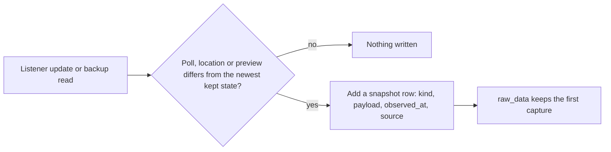

**Options.**

- **A. Leave it.** Nothing old is lost. The archive just does not follow these.
- **B. Snapshots for all three.** A new table, one row per observed state, the viewer showing the newest. A live location can move every few seconds for hours, so it grows fast.
- **C. Snapshots for polls and link previews only.** Live locations stay as first captured.

```json
{ "chat_id": -1001900000001, "message_id": 1266, "kind": "poll", "observed_at": "2026-10-01T10:12:00", "source": "listener",
  "payload": { "closed": true, "results": { "total_voters": 14 } } }
```

**Recommendation: C.** A poll's result is the point of a poll, and a preview changes rarely. Live locations need a throttle first.

## 10. A last-message preview in the chat list

**Today.** The second line of a chat row is the chat's type and size ("group · 24 members"). `/api/chats` returns `last_message_date` and no text. [Viewer look](viewer-ui-proposals.md#open-questions) left the preview open. It also asked whether a deleted or edited last message should show the way the chat does, and whether a viewer restricted to some accounts should see previews.

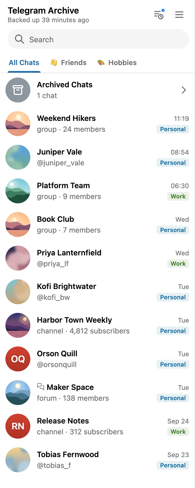

**Options.**

- **A. Leave it.**
- **B. The newest message, deleted or not.** The sender's first name in a group, "You" for the account's own, a word for media with no text. A deleted one shows with the chat's deletion mark.
- **C. The newest message not deleted in Telegram.** Otherwise as B. This is what Telegram's own list shows.

In B and C the preview reads through the same restrictions as the chat's messages, so a restricted viewer sees only what it could open anyway. Both need a last-message read in `get_all_chats` on SQLite and PostgreSQL.

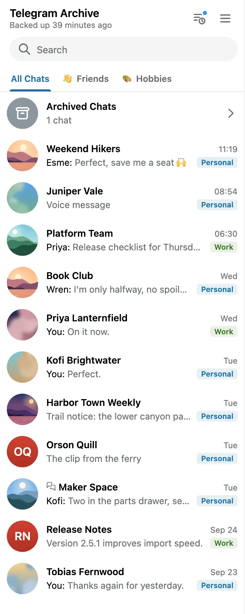

**Recommendation: C.** It matches the Telegram list the viewer copies, and the chat itself still shows the deletion.

## Dropped

- **Voice waveforms.** [Viewer look](viewer-ui-proposals.md#open-questions) asked whether to keep waveform bytes. The [roadmap](../roadmap/index.md) already plans waveforms, so only the implementation is open.
- **The info panel's deleted and edited counts opening What changed.** The roadmap plans it; today they open the chat's Deleted only and Edited only modes.
- **The other questions in Viewer look.** Its "Implemented" note records a decision for the default theme, upgrades, the font, avatar placement, the wallpaper, the theme count and account chips.

## How the pictures were made

Seed the demo archive with [`scripts/generate_dummy_db.py`](../../scripts/generate_dummy_db.py), run the viewer on it, then run [`rig/shoot.mjs`](rig/shoot.mjs) once per option with [`open-questions/shared.js`](open-questions/shared.js) first, the question's shared script if it has one, and the option's `override.js`:

```bash
node docs/design/rig/shoot.mjs --only 35 --port 8131 --out /tmp/q4-c \
    --theme telegram --scheme light --css none \
    --js docs/design/open-questions/shared.js,docs/design/open-questions/4-reaction-history/shared-4.js,docs/design/open-questions/4-reaction-history/C-show-history/override.js
```

| Question | View | Scripts |
|---|---|---|
| 2 | 31 | `2-live-edit-media/<option>/override.js` |
| 3 | 31 | `3-pre-034-pencil/shared-3.js`, then the option |
| 4 | 35 | `4-reaction-history/shared-4.js`, then the option |
| 5 | 10 | CSS `5-feed-reactions/shared-5.css`; `shared-5.js`, then the option |
| 6 | 34 | `6-chat-period/shared-6.js`, then the option; C adds its `override.css` |
| 10 | 01 | `10-chat-list-preview/B-preview/override.js` and `override.css` |

`shared.js` changes the demo rows in the app's own list and in every later answer of the messages endpoint, so the 3 second refresh keeps the state. No template or app code changed. Desktop pictures are 1440 by 900 at 2x, cropped to what matters, Telegram Day. The viewer allows 15 logins in 5 minutes and every rig run logs in twice, so a long session needs a restart of the viewer now and then.
