# Viewer look: four proposals and a recommendation

The viewer works, but it does not look like a Telegram client. Messages sit in tall boxy bubbles, every sender in a group gets the same colour, the light themes turn grey, and the default palette is a generic dark admin navy. This document shows what is wrong, four ways to fix it, and which one to build.

Every proposal is one override stylesheet, the `theme.css` in its folder, loaded into the real viewer after the viewer's own styles. We changed no markup or script for the pictures. [`design/rig/shoot.mjs`](rig/shoot.mjs) took the screenshots against a demo archive with fake chats and people. Desktop views are 1440 by 900 and phone views 390 by 844. The current look is in [`mockups/00-current/`](mockups/00-current/).

| Proposal | Default look | Score | In one line |
| --- | --- | --- | --- |
| [Telegram Desktop](#telegram-desktop) | Telegram Day, light with a green wallpaper | 8.5 | The closest match to the client most people use, and the most consistent across views. |
| [Telegram mobile](#telegram-mobile) | iOS day classic, light with a pattern wallpaper | 8 | The best phone layout, but the most fragile CSS and the most follow-up work. |
| [Refined slate](#refined-slate) | Polished Slate, dark | 7 | Fixes the shapes and keeps the current identity, so it does not answer "a better default colour". |
| [Modern minimal](#modern-minimal) | Neutral light | 6.5 | Calm and readable, and the cheapest, but it stops looking like Telegram. |

In short, we recommend the Telegram Desktop structure for every theme and eleven themes in total. The default becomes "Match system", which shows Telegram Day or Telegram Night. [The recommendation](#recommendation) has the details.

## What is wrong with the current look

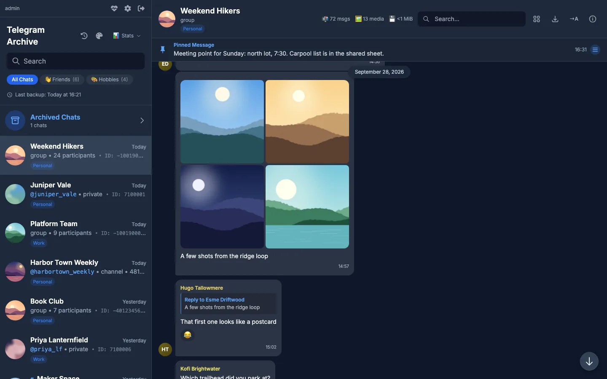

Desktop chat, Slate. Tall bubbles with the time on its own line, every name yellow, every initials avatar olive, and a three-line header with emoji stats.

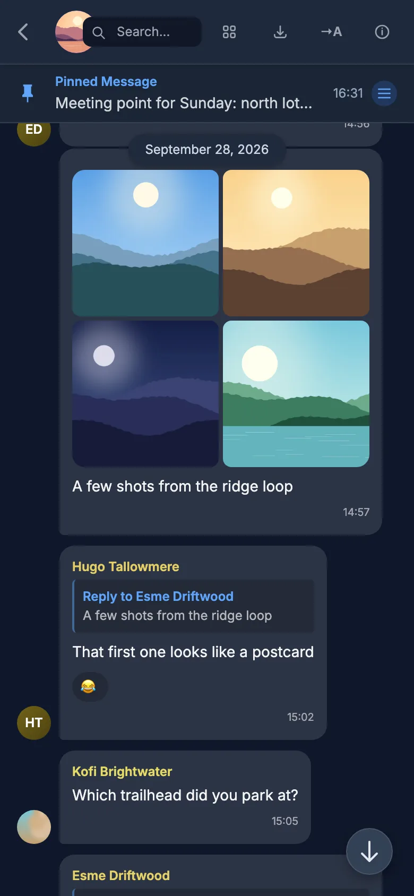

Phone chat. The search box sits on top of the chat photo and the chat name is not visible. The floating date pill covers the top bubble.

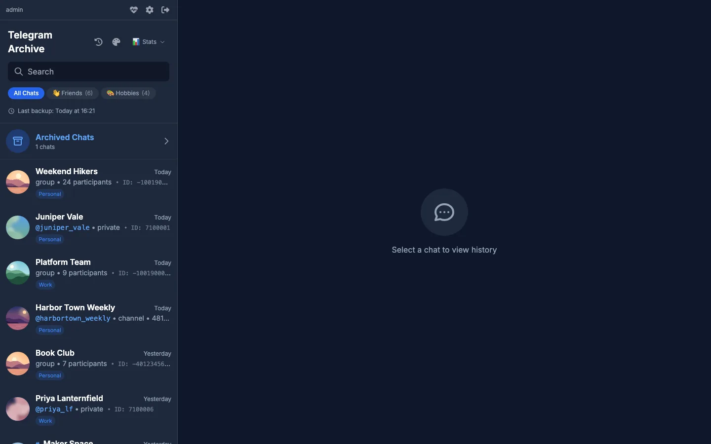

Chat list. Rows are 92px tall and show the type, the participant count and a monospace ID instead of the last message. About 250px of chrome sits above the first chat.

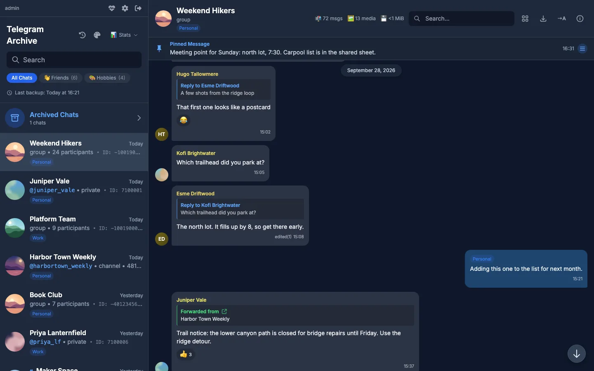

Replies and forwards. Quotes are black boxes, the forward label is a fixed green, and the account chip on the outgoing bubble is blue on blue.

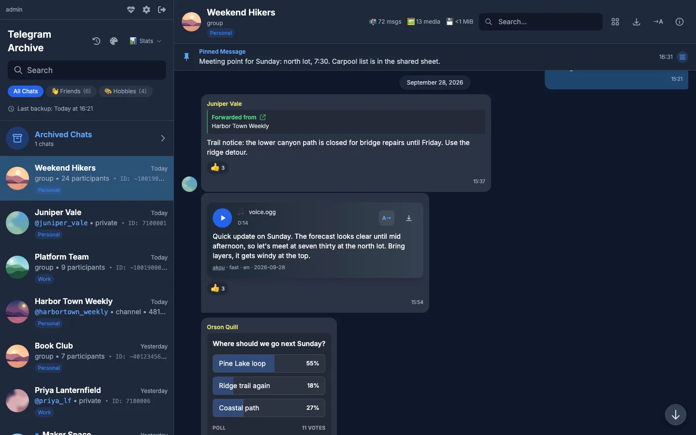

Voice note. A raised card inside the bubble, a music emoji and the file name instead of a waveform.

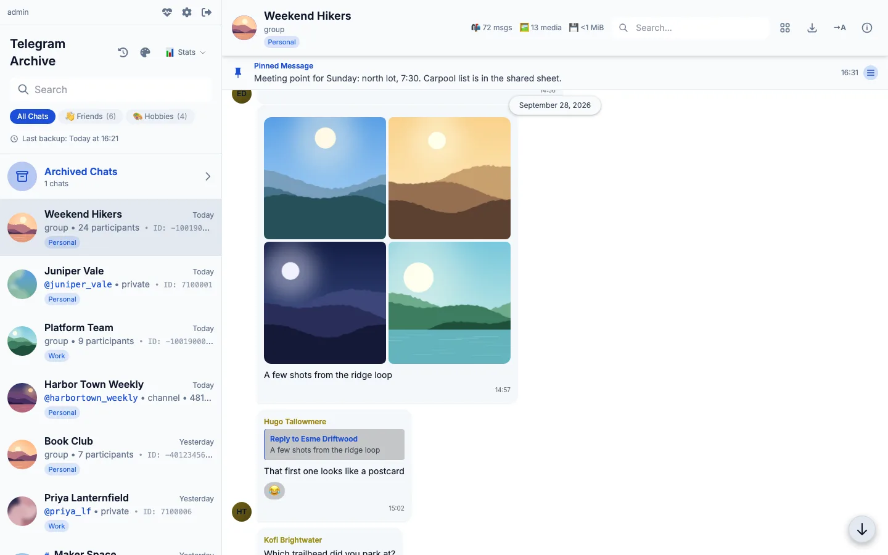

The Day theme. Incoming bubbles are 1.08:1 against the white pane, so they almost disappear, and the reply box is grey mud.

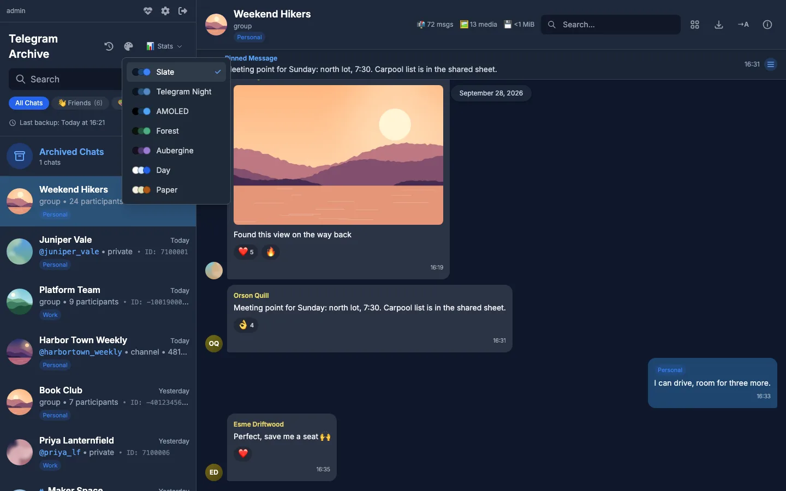

The theme picker. Seven themes, no Telegram light theme and no way to follow the system setting.

The causes, most important first:

1. **Bubbles are too tall.** 12px padding on every side, the time on its own line and reactions on another. A one-line message is about 88px tall, so a screen shows about half as many messages as Telegram Desktop.
2. **Grouping is half done.** The avatar sits on the first bubble of a run and the tail on the last, and bubbles in the middle keep full corners. A run reads as separate cards.
3. **Sender colours collide.** The name hue is a hash of the ID mod 360, so neighbouring IDs get almost the same hue. Telegram uses seven fixed colours picked by ID mod 7.
4. **Light themes break.** Reply, forward, poll, reaction, code and service blocks use fixed black overlays and a fixed green. On Day and Paper they turn grey, and the forward label drops to 1.01:1.
5. **The chat list shows the wrong things.** Type, count and ID instead of the last message, in three lines.
6. **The chrome wastes space.** A 250px sidebar header, a 90px chat header, and a phone header that hides the chat name.
7. **The default palette is generic.** Slate is the Tailwind slate and blue scale. A Telegram Night palette exists but is not the default, and there is no Telegram light theme or system option.

Smaller issues: no maximum width for the message column on wide screens, corner radii that follow no scale, a fixed navy browser colour on every theme, a login page that ignores the theme, and a scrollbar track that paints a light strip along the chat pane.

## The proposals

Each section shows the current look and the proposal one after the other, for the desktop chat and then the phone chat.

### Telegram Desktop

Match Telegram Desktop as closely as CSS allows. The default is Desktop's "Day classic": a white chat list, a green gradient wallpaper, white incoming and light green outgoing bubbles. The dark option is Desktop's "Night" with the exact values from its theme file.

Current desktop chat.

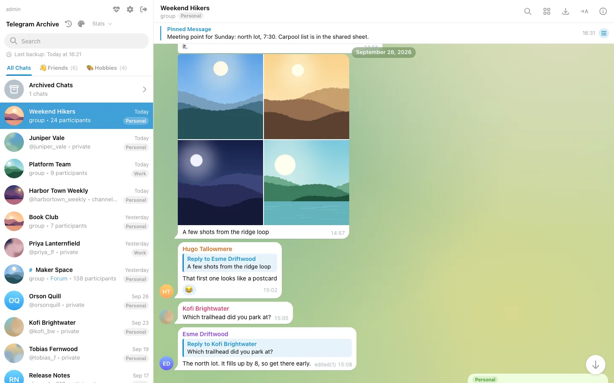

Telegram Desktop proposal. One-line messages drop from 88px to 52px, each sender has its own colour, and the header is one 54px bar.

Current phone chat.

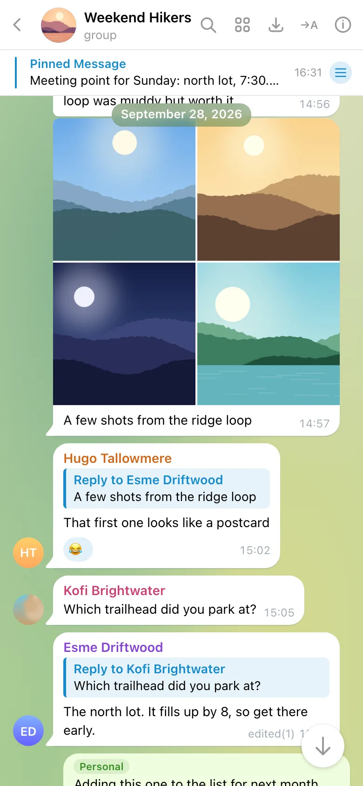

Telegram Desktop proposal on a phone. The chat name is visible and search is an icon.

Night versions: [desktop chat](mockups/telegram-desktop/dark/02-chat-desktop.webp), [replies](mockups/telegram-desktop/dark/03-chat-replies.webp), [phone chat](mockups/telegram-desktop/dark/04-chat-mobile.webp). Other light views are in [`mockups/telegram-desktop/`](mockups/telegram-desktop/).

#### Palette

| Role | Telegram Day | Telegram Night |
| --- | --- | --- |
| Chat list, header, panels | `#FFFFFF` | `#17212B` |
| Chat area | gradient `#DBDDBB` `#6BA587` `#D5D88D` `#88B884` | `#0E1621` |
| Incoming bubble | `#FFFFFF` | `#182533` |
| Outgoing bubble | `#EFFDDE` | `#2B5278` |
| Text | `#000000` | `#F5F5F5` |
| Secondary text | `#999999` | `#708499` |
| Accent | `#40A7E3` | `#5288C1` |
| Links, quotes in incoming | `#168ACD` | `#71BAFA` |
| Quotes in outgoing | `#3A8E26` | `#83CAFF` |
| Selected chat row | `#419FD9`, white text | `#2B5278` |
| Sender names | Desktop's seven light peer colours | Desktop's seven dark peer colours |

#### What changes

- Bubbles get 16px corners, 6px on joined corners, and a drawn tail on the last bubble of a run. Padding is 6px by 11px and bubbles stop at 480px wide.
- The time floats at the end of the last text line, or on the reactions row.
- Names and initials avatars use Telegram's seven peer colours and gradients with white initials.
- Reply quotes are tinted blocks with a 3px bar, blue in incoming and green in outgoing. The forward header is two plain lines. Polls, reactions, link previews and code use accent tints instead of black overlays.
- Photos and albums run to the bubble edge. Voice notes lose the inner card.
- Chat list rows are 62px with 46px avatars, and the numeric ID is hidden. The sidebar header shrinks from 250px to 180px, with a grey search pill and underlined folder tabs.
- The chat header is one bar with no emoji stats. Search collapses to an icon, which also fixes the phone header.
- Date and service pills use Desktop's translucent pill. The empty pane shows the wallpaper with one pill. The picker gets "Telegram Day" and a "Match system" entry.
- The font moves from Inter to the system stack with Open Sans first.

#### What it costs beyond CSS

- New theme entries in `KNOWN_THEMES` and `viewerThemes`, and a system option with a `matchMedia` listener.
- Peer colours by ID mod 7 in `getSenderColor` and `getAvatarFill`. The mockup emulates this with 360 attribute selectors on the inline hue, which must not ship.
- The avatar on `isRunEnd(index)` instead of `showSenderName(index)`.
- A chat list preview with the last message and its sender, which the chat list API has to return.
- A member count or "private chat" in the header instead of the raw type, and the per-chat stats in the info panel.
- A 15 minute grouping window, a fix for the double date pill, "edited" with the count in a tooltip, a sticker flag, a waveform, a pattern asset for the wallpaper, a per-theme browser colour and a themed login page.
- Stable class names, because much of the stylesheet reaches elements through Tailwind class chains.

#### Score: 8.5 of 10

| Criterion | Score | Why |
| --- | --- | --- |
| Long chats | 9 | Short bubbles, clear runs with tails, a width cap that keeps replies close. |
| Telegram feel | 9 | It is Telegram Desktop, down to the pill and the selected row. |
| Audit fixes | 9 | Fixes every high issue. The floating date pill still covers the top bubble. |
| Mobile | 7 | The chat name shows, but five icons and the photo crowd the bar, and the scroll button covers the last time. |
| Contrast | 6 | Desktop's own values are low: secondary text `#999999` is 2.9:1 on white, the incoming time 2.3:1, white on the selected row 2.9:1. These need darkening. |
| Consistency | 9 | Chat, search, gallery, picker and empty pane all look like one app. |
| Work beyond CSS | 6 | Thirteen follow-up items, most of them small template or script changes. |

### Telegram mobile

Copy the Telegram iOS app. The default is iOS day classic: the green pattern wallpaper, white incoming and `#E1FFC7` outgoing bubbles. The dark variant follows iOS Night: black lists and a blue gradient for outgoing bubbles. We designed the phone views first.

Current desktop chat.

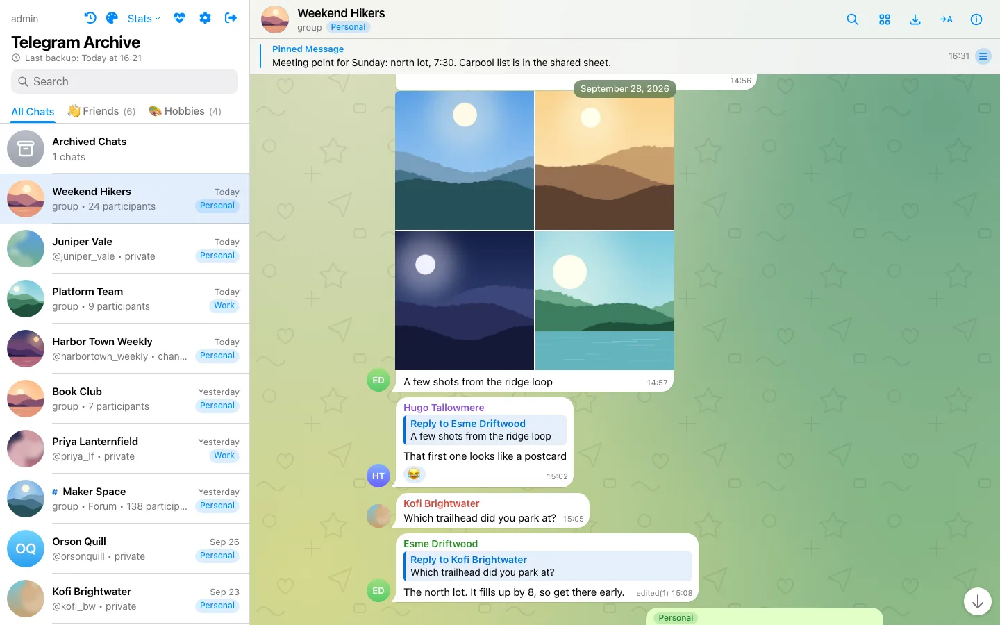

Telegram mobile proposal on a desktop. Pattern wallpaper, iOS bubble shapes, and the avatar beside the tail at the end of each run.

Current phone chat.

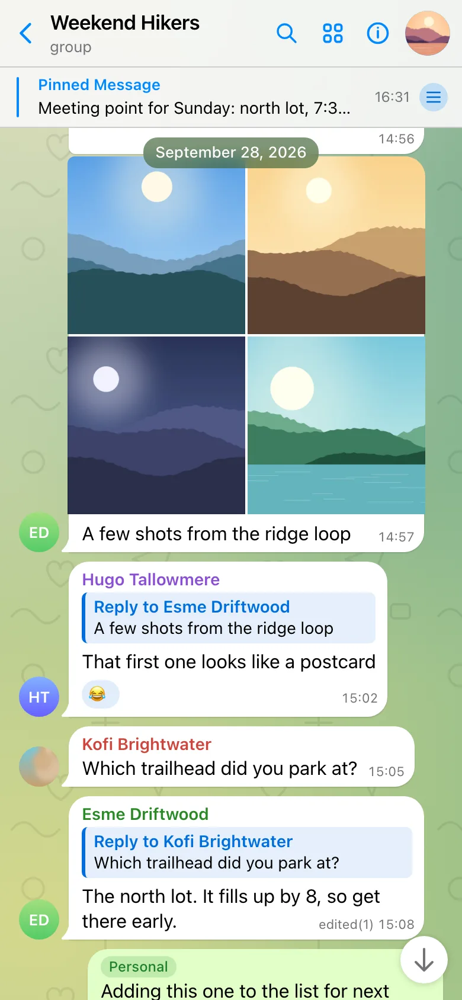

Telegram mobile proposal on a phone. A slim bar with the chat photo on the right, and the title always visible.

Dark versions: [desktop chat](mockups/telegram-mobile/dark/02-chat-desktop.webp), [replies](mockups/telegram-mobile/dark/03-chat-replies.webp), [phone chat](mockups/telegram-mobile/dark/04-chat-mobile.webp), [phone chat list](mockups/telegram-mobile/dark/05-chat-list-mobile.webp), [voice note](mockups/telegram-mobile/dark/08-transcript.webp).

#### Palette

| Role | Light | Dark |
| --- | --- | --- |
| Lists, panels | `#FFFFFF` | `#000000` |
| Bars | `#F7F7F7` at 94% | `#161617` at 92% |
| Chat area | green gradient with a line pattern | near black `#050807` with a faint glow and the pattern |
| Incoming bubble | `#FFFFFF` | `#262629` |
| Outgoing bubble | `#E1FFC7` | gradient `#3274EC` to `#2662DC`, white text |
| Secondary text | `#737378`, 4.7:1 | `#8D8E93` |
| Accent | `#0088FF` | `#3E88F7` |
| Outgoing time | `#008208`, 4.6:1 | white at 80% |
| Sender names | seven peer colours darkened to at least 4.1:1 | seven bright peer colours |

#### What changes

- Padding 6px by 10px, 17px corners, 6px on joined corners, a curved tail on the last bubble, and the avatar beside that tail.
- Seven peer colours and bright gradient avatars. Colours on the light side of each bubble for quotes, forwards, polls, files, reactions and code.
- Photos edge to edge. A photo with no caption carries the time in a pill. Stickers stand on the wallpaper.
- Voice notes show a play button, a waveform and the duration on the bubble. The waveform is a fixed picture in the mockup.
- Chat list rows are two lines with hairline separators, 60px avatars on a phone and 54px on a desktop. The sidebar gets an iOS large title and the tool icons move into the top bar.
- A translucent chat header. Search is an icon. On a phone the chat photo moves to the right.
- A centred message column of up to 760px.
- We measured contrast and darkened the iOS values that fell under about 4:1.

#### What it costs beyond CSS

- The same theme, peer colour, run class, inline time, chat list preview and header work as Telegram Desktop.
- The mockup places the avatar with CSS anchor positioning, which only works in recent Chromium, and pulls the sidebar buttons up with a negative margin. Both need template changes to ship.
- The mockup hides export and the transcript toggle under 768px. They must move into the info panel or a menu first, or phone users lose them.
- A real waveform needs the stored waveform bytes. The pattern and gradient ship as a built-in wallpaper that `VIEWER_CHAT_BACKGROUND` can replace.
- Reply colours by the quoted sender's peer colour need that sender's ID in the reply data.
- The stylesheet is 87 KB, most of it generated selectors for the peer colours.

#### Score: 8 of 10

| Criterion | Score | Why |
| --- | --- | --- |
| Long chats | 8 | Short bubbles and clear runs. The pattern adds texture behind the text. |
| Telegram feel | 9 | Unmistakably Telegram, iOS flavour. On a desktop the large title and blue icons feel like a phone app. |
| Audit fixes | 9 | Every high issue, and the only design with the avatar beside the tail. |
| Mobile | 9 | The best phone header and chat list of the four. |
| Contrast | 8 | Measured and corrected, names at least 4.1:1. |
| Consistency | 8 | Consistent, but the iOS segmented control in the gallery and the iOS sidebar sit oddly beside a desktop layout. |
| Work beyond CSS | 4 | The most fragile tricks and the most follow-up work. |

### Refined slate

Keep the dark slate identity and polish it. Telegram's proportions, a calmer blue-grey palette, Telegram Web's blue accent, and theme tints instead of black overlays. The same CSS also repairs the Day palette.

Current desktop chat.

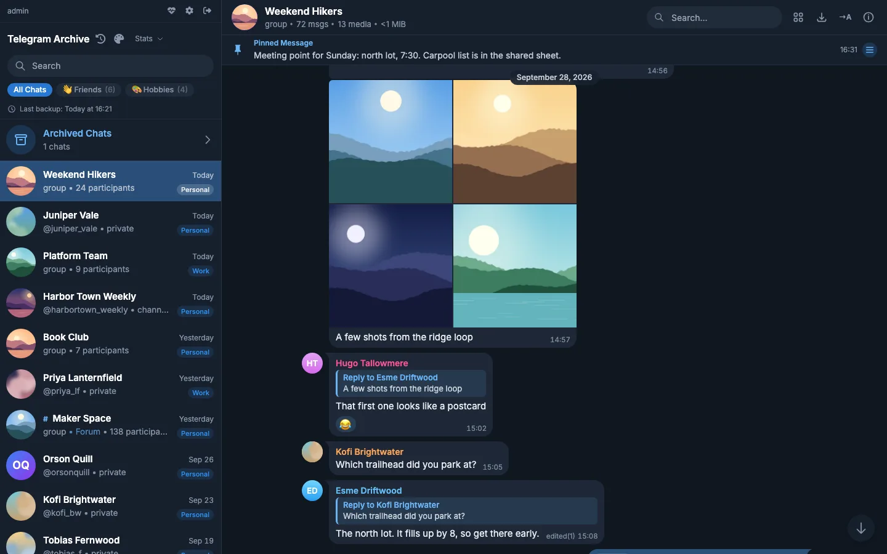

Refined slate proposal. The same dark mood with shorter bubbles, peer colours and a one-line header with the stats as a subtitle.

Current phone chat.

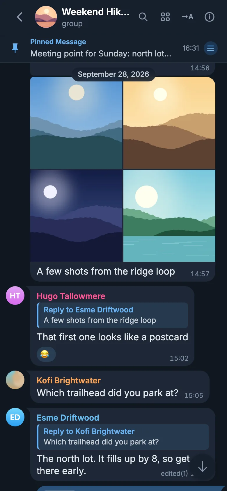

Refined slate proposal on a phone. The title shows but is cut to "Weekend Hik...", and the scroll button covers the last time.

Day versions: [desktop chat](mockups/refined-slate/day/02-chat-desktop.webp), [phone chat](mockups/refined-slate/day/04-chat-mobile.webp), [voice note](mockups/refined-slate/day/08-transcript.webp).

#### Palette

| Role | Slate | Repaired Day |
| --- | --- | --- |
| Chat canvas | `#101721` | `#E2E8EF` |
| Sidebar, headers | `#17202D` | `#FFFFFF` |
| Incoming bubble | `#1E2837` | `#FFFFFF` |
| Outgoing bubble | `#2B527A` | `#DEF1FD` |
| Text | `#E7ECF2` | Day's existing ink |
| Secondary text | `#8593A6`, 5.3:1 on the sidebar | Day's existing muted text |
| Accent | `#3390EC` | `#3390EC` |
| Links and quotes | `#6AB3F3` | `#1178B9` |
| Selected chat row | `#294E78` | `#3390EC`, white text |
| Sender names | Telegram Night's seven peer colours | Telegram's seven light peer colours |

#### What changes

- 7px by 11px padding, 15px text, 16px corners and 6px on joined sides. The time at the end of the last line.
- Avatar, name and a small tail together at the top of a run, 2px between bubbles in a run and 8px between senders.
- An accent-tinted reply quote, a one-line "Forwarded from" header, polls and voice notes drawn on the bubble, media to the edge, stickers without a bubble.
- Chat list rows of 66px, the sidebar header at about 190px, a 56px chat header with a "group, 72 msgs, 13 media" subtitle.
- An 820px reading column. On phones search collapses to an icon.

#### What it costs beyond CSS

- Peer colours in script. The mockup maps the demo senders by name, which must not ship.
- A `message-run-start` class, a floated time element, the emoji removed from the stats markup, the ID removed from the chat list, export moved out of the phone header, a waveform, new swatch dots and a per-theme browser colour.
- Radius, padding and text size moved into variables.

#### Score: 7 of 10

| Criterion | Score | Why |
| --- | --- | --- |
| Long chats | 8 | Much shorter bubbles, clear senders, a reading column. |
| Telegram feel | 6 | Telegram proportions, but still a dark dashboard palette, and the tail sits at the top of the run, which no Telegram client does. |
| Audit fixes | 8 | Fixes the shapes, the overlays and the chrome. It keeps Slate as the default, and the default is what the maintainer wants changed. |
| Mobile | 6 | The title is cut short and the scroll button covers content. |
| Contrast | 8 | Measured, secondary text 5.3:1. |
| Consistency | 8 | Consistent across views. The floating date pill lands inside a bubble header in the voice note view. |
| Work beyond CSS | 7 | Ten items, none of them fragile. |

### Modern minimal

A calm archive reader that makes no attempt to copy Telegram. Light by default: white panels on a pale grey canvas, white incoming and pale blue outgoing bubbles, one blue accent. A dark option with neutral greys. Names are one ink colour and there are no tails.

Current desktop chat.

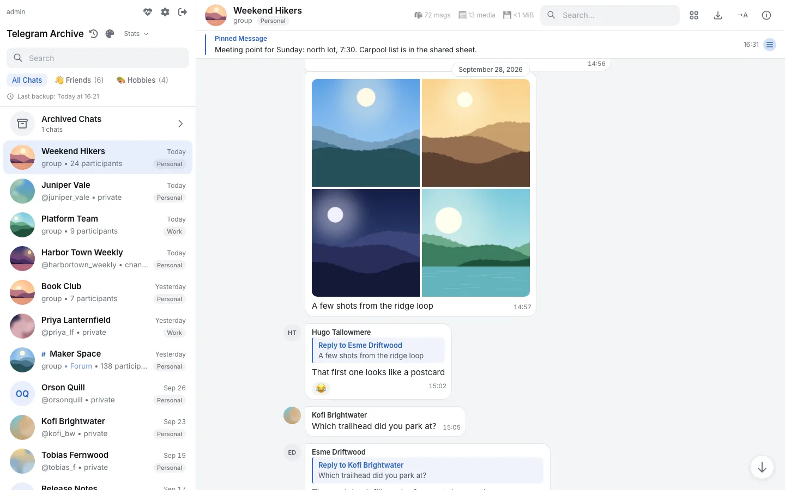

Modern minimal proposal. Hairline bubbles, ink names, grey initials, and a centred 760px column.

Current phone chat.

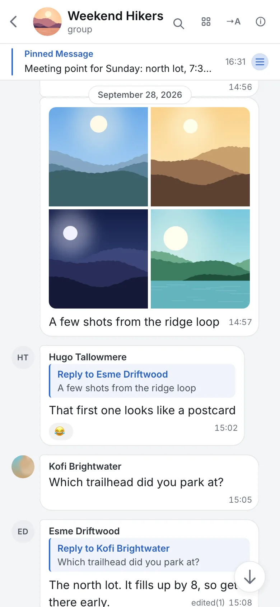

Modern minimal proposal on a phone. The full title shows, and search is an icon.

Dark versions: [desktop chat](mockups/modern-minimal/dark/02-chat-desktop.webp), [phone chat](mockups/modern-minimal/dark/04-chat-mobile.webp).

#### Palette

| Role | Light | Dark |
| --- | --- | --- |
| Chat canvas | `#F3F4F6` | `#111315` |
| Panels | `#FFFFFF` | `#181A1D` |
| Incoming bubble | `#FFFFFF` with a 7% black hairline | `#202327` |
| Outgoing bubble | `#E1EBFC` | `#213452` |
| Text | `#1B1F24` | `#E6E8EB` |
| Secondary text | `#68707C`, 5.0:1 | `#8E959F`, 5.8:1 |
| Accent | `#2F6AD6` | `#639BEE` |
| Selected row | `#E7EEFC` | `#1F2C42` |

#### What changes

- 7px by 12px padding, 15px text and 16px on a phone, 1.5 line height, no shadows. The time inline, sharing the reactions row.
- Runs join with 6px corners, the avatar sits at the top beside the name, no tails.
- One ink colour for names and one grey for initials avatars.
- Theme tints for replies, forwards, polls, code and service pills.
- 62px chat list rows, a 196px sidebar header, a 56px chat header, a collapsing phone search, a transparent scrollbar track.

#### What it costs beyond CSS

- The least of the four: new theme entries and a system option, a per-sender class instead of the inline hue, words or icons instead of the emoji, export moved out of the phone header, a per-theme browser colour, the date pill fix and stable class names.

#### Score: 6.5 of 10

| Criterion | Score | Why |
| --- | --- | --- |
| Long chats | 7 | Easy to read one message at a time. In a busy group, one ink colour for every name makes speaker changes harder to spot. |
| Telegram feel | 3 | It sets out to stop looking like Telegram. |
| Audit fixes | 7 | Fixes the shapes and the light-theme mud. It drops the sender colour problem instead of solving it, and the date pill and emoji remain. |
| Mobile | 7 | The title shows, but short messages wrap the time onto its own line, and the scroll button covers text. |
| Contrast | 9 | The best measured values, and hairlines where fills are too close to the canvas. |
| Consistency | 8 | Consistent, but the picker swatches still show the old palettes. |
| Work beyond CSS | 8 | The smallest stylesheet and the fewest template changes. |

## Recommendation

**One structure, many palettes.** Every theme shares the Telegram Desktop structure: bubble shape, tail on the last bubble, avatar at the bottom of a run, seven peer colours, inline time, 62px chat list rows, one-bar chat header, collapsing search. A theme only sets tokens. That keeps every theme correct by construction, and it is why the phases below put tokens first.

**The default becomes "Match system".** It shows Telegram Day on a light system and Telegram Night on a dark one, which is what the Telegram apps do. `VIEWER_DEFAULT_THEME` can still pin one theme for every browser.

**Telegram Day takes two things from the mobile proposal.** The first is the line pattern over the green gradient. Desktop has one too, but the Desktop mockup used the gradient alone. The second is its contrast fixes. Secondary text and times move from `#999999` at 2.9:1 to `#707579` at 4.7:1, which is Telegram Web's value. The selected chat row moves from `#419FD9` to `#2A78BA`, so its white text reaches 4.7:1.

**The mobile proposal's dark palette becomes a theme of its own.** iOS Night, with black lists and blue gradient outgoing bubbles, looks different from Telegram Night. Its light palette does not. It is almost the same as Telegram Day, so we leave it out.

**Modern minimal becomes two themes.** Minimal and Graphite, for people who want a quiet reader. With per-sender classes and a tail token, they set all seven peer colours to ink and hide the tail, without a second structure.

**The existing themes keep their current ids.** Every saved choice and every `?theme=` link keeps working. Slate takes the refined slate palette. Telegram Night takes Desktop Night's exact values. Day takes the refined slate repair, with a light slate canvas, white incoming and `#DEF1FD` outgoing bubbles. Paper gets the token-based quotes and pills. AMOLED, Forest and Aubergine keep their colours and gain the new shapes.

Theme ids must be 3 to 16 lowercase letters, because `_sanitize_theme_slug` in [`telegram_archive/web/main.py`](../../telegram_archive/web/main.py) drops anything else. That rules out ids such as `telegram-day`.

### Suggested theme list

| Id | Label | Kind | Source |
| --- | --- | --- | --- |
| `system` | Match system | Telegram Day or Telegram Night | new, the default |
| `telegram` | Telegram Day | light | Telegram Desktop proposal, plus the pattern and contrast fixes |
| `night` | Telegram Night | dark | existing id, Desktop Night's exact values |
| `iosnight` | iOS Night | dark | Telegram mobile proposal, dark palette |
| `slate` | Slate | dark | existing id, refined slate palette |
| `minimal` | Minimal | light | Modern minimal proposal, light palette |
| `graphite` | Graphite | dark | Modern minimal proposal, dark palette |
| `amoled` | AMOLED | dark | existing, new shapes |
| `forest` | Forest | dark | existing, new shapes |
| `aubergine` | Aubergine | dark | existing, new shapes |
| `day` | Day | light | existing id, refined slate repair |
| `paper` | Paper | light | existing, token-based quotes and pills |

## Implementation plan

Each phase is one pull request. Phases 1 and 2 give most of the visible change. Almost everything lives in [`telegram_archive/web/templates/index.html`](../../telegram_archive/web/templates/index.html). That file holds the style block at lines 46 to 894, the Tailwind config at 895 to 945, the boot script at 20 to 35, the template and the app script.

### Phase 1: tokens

No visible change on Slate. The goal is that every colour comes from a variable.

- Replace every fixed overlay and colour with tokens: the `bg-black/N` blocks on reply, forward, poll, file row, reactions and extended media, the fixed green and blue utilities, `.tg-code`, `.tg-pre` and `.tg-blockquote`, the service pill colours, the spinner track, the chat avatar placeholder gradient and the login gradient.
- Add the tokens the proposals needed: quote and link colours per bubble side, incoming and outgoing time colours, seven peer colours and seven avatar gradients, a wallpaper, the selected-row text colour, bubble radius, joined radius, padding and text size, and a tail switch.
- Restate every token in every theme block, including the neutral scale for the dark themes that now inherit it from Slate.
- Add stable class names in the template: `chat-row`, `chat-header`, `message-meta`, `message-reactions`, `reply-quote`, `forward-header`, `media-block`, `run-start`, `run-middle`, `run-end`, and flags for stickers and media-only bubbles.
- Make `getSenderColor`, `getSenderNameColor` and `getAvatarFill` near line 8209 return a class or index from `sender_id % 7` instead of an inline hue.

### Phase 2: palettes and the theme list

- Add `system`, `telegram`, `iosnight`, `minimal` and `graphite`, and retune `slate`, `night`, `day` and `paper`.
- Update `KNOWN_THEMES` at line 31 and `viewerThemes` near line 5381 together, with new swatch dots and a "Match system" row. The boot script falls back to `system` and listens to `prefers-color-scheme` changes.
- Update `<meta name="theme-color">` from the theme's panel colour on every change.
- Ship the default pattern and gradient as a static file in [`telegram_archive/web/static/`](../../telegram_archive/web/static/). `VIEWER_CHAT_BACKGROUND` still replaces it. Its injection sits in `telegram_archive/web/main.py` near lines 740 to 760.
- Update the theme table and the default in [`docs/viewer/themes.md`](../viewer/themes.md), with new screenshots in [`docs/images/screenshots/`](../images/screenshots/). Update the `VIEWER_DEFAULT_THEME` row in [`docs/reference/environment-variables.md`](../reference/environment-variables.md).

### Phase 3: structure in CSS and the template

- Bubble shape, joined corners and the tail on the last bubble.
- The avatar on `isRunEnd(index)` instead of `showSenderName(index)` near line 1931, and the tail class on the same row.
- The time as a floated element inside the text block, so it measures itself instead of relying on a reserved width.
- Media to the bubble edge, the voice note without its card, stickers without a bubble.
- Chat list rows, the sidebar header, the one-bar chat header, the collapsing search button, a maximum width for the message column, a transparent scrollbar track.
- Hide the floating date pill while the inline separator for the same day is under it.
- Move export and the transcript toggle into the info panel on phones before the header hides them.
- Remove the emoji from the per-chat stats and the voice row, and fix "1 chats".

### Phase 4: data the look needs

- Return the last message text and its sender with each chat for the chat list preview. The data comes from `get_all_chats` in [`telegram_archive/db/adapter.py`](../../telegram_archive/db/adapter.py) near line 1286 and goes out through `/api/chats` in `telegram_archive/web/main.py` at line 2834. It has to work on SQLite and PostgreSQL and respect viewer account restrictions.
- The chat header status: a member count or "private chat" instead of the raw type.
- A grouping window, so the same sender starts a new run after 15 minutes.
- The voice waveform, if the archive keeps the waveform bytes. Any new column goes beside existing data, never in place of it, with an idempotent migration.

## Open questions

1. **Default.** "Match system", or a fixed Telegram Day for everyone who has not picked a theme?
2. **Upgrades.** Browsers that never picked a theme switch from Slate to the new default after the upgrade. Is a changelog note enough, or should the release keep Slate as the fallback for one version?
3. **Font.** Keep the bundled Inter, or move to the system font stack with Open Sans first, as the Desktop proposal does?
4. **Avatar placement.** At the bottom of a run beside the tail, as every Telegram client does, or at the top beside the name?
5. **Wallpaper.** Ship the pattern file with the image, or the gradient alone?
6. **Chat list preview.** Should the last message show deleted or edited messages the way the chat does? And should a viewer restricted to some accounts see previews at all?
7. **Theme count.** Eleven themes plus "Match system". Keep all of them, or drop iOS Night, Minimal or Graphite?
8. **Waveform.** Worth a change to the backup to keep waveform bytes, or show the play button and duration only?
9. **Account chips on bubbles.** Hide them in a chat that belongs to one account, since the header already names it?
