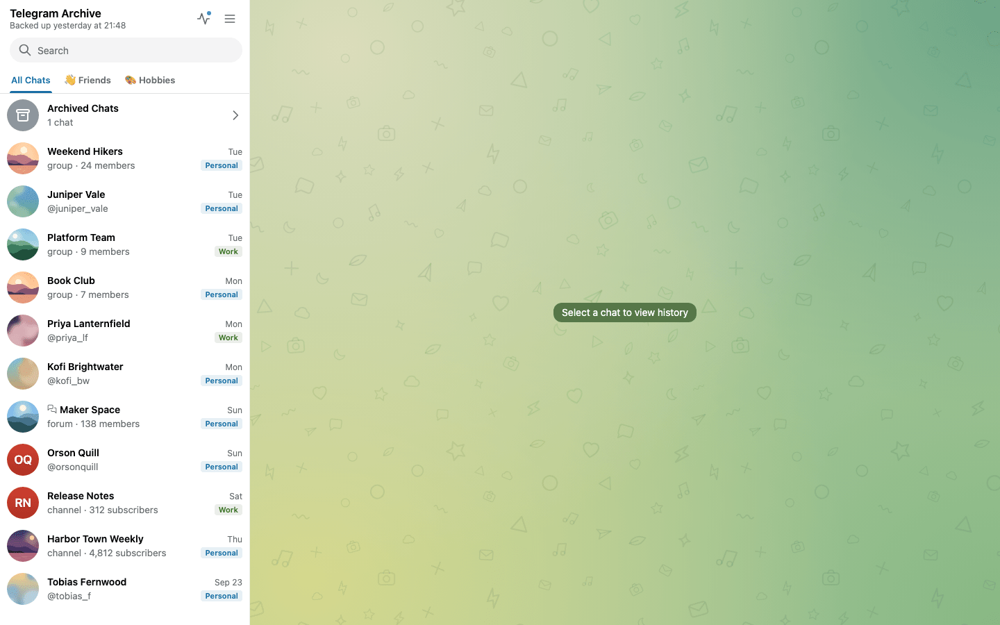

# Run with Docker

This page takes you from an empty Docker host to a running backup and a viewer you can sign in to. It also explains what the stock `docker-compose.yml` does.

## Before you start

You need:

- A Linux host with Docker Engine and a recent Docker Compose.
- An amd64 or arm64 machine. Both images ship for both architectures.
- A Telegram account and the phone that receives its login codes.
- An API id and API hash for that account. Open [my.telegram.org/apps](https://my.telegram.org/apps), sign in with your phone number, open **API development tools** and create an app. Copy `api_id` and `api_hash`. The id is a number.

The compose file uses the long `env_file` syntax with `path` and `required: false`. Older Compose releases reject it. If `docker compose up` complains about `env_file`, update Compose.

### Disk space

Nothing in the archive deletes data on its own, so the data directory only grows. Plan for:

- Media takes the most space: every photo, video, voice note, sticker and document from every chat you back up, up to `MAX_MEDIA_SIZE_MB`. The default limit is 100 MB. With the default `DEDUPLICATE_MEDIA=true`, a file shared by several chats of one account is stored once.
- The database grows with every message. The archive keeps the earlier text of every edited message. By default it also keeps deleted messages and only marks them as deleted.
- Thumbnails in `media/.thumbs` are a cache. You can delete them, and the viewer rebuilds them.
- An import copies the export's media into the archive, so it needs that much free space again.
- The upgrade from 7.x needs free space of three times the database file plus its `-wal` file.

To limit growth, use `MAX_MEDIA_SIZE_MB`, `DOWNLOAD_MEDIA_TYPES`, `DOWNLOAD_DOCUMENT_MIME_TYPES`, `SKIP_MEDIA_CHAT_IDS` and the chat filters. Read [Media downloads](../configuration/media.md) before the first large run, because some of these skip files for good.

To see how much space you use, pick one:

- In the viewer, signed in with the master login, open the Stats dropdown or the Archive Status panel.
- Run `docker compose exec telegram-backup python -m src stats`.
- Run `du -sh data/backups/media` on the host.

## Set it up

### 1. Get the files

```bash
git clone https://github.com/GeiserX/Telegram-Archive.git
cd Telegram-Archive
```

The compose file pins both images, `drumsergio/telegram-archive` and `drumsergio/telegram-archive-viewer`, to the current release. Moving that pin is how you upgrade later.

### 2. Write your settings

```bash
cp .env.example .env
```

Open `.env` and set these lines:

```ini
TELEGRAM_API_ID=12345678
TELEGRAM_API_HASH=0123456789abcdef0123456789abcdef
TELEGRAM_PHONE=+15551234567
VIEWER_USERNAME=admin
VIEWER_PASSWORD=choose-a-long-password
VIEWER_TIMEZONE=Europe/London
```

`TELEGRAM_PHONE` is in international format with the leading `+`. `VIEWER_TIMEZONE` takes a tz database name. Set it, because the code default is `Europe/Madrid`. Without `VIEWER_USERNAME` and `VIEWER_PASSWORD`, every viewer data route answers 503 `Viewer authentication is not configured`. See [The viewer starts closed](../viewer/access.md#the-viewer-starts-closed).

Two defaults to know before the first run:

- Bot chats are not backed up. Add `bots` to `CHAT_TYPES` if you want them. See [Choosing chats](../configuration/choosing-chats.md).
- The backup skips media files over 100 MB. Set `MAX_MEDIA_SIZE_MB=0` to remove the limit.

### 3. Create the data directory

```bash
mkdir -p data && sudo chown -R 1000:1000 data
```

Both containers run as uid 1000 and write the session, database and media under `./data`. The directory must belong to that uid. `chmod 755` does not fix a `Permission denied` here. On Podman, add `--userns=keep-id:uid=1000,gid=1000` to your run commands instead.

### 4. Log in to Telegram

!!! warning "Module name in the 8.16.1 images"
    The 8.16.1 images know the module only as `src`, so this page uses `python -m src`. See [the module rename](../operations/upgrading.md#module-rename).

```bash
docker compose run --rm telegram-backup python -m src auth
```

The login code arrives in your Telegram app. If the account has two-step verification, the command then asks for that password. It echoes the password on screen as you type, so run it where nobody can see. The session is saved under `data/session`. Treat that file like a password: it gives full access to your account. Everything else about login is in [Log in to Telegram](telegram-login.md).

### 5. Start both containers

```bash
docker compose up -d
```

`telegram-backup` migrates the database, runs a full backup straight away and then follows `SCHEDULE`. The default is `0 */6 * * *`, every six hours. The scheduler reads the cron expression in the container's local time. That is UTC, because the image sets no `TZ`. `telegram-viewer` serves the web viewer. Watch the first backup with `docker compose logs -f telegram-backup`.

### 6. Open the viewer

Open [http://127.0.0.1:8000](http://127.0.0.1:8000) on the Docker host and sign in with `VIEWER_USERNAME` and `VIEWER_PASSWORD`.

The compose file publishes the viewer on 127.0.0.1 only. From another machine, use an SSH tunnel and open the same address locally:

```bash
ssh -L 8000:127.0.0.1:8000 you@server
```

For access without a tunnel, put a reverse proxy in front. See [Exposing the viewer safely](../viewer/exposing.md).

After the first backup the viewer shows your chats:



### Next

- [Your first backup](first-backup.md): what the first run does and how to follow it.
- [Choosing chats](../configuration/choosing-chats.md): back up only the chats you want.
- [Real-time listener](../configuration/listener.md): capture new messages, edits and deletions as they happen.

## What the stock compose file does

The file runs two services, `telegram-backup` and `telegram-viewer`, both pinned to the same version. It also holds three optional services, all commented out. Those are described at the end of this section.

### The telegram-backup service

It runs the Telegram client and the scheduler with `python -m src schedule`.

It loads the whole `.env` through `env_file`, so every variable you put there reaches this container. It also has its own `environment:` block, and that block wins on conflict:

- `BACKUP_PATH` is hard-set to `/data/backups` in both services. `BACKUP_PATH` in `.env` does nothing.
- `CHAT_TYPES` is passed as `${CHAT_TYPES:-private,groups,channels}`. An empty `CHAT_TYPES=` in `.env` becomes that default.

The block also sets some defaults that differ from the code defaults:

| Variable | Compose default | Why |
|----------|-----------------|-----|
| `VIEWER_HOST` | `telegram-viewer` | Real-time updates on SQLite are pushed to the viewer container by name. |
| `VIEWER_PORT` | `8000` | The port the viewer listens on. |
| `POSTGRES_HOST` | `postgres` | The name of the optional PostgreSQL service. |

Compose also sets `DB_PATH` to `/data/backups/telegram_backup.db`. That is the image default, and setting it in both services keeps them on the same file.

### The telegram-viewer service

It serves the web viewer. It has no `env_file` on purpose, so your Telegram credentials and proxy passwords never enter the container that faces the network. It receives only the variables listed in its own `environment:` block:

| Area | Variables |
|------|-----------|
| Paths | `BACKUP_PATH` |
| Sign-in | `VIEWER_USERNAME`, `VIEWER_PASSWORD`, `ALLOW_ANONYMOUS_VIEWER`, `AUTH_SESSION_DAYS` |
| Display | `VIEWER_TIMEZONE`, `VIEWER_DEFAULT_THEME`, `VIEWER_CHAT_BACKGROUND`, `SHOW_STATS`, `DISPLAY_CHAT_IDS` |
| Security | `CORS_ORIGINS`, `SECURE_COOKIES`, `TRUST_PROXY_HEADERS`, `INTERNAL_PUSH_SECRET`, `AUTH_PROXY_HEADER`, `AUTH_PROXY_ADMIN_USERS`, `AUTH_PROXY_DEFAULT_ACCESS` |
| Notifications | `PUSH_NOTIFICATIONS`, `VAPID_PRIVATE_KEY`, `VAPID_PUBLIC_KEY`, `VAPID_CONTACT` |
| Database | `DATABASE_URL`, `DB_TYPE`, `DB_PATH`, `POSTGRES_HOST`, `POSTGRES_PORT`, `POSTGRES_USER`, `POSTGRES_PASSWORD`, `POSTGRES_DB` |
| Transcription | `TRANSCRIPTION_ENABLED`, `TRANSCRIPTION_URL` |
| Logging | `LOG_LEVEL` |

The viewer receives `LOG_LEVEL` but always logs at INFO. The variable only affects the backup container.

The viewer reads more variables than that. These do nothing from `.env` until you add them to the viewer's `environment:` block:

- `STATS_CALCULATION_HOUR`
- `THUMBNAIL_CACHE_DIR`
- `DATABASE_PATH`
- `DATABASE_DIR`
- `DATABASE_TIMEOUT`
- `DB_ECHO`
- `MAX_WS_CONNECTIONS`
- `MAX_WS_SUBSCRIPTIONS_PER_CONNECTION`
- `ENABLE_NOTIFICATIONS`
- `MEDIA_MAX_DOWNLOAD_ATTEMPTS`
- `TRANSCRIPTION_WEBHOOK_SECRET`: already in the block, commented out.
- `HEALTHCHECK_URL`: the image's healthcheck reads it. Set it only if you change the viewer's port.

To add one, put it under `telegram-viewer` like this:

```yaml
  telegram-viewer:
    environment:
      STATS_CALCULATION_HOUR: ${STATS_CALCULATION_HOUR:-3}
```

!!! warning "Keep the database settings the same in both services"
    `DATABASE_PATH` or `DATABASE_DIR` in `.env` moves the backup's SQLite file but not the viewer's, because the viewer never sees them. The viewer then opens a different, empty database and shows no chats. Add the same variable to both services, or use `DB_PATH`, which both already receive.

### Shared settings

Both services share the same hardening:

- a read-only root filesystem, with a tmpfs at `/tmp`
- all Linux capabilities dropped, and `no-new-privileges`
- `stop_grace_period: 90s`, so a backup that is stopped mid-run has time to finish its writes
- `json-file` logs capped at 10 MB, three files

`telegram-backup` also has resource limits of 1 CPU and 1 GB, present but commented out.

Both mount `./data:/data` read-write. On SQLite the viewer's mount must stay writable, for the database's WAL files, the shared `.push-secret` file and the thumbnail cache. Mount it `:ro` only when you use PostgreSQL.

The two services start in any order. The backup owns the schema and migrates it on start. The viewer never migrates.

!!! warning "Upgrading from 7.x"
    Migration 022 rebuilds every table and refuses to run while another process holds the SQLite file. It exits without changing anything, and the container keeps restarting until you stop the viewer. Stop both containers, then start the backup first. See [Upgrading from 7.x](../operations/upgrading.md#upgrading-from-7x).

To apply a change, edit `.env` and run `docker compose up -d` again. Compose recreates only the containers whose settings changed.

### Optional services

The three commented-out services are:

- A PostgreSQL server. See [SQLite and PostgreSQL](../configuration/database.md).
- An akou server for voice transcription. See [Voice transcription](../configuration/transcription.md).
- A second viewer limited to a few chats with `DISPLAY_CHAT_IDS`. See [Logins, viewer accounts and share links](../viewer/access.md).

Enabling PostgreSQL also means uncommenting the `volumes: postgres_data:` block at the end of the file.

??? example "The stock docker-compose.yml"

    ```yaml
    --8<-- "docker-compose.yml"
    ```

## One-off commands

Run any command with a fresh container:

```bash
docker compose run --rm telegram-backup python -m src <command>
```

`export`, `stats` and `list-chats` only read the database, so you can also run them inside the running container:

```bash
docker compose exec telegram-backup python -m src stats
docker compose exec telegram-backup python -m src export -o /data/backups/export.json
```

The container's root filesystem is read-only, so any output file must go under `/data`. It then appears under `./data` on the host.

Commands that connect to Telegram use the scheduler's session file, so stop the scheduler first. See [One client per session](telegram-login.md#one-client-per-session).

```bash
docker compose stop telegram-backup
docker compose run --rm telegram-backup python -m src fill-gaps
docker compose start telegram-backup
```

Always give the backup image a command. Without one it prints the help text and exits 0, and `restart: unless-stopped` turns that into a restart loop.

The full list of commands is in [Command line and Python API](../reference/cli.md).

## Running without Compose

You can run the same setup with plain `docker run`. First create a network so the backup can push real-time updates to the viewer by name:

```bash
docker network create telegram-archive
```

In `.env`, uncomment `VIEWER_HOST=telegram-viewer` and `VIEWER_PORT=8000`.

Plain `docker run --env-file` keeps everything after `=`, inline comments included. Compose strips them, so the file works there as it is. Before you use `.env` outside Compose, delete the trailing `# ...` on the `MAX_MEDIA_SIZE_MB` and `TRANSCRIPTION_URL` lines, or move those comments to their own lines. Otherwise the backup exits at start with `MAX_MEDIA_SIZE_MB must be an integer`.

Log in once, then start the backup:

```bash
docker run -it --rm --env-file .env -v ./data:/data \
  drumsergio/telegram-archive:8.16.1 python -m src auth

docker run -d --name telegram-backup --restart unless-stopped \
  --network telegram-archive \
  --env-file .env \
  -v ./data:/data \
  --read-only --tmpfs /tmp \
  --cap-drop ALL --security-opt no-new-privileges:true \
  --stop-timeout 90 \
  --log-opt max-size=10m --log-opt max-file=3 \
  drumsergio/telegram-archive:8.16.1 python -m src schedule
```

The viewer gets explicit `-e` variables, never the whole `.env`. Its database settings must match the backup's. With the image defaults, both use `/data/backups/telegram_backup.db`:

```bash
docker run -d --name telegram-viewer --restart unless-stopped \
  --network telegram-archive \
  -p 127.0.0.1:8000:8000 \
  -v ./data:/data \
  --read-only --tmpfs /tmp \
  --cap-drop ALL --security-opt no-new-privileges:true \
  --stop-timeout 90 \
  --log-opt max-size=10m --log-opt max-file=3 \
  -e VIEWER_USERNAME=admin \
  -e VIEWER_PASSWORD=choose-a-long-password \
  -e VIEWER_TIMEZONE=Europe/London \
  -e DB_TYPE=sqlite \
  -e DB_PATH=/data/backups/telegram_backup.db \
  drumsergio/telegram-archive-viewer:8.16.1
```

For PostgreSQL, see [SQLite and PostgreSQL](../configuration/database.md). What each setting means is in [Environment variables](../reference/environment-variables.md).

## Removing the install

```bash
docker compose down
```

This removes the containers and the network and keeps `./data`. With the optional PostgreSQL service, `docker compose down -v` also removes the `postgres_data` volume.

The Telegram login stays valid until you end it. In Telegram, open **Settings > Devices** and terminate the backup's session. Then delete `./data` if you no longer want the archive. To move the archive to another machine instead, copy `./data`, `.env` and `docker-compose.yml` as described in [Backing up the archive](../operations/backup-and-restore.md), and never run both machines at once.
