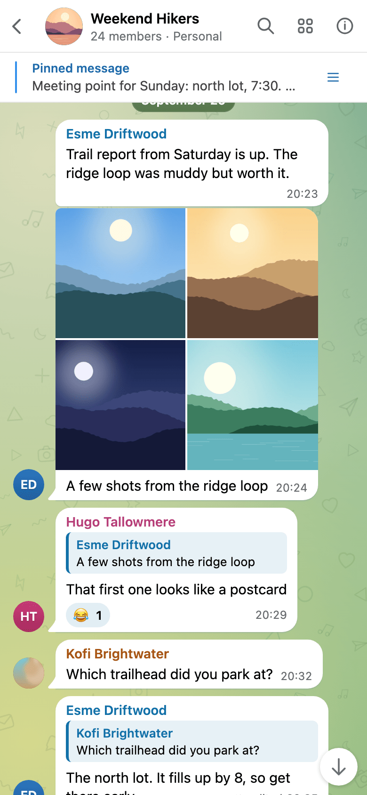
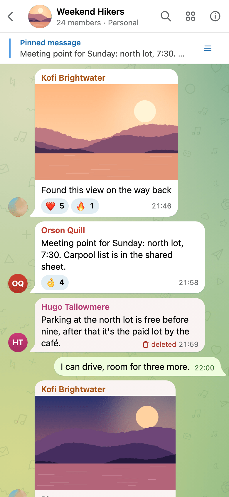
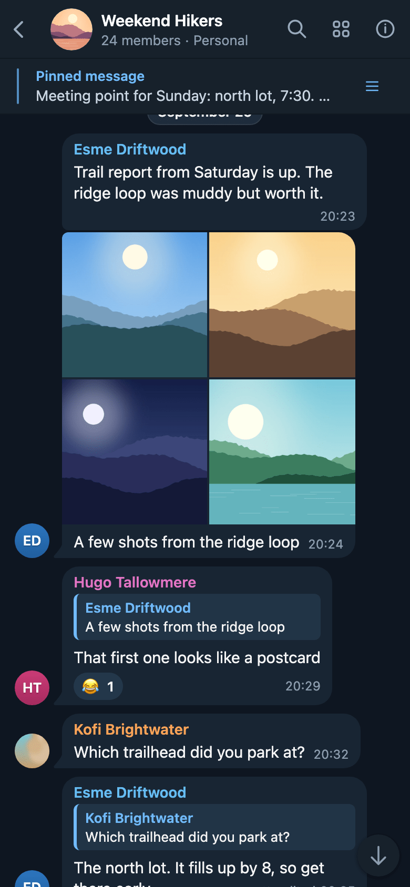
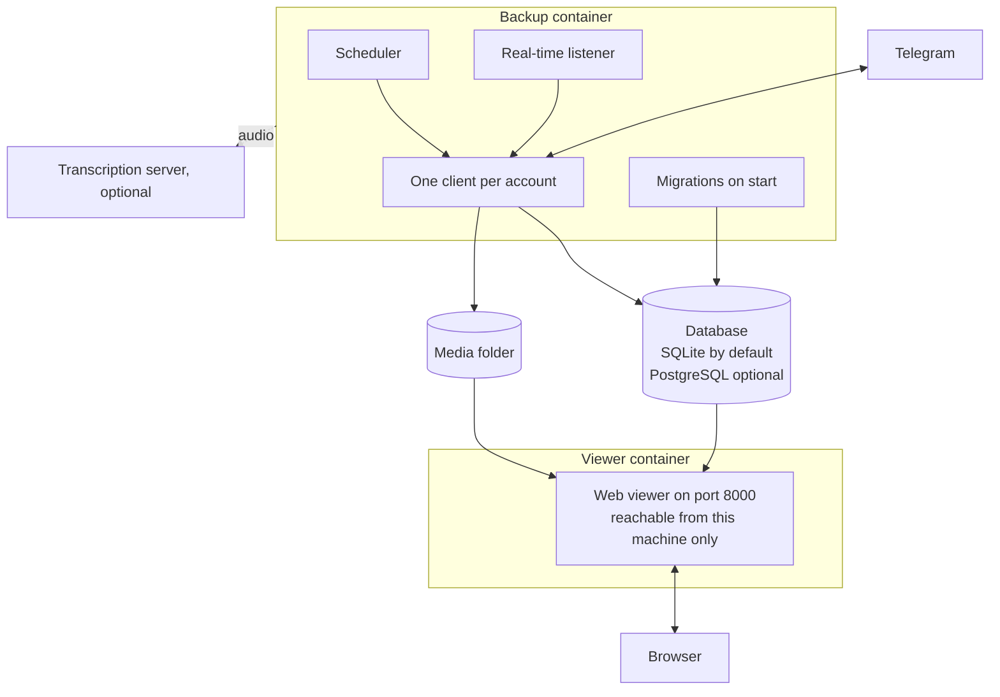

---
hide:
  - navigation
---

# Telegram Archive { .ta-visually-hidden }

  

  
  
  
  

---

**Telegram Archive** backs up one or more Telegram accounts to a machine you host, in Docker or from the [Python package](getting-started/pip.md). Telegram Desktop's own export is a file you make by hand: it holds no earlier version of an edited message, no deleted message, and nothing reads it like the app. Telegram Archive runs on a schedule, fetches only what is new, keeps every edit and every deletion, and shows the archive in a viewer that reads like Telegram. Start with [Run with Docker](getting-started/docker.md), then [Using the viewer](viewer/using-the-viewer.md). Only the backup talks to Telegram; the viewer only reads the archive.

-   :material-docker: **[Run with Docker](getting-started/docker.md)**

    ---

    [Log in to Telegram](getting-started/telegram-login.md), then start the backup and the viewer with the shipped compose file.

-   :material-play-circle-outline: **[Your first backup](getting-started/first-backup.md)**

    ---

    Follow the first run, see what a finished one looks like, and pick the settings to change next.

-   :material-monitor-cellphone: **[Using the viewer](viewer/using-the-viewer.md)**

    ---

    Read chats, search messages, browse shared media and see what changed since the last run.

-   :material-format-list-bulleted: **[Environment variables](reference/environment-variables.md)**

    ---

    Every setting, its default and what it changes.

## The viewer

<figure markdown>

<figcaption>On a phone</figcaption>
</figure>
<figure markdown>

<figcaption>Deletions kept</figcaption>
</figure>
<figure markdown>

<figcaption>Every edit kept</figcaption>
</figure>
<figure markdown>

<figcaption>Telegram Night</figcaption>
</figure>

The viewer looks and works like the Telegram app, with the archive behind it: chats, folders, forum topics, search, shared media and an info panel. What Telegram no longer shows, it keeps and marks: a [deleted message](viewer/using-the-viewer.md#deleted-messages) stays with its text, an [edited message](viewer/using-the-viewer.md#reactions-edits-and-deletions) keeps its earlier versions, and [What changed](viewer/using-the-viewer.md#what-changed) lists every deletion, edit and new transcript. [Logins, viewer accounts and share links](viewer/access.md) covers who can open which chats, [Themes and wallpaper](viewer/themes.md) the twelve themes, and [Exposing the viewer safely](viewer/exposing.md) a reverse proxy in front of it.

## What it saves

- Messages with their formatting, replies, forwards, reactions, pinned messages, polls and service messages.
- Every edit, with the earlier text, and every deletion, kept and marked. See [Catching changes to older messages](configuration/schedule.md#catching-changes-to-older-messages).
- Photos, videos, voice notes, audio, round videos, GIFs, stickers, documents and link previews, each file stored once. Files over 100 MB are skipped by default. See [Media downloads](configuration/media.md).
- Forum topics, Telegram folders, archived chats, avatars and earlier profile photos.
- [Several accounts](configuration/multiple-accounts.md) in one archive, [transcripts](configuration/transcription.md) of voice messages, and [imports](operations/maintenance.md) of Telegram Desktop exports. Bot chats are skipped unless you [add them](configuration/choosing-chats.md).

## How it runs

- Two images, `drumsergio/telegram-archive` for the backup and `drumsergio/telegram-archive-viewer`, share one version number, run on amd64 and arm64, and run as user id 1000.
- The [listener](configuration/listener.md) saves new messages, edits and reactions as they happen. A full backup runs when the container starts, then on a cron [schedule](configuration/schedule.md), once a day by default, to fetch what the listener could not see.
- The archive is [SQLite by default, or PostgreSQL](configuration/database.md). An [upgrade](operations/upgrading.md) is usually a pin change and a restart; [Backing up the archive](operations/backup-and-restore.md) says how to keep a copy.

## What it does not do

- It does not save secret chats.
- It cannot recover messages deleted before the first backup.
- It never sends or changes anything in your account. Only the separate restore script posts archived messages back to a chat, as you. See [Command line and Python API](reference/cli.md).
- The viewer is in English only and has no offline mode.

## Privacy

- The archive stays on your own disk. Nothing leaves it unless you turn on one of the three optional features below.
- The logs never contain message text, chat ids, account labels or phone numbers.
- [Transcription](configuration/transcription.md) sends the audio, its file name and its content hash to the server you configure. No message text or chat details go with it.
- The [event webhook](configuration/event-webhook.md) sends each edit or deletion, message text included, to the URL you configure.
- [Web Push](viewer/live-updates.md#what-a-push-contains) with `PUSH_NOTIFICATIONS=full` sends the chat title, the sender and the first 100 characters of each new message through your browser's push service, encrypted for the browser.

## Getting help

- Something broken: read [Monitoring and troubleshooting](operations/troubleshooting.md), then open an issue with the details it lists.
- A security problem: follow the [security policy](https://github.com/GeiserX/Telegram-Archive/blob/main/SECURITY.md), never a public issue.
- What changed between releases: the [changelog on GitHub](https://github.com/GeiserX/Telegram-Archive/blob/main/docs/CHANGELOG.md). What is planned: the [Roadmap](roadmap/index.md).
- Terms these pages use: the [Glossary](reference/glossary.md). Scripting against the viewer: the [HTTP API](reference/api.md). Sending a fix: [Development](development.md).

## License

Telegram Archive is released under the [GPL-3.0-or-later](https://github.com/GeiserX/Telegram-Archive/blob/main/LICENSE) license. It is built on [Telethon](https://github.com/LonamiWebs/Telethon).
