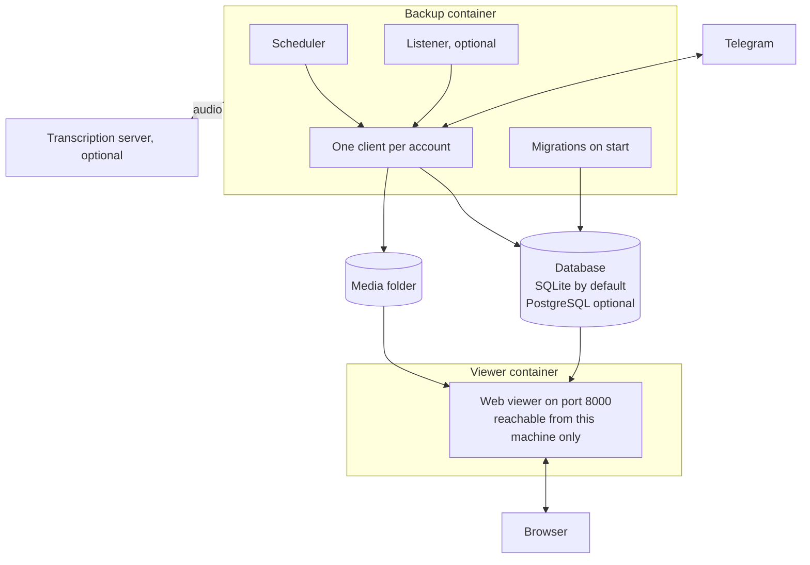

---
hide:
  - navigation
---

# Telegram Archive { .ta-visually-hidden }

  

  
  
  
  

---

**Telegram Archive** is a self-hosted backup of one or more Telegram accounts. It runs in Docker, or from the Python package, on your own machine and comes with a web viewer to read and search what it saved. The backup process is the only part that talks to Telegram. The viewer reads the archive and never contacts Telegram.

-   :material-docker: **[Run with Docker](getting-started/docker.md)**

    ---

    Start the backup and the viewer with the shipped compose file.

-   :material-play-circle-outline: **[Your first backup](getting-started/first-backup.md)**

    ---

    Follow the first run, check that it worked and pick the settings to change next.

-   :material-monitor-cellphone: **[Using the viewer](viewer/using-the-viewer.md)**

    ---

    Read chats, search messages and browse shared media.

-   :material-format-list-bulleted: **[Environment variables](reference/environment-variables.md)**

    ---

    Every setting, its default and what it changes.

## The viewer

The viewer looks and works like the Telegram app, with the archive behind it. See [Using the viewer](viewer/using-the-viewer.md).

## What it saves

- Messages with their formatting, replies and forwards.
- Edits kept as earlier versions and deletions kept and marked. Both need either the real-time listener, with `LISTEN_DELETIONS=true` for deletions, or `SYNC_DELETIONS_EDITS=true` on the scheduled backup. See [Real-time listener](configuration/listener.md).
- Photos, videos, voice notes, audio files, round videos, GIFs, stickers, documents and link previews. Each file is stored once and shared between the chats that hold it. By default the backup skips files over 100 MB. See [Media downloads](configuration/media.md).
- Reactions, as a count per emoji.
- Pinned messages, polls, service messages, forum topics, Telegram folders, archived chats, avatars and earlier profile photos.
- Several accounts in one archive. See [Multiple accounts](configuration/multiple-accounts.md).
- Transcripts of voice messages, and of other audio and video if you ask for it, once you configure a transcription server. See [Voice transcription](configuration/transcription.md).
- Imports from Telegram Desktop exports. See [Import and maintenance tasks](operations/maintenance.md).

The backup skips bot chats unless you add them. See [Choosing chats](configuration/choosing-chats.md).

## How it runs

- The backup image is `drumsergio/telegram-archive` and the viewer image is `drumsergio/telegram-archive-viewer`. Both share one version number. Each image runs on linux/amd64 and linux/arm64. Each runs as user id 1000.
- A backup runs when the container starts, then on a cron schedule. The default is 00:00, 06:00, 12:00 and 18:00 in the container's time zone, which is UTC in the image. See [Schedule and backup tuning](configuration/schedule.md).
- When the listener is on, it captures changes between runs.
- At the end of each backup, the backup retries failed media downloads and processes pending transcriptions.

## What it does not do

- It does not save secret chats.
- Messages deleted before the first backup are gone.
- It never sends or changes anything in your Telegram account. The one exception is a separate restore script that sends archived messages back to a chat as you. See [Command line and Python API](reference/cli.md).
- The viewer interface is in English only and has no offline mode.

## Privacy

- The archive stays on your own disk. Nothing leaves it unless you turn on one of the optional features below, and each sends only what its page describes.
- Logs never contain message text, chat ids, account names or phone numbers.
- Transcription is optional. When you turn it on, it sends the server you configure the audio file, its stored file name, a fingerprint of the file called its content hash, your transcription options and, if you set one, your callback URL. No message text or chat details go with it.
- The event webhook is optional. When on, it sends the message text, the previous text, the chat title and the sender name of each edit or deletion to the URL you configure. See [Event webhook](configuration/event-webhook.md).
- Web Push notifications are optional. In full mode a short encrypted preview of each new message goes through your browser's push service.

## Getting help

- Something broken: read [Monitoring and troubleshooting](operations/troubleshooting.md), then open an issue with the details it lists.
- A security problem: follow the [security policy](https://github.com/GeiserX/Telegram-Archive/blob/main/SECURITY.md) and do not open a public issue.
- What changed between releases: the [changelog on GitHub](https://github.com/GeiserX/Telegram-Archive/blob/main/docs/CHANGELOG.md).

## License

Telegram Archive is released under the [GPL-3.0](https://github.com/GeiserX/Telegram-Archive/blob/main/LICENSE) license. It is built on [Telethon](https://github.com/LonamiWebs/Telethon). Release notes are in the [changelog on GitHub](https://github.com/GeiserX/Telegram-Archive/blob/main/docs/CHANGELOG.md).
