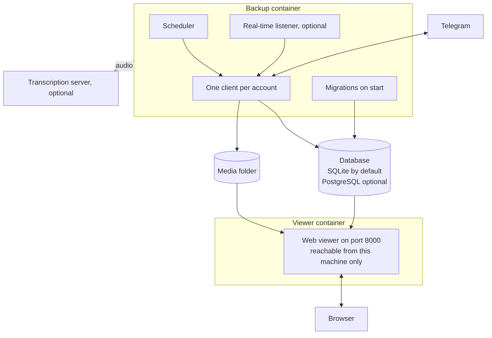

---
hide:
  - navigation
---

# Telegram Archive { .ta-visually-hidden }

  

  
  
  
  

---

**Telegram Archive** is a self-hosted backup of one or more Telegram accounts. It runs on your own machine, in Docker or from the [Python package](getting-started/pip.md). A web viewer lets you read and search what it saved. Only the backup talks to Telegram. The viewer only reads the archive.

-   :material-docker: **[Run with Docker](getting-started/docker.md)**

    ---

    [Log in to Telegram](getting-started/telegram-login.md), then start the backup and the viewer with the shipped compose file.

-   :material-play-circle-outline: **[Your first backup](getting-started/first-backup.md)**

    ---

    Follow the first run, check that it worked and pick the settings to change next.

-   :material-monitor-cellphone: **[Using the viewer](viewer/using-the-viewer.md)**

    ---

    Read chats, search messages and browse shared media.

-   :material-format-list-bulleted: **[Environment variables](reference/environment-variables.md)**

    ---

    Every setting, its default and what it changes.

## The viewer

The viewer looks and works like the Telegram app, with the archive behind it. See [Using the viewer](viewer/using-the-viewer.md).

## What it saves

- Messages with their formatting, replies and forwards.
- Edits and deletions. An edit keeps the earlier version, and a deleted message stays in the archive, marked as deleted. The [real-time listener](configuration/listener.md) catches edits when `ENABLE_LISTENER=true`, and deletions when you also set `LISTEN_DELETIONS=true`. The scheduled backup catches both with `SYNC_DELETIONS_EDITS=true`. See [Catching changes to older messages](configuration/schedule.md#catching-changes-to-older-messages).
- Photos, videos, voice notes, audio files, round videos, GIFs, stickers, documents and link previews. Each file is stored once and shared between the chats that hold it. By default the backup skips files over 100 MB. See [Media downloads](configuration/media.md).
- Reactions, as a count per emoji.
- Pinned messages, polls, service messages, forum topics, Telegram folders, archived chats, avatars and earlier profile photos.
- Several accounts in one archive. See [Multiple accounts](configuration/multiple-accounts.md).
- Transcripts of voice messages once you configure a transcription server. Other audio and video can be transcribed too if you turn that on. See [Voice transcription](configuration/transcription.md).
- Imports from Telegram Desktop exports. See [Import and maintenance tasks](operations/maintenance.md).

The backup skips bot chats unless you add them. See [Choosing chats](configuration/choosing-chats.md).

## How it runs

- The backup image is `drumsergio/telegram-archive` and the viewer image is `drumsergio/telegram-archive-viewer`. Both share one version number, run on linux/amd64 and linux/arm64, and run as user id 1000.
- A backup runs when the container starts, then on a cron schedule. The default is 00:00, 06:00, 12:00 and 18:00 in the container's time zone, which is UTC in the image. See [Schedule and backup tuning](configuration/schedule.md).
- When the listener is on, it captures changes between runs.
- At the end of each run, the backup retries failed media downloads, verifies media if `VERIFY_MEDIA` is on, and processes pending transcriptions. With `FILL_GAPS` on, the scheduler then looks for missing messages.

## What it does not do

- It does not save secret chats.
- It cannot recover messages deleted before the first backup.
- The backup and the viewer never send or change anything in your Telegram account. Only the separate restore script sends messages: it posts archived messages back to a chat as you. See [Command line and Python API](reference/cli.md).
- The viewer interface is in English only and has no offline mode.

## Privacy

- The archive stays on your own disk. Nothing leaves it unless you turn on one of the optional features below.
- The backup and viewer logs never contain message text, chat ids, Telegram account labels or phone numbers. Commands you run by hand, such as `list-chats` and `fill-gaps`, print the ids and names of the chats they work on, and `LOG_CHAT_TITLES=true` adds chat titles to progress lines.
- Transcription is optional. When you turn it on, it sends these to the transcription server you configure:
    - The audio. For a video, or a file over the upload limit, that is the sound track extracted from it.
    - A file name taken from the stored file.
    - The stored file's content hash, a fingerprint of the file.
    - Your API key, when you set one.
    - Your transcription options.
    - Your callback URL, when you set one.

    No message text or chat details go with it. See [Voice transcription](configuration/transcription.md).
- The event webhook is optional. When you turn it on, it sends each edit or deletion to the URL you configure. The default body holds the event name, the account, chat, message and sender ids, the chat title, the sender name, the message date, the media type, the message text and, for an edit, the old and new text. `EVENT_WEBHOOK_BODY_TEMPLATE` changes the body. See [Event webhook](configuration/event-webhook.md).
- Web Push notifications are optional. With `PUSH_NOTIFICATIONS=full`, the chat title, the sender name and the first 100 characters of each new message go through your browser's push service, encrypted for the browser. See [Live updates and notifications](viewer/live-updates.md#what-a-push-contains).

## Getting help

- If something is broken, read [Monitoring and troubleshooting](operations/troubleshooting.md), then open an issue with the details it lists.
- To report a security problem, follow the [security policy](https://github.com/GeiserX/Telegram-Archive/blob/main/SECURITY.md) and do not open a public issue.
- The [changelog on GitHub](https://github.com/GeiserX/Telegram-Archive/blob/main/docs/CHANGELOG.md) lists what changed between releases.
- The [Glossary](reference/glossary.md) explains the terms these pages use.
- To script against the viewer, use the [HTTP API](reference/api.md).
- The [Roadmap](roadmap/index.md) lists what is planned next.
- To send a fix or a feature, read [Contributing](contributing.md).

## License

Telegram Archive is released under the [GPL-3.0](https://github.com/GeiserX/Telegram-Archive/blob/main/LICENSE) license. It is built on [Telethon](https://github.com/LonamiWebs/Telethon).
