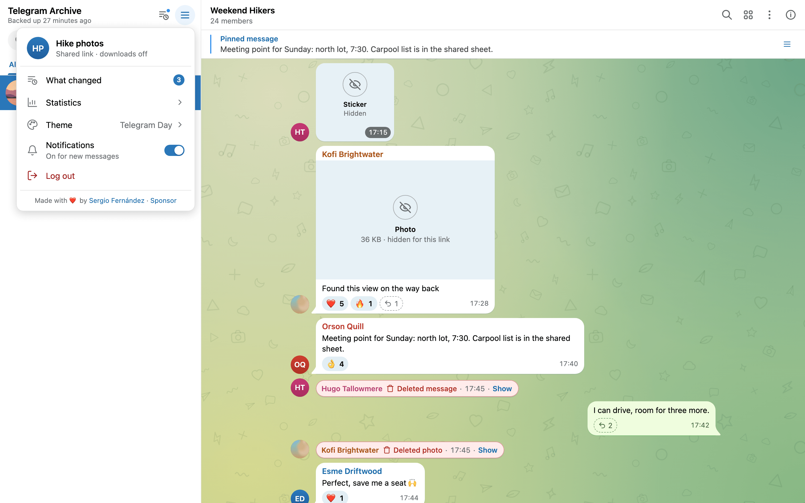

# Logins, viewer accounts and share links

Each login to the viewer has a role and a set of granted chats. TLS, proxy setup and the routes that need no login are in [Exposing the viewer safely](exposing.md).

## The viewer starts closed

The viewer serves no archive data until you choose how people log in. You have three options:

- `VIEWER_USERNAME` plus `VIEWER_PASSWORD` for a master login.
- `AUTH_PROXY_HEADER` for identity set by a trusted reverse proxy.
- `ALLOW_ANONYMOUS_VIEWER=true` for an open, read-only viewer.

With none of them set, the container is up and healthy, the login page shows, and sign-in fails. Every data route answers HTTP 503 `Viewer authentication is not configured`.

## Roles

| Role | Who gets it | What it can do |
|------|-------------|----------------|
| master | The `VIEWER_USERNAME` login, or a proxy user listed in `AUTH_PROXY_ADMIN_USERS` | Everything, including admin-only features |
| viewer | A viewer account created by the master login, or a proxy user | Only the Telegram accounts and chats granted to it |
| token | A session opened with a share link | Only the chats of that token |
| viewer, user name `anonymous` | Every visitor when `ALLOW_ANONYMOUS_VIEWER=true` | Read-only access to every chat in `DISPLAY_CHAT_IDS`. See [Anonymous mode](#anonymous-mode). |

The master login also gets **Admin Settings**, viewer accounts, share tokens, the audit log, the **Archive Status** panel and file paths in the info panel. When `MEDIA_OPEN_CMD` or `MEDIA_OPEN_PATH_CMD` is set, the master login also gets the media **Open** buttons.

## The master login

Set both variables in the viewer's environment:

```yaml
services:
  telegram-viewer:
    environment:
      VIEWER_USERNAME: admin
      VIEWER_PASSWORD: change-me-to-a-long-password
```

Password login is on only when both values are non-empty. Leading and trailing spaces are stripped from both. At login the viewer checks viewer accounts first, then the master login. The master comparison takes the same time however many characters match, so timing does not reveal how close a guess was.

A request with the header `X-Viewer-Only: true` cannot log in as master or reach master routes. Viewer accounts can still log in with that header present.

Viewer passwords and share tokens are stored as PBKDF2-HMAC-SHA256 hashes with 600,000 rounds. The master password is never stored; it lives only in the environment.

## Sessions

A successful login sets the cookie `viewer_auth`, which is `HttpOnly` and `SameSite=Lax`.

- A session lasts `AUTH_SESSION_DAYS` days, default 30, counted from login, not from last use. The value must be a whole number: anything else stops the viewer at start.
- A running viewer keeps at most 10 sessions per user in memory. An 11th login ends the oldest one it knows about. At start it loads every stored session, but a session another viewer opens later is counted only once a request uses it here.
- Sessions live in the database and survive a viewer restart. A sweep every 900 seconds removes expired ones and closes their live connections.
- A viewer checks each session it holds in memory against the database again once the last check is 60 seconds old. A session ended on another viewer on the same database stops working here within 60 seconds. See [A second viewer](#a-second-viewer).
- Logging out ends that session and deletes every push subscription of that user. Other browsers of the same user subscribe again on their next load.

!!! warning "Changing the master password does not log anyone out"
    The viewer does not check existing sessions of the master login against `VIEWER_USERNAME` or `VIEWER_PASSWORD` again. After a change they stay valid until `AUTH_SESSION_DAYS` runs out, or until you [end every session](#end-every-session).

Logins and share-token logins share one rate limit: 15 attempts per client IP in 300 seconds, then HTTP 429. Behind a reverse proxy every client can look like the same IP, so one client can use up the limit for all. [Exposing the viewer safely](exposing.md) shows how to fix this.

## Reset a password

### The master password

Set a new `VIEWER_PASSWORD` in `.env` and recreate the viewer:

```bash
docker compose up -d telegram-viewer
```

Sessions opened with the old password stay valid. See the warning under [Sessions](#sessions). To log them out, sign in with the new password and [end every session](#end-every-session). **End all but this one** keeps the session you just opened.

### A viewer account

Open **Admin Settings**, **Viewer Accounts**, edit the viewer account and type a new password of at least 8 characters. Saving ends that account's sessions. See [Viewer accounts](#viewer-accounts).

### A share token

The token is shown once and only its hash is stored, so a lost link cannot be recovered. Revoke or delete the token and create a new one.

### Proxy identity

The password belongs to the reverse proxy or the identity provider in front of it. The viewer stores none.

## End every session

The master can log out every browser at once, for example after a master password change. This ends the master's sessions, every viewer account's sessions and every share-token session. Accounts and share tokens stay as they are, so people log in again with their current password or link.

Open the gear icon, **Admin Settings**, then the **Sessions** tab. It has two buttons, and each asks you to confirm:

- **End every session** logs out everyone, you included. The page returns to the login.
- **End all but this one** keeps the browser you click it in and logs out everything else, your other browsers included.

Both close the live connections of the ended sessions and delete the push subscriptions of their users. Those users subscribe again after their next login. The audit log records the action as `sessions_ended_all`, or `sessions_ended_all:kept_current` when your session was kept. A second viewer on the same database drops the ended sessions within 60 seconds. See [A second viewer](#a-second-viewer).

The same action is the route `POST /api/admin/sessions/end-all`. Only the master may call it: the master login, or a proxy identity listed in `AUTH_PROXY_ADMIN_USERS`. Viewer accounts and share-token sessions get HTTP 403, and so does a request with `X-Viewer-Only: true`. Add `?keep_current=true`, or send the JSON body `{"keep_current": true}`, to keep the session of the cookie you call it with. Without either, your own session ends too:

```bash
curl -X POST -b "viewer_auth=<your session cookie>" \
  "https://archive.example.com/api/admin/sessions/end-all?keep_current=true"
```

The answer names how many sessions ended and whether yours was one of them:

```json
{"success": true, "ended": 4, "current_session_ended": false}
```

When `current_session_ended` is `true`, the answer also clears the cookie. A caller signed in through proxy identity has no session of its own, so the action ends nothing of theirs and the next request signs them in again through the proxy.

## Viewer accounts

The master login manages accounts in the viewer itself. Open the gear icon, **Admin Settings**, then the **Viewer Accounts** tab. The **Create Viewer** form has these fields:

| Field | Meaning |
|-------|---------|
| Username | At least 3 characters. It cannot match the master username, in any letter case. |
| Password | At least 8 characters. When editing, leave it empty to keep the current one. |
| Allowed Chats | The chats this user may open. |
| Allowed Accounts | **All accounts**, or only the Telegram accounts you tick. Ticking none means the user sees no chats. |
| Active | Untick to block the account without deleting it. |
| No Downloads | Makes this a [no-download login](#no-download-logins). |

Saving a change to a viewer account, or deleting it, ends all of its sessions, closes its live connections and deletes its push subscriptions. The user has to log in again. A second viewer on the same database drops those sessions within 60 seconds. See [A second viewer](#a-second-viewer).

!!! warning "No chats ticked means all chats"
    The form sends an empty **Allowed Chats** box as "all chats". Viewer accounts created through proxy identity start with no chats at all. If you edit one of them and tick nothing, you widen it to every chat. Always tick the chats you mean to grant.

## Share links

A share link gives someone access to a fixed set of chats without an account. In **Admin Settings**, open **Share Tokens** and fill in **Create Share Token**:

| Field | Meaning |
|-------|---------|
| Label | Optional. It names the session and the audit entries. |
| Expiry date and time | Optional. You enter it in your browser's local time and it is stored in UTC. |
| Allowed Chats | Required. A token must name at least one chat. |
| No Downloads | Optional. Makes this a [no-download login](#no-download-logins). |

Press **Create Token**. The viewer shows a 64-character hex token and a ready link, each with a copy button. They are shown only once. The database keeps only a salted hash. The link has this form:

```text
https://archive.example.com/#token=<token>
```

When the link opens, the page signs in with the token and removes it from the address bar. Browsers never send the part after `#` to the server, so the token stays out of access logs.

You can also paste the token into the **Share Token** mode of the login page. A hand-made `?token=` link works too, but it reaches server access logs.

The session is named `token:<label>`, and it sees only the chats of the token. A token with no label is named `token:token:<id>`, where `<id>` is its number in the token list. Tokens have no account grant; the chat list is the whole scope.



To end access:

- **Revoke** or **Delete** the token in the list. Either one ends every session the token created and deletes their push subscriptions on this viewer. A second viewer on the same database drops those sessions within 60 seconds. See [A second viewer](#a-second-viewer). Changing its chats or its no-download setting through the API does the same.
- Do not rely on expiry for this. Expiry only stops new logins with the token. Sessions it already opened keep working until `AUTH_SESSION_DAYS` runs out.

Each token login checks the presented token against every live token in turn, at about 50 ms per token. Delete tokens you no longer need.

!!! note "Share links need the master login"
    Share-token sessions and viewer accounts use the session cookie. The viewer checks that cookie only when `VIEWER_USERNAME` and `VIEWER_PASSWORD` are set. With proxy identity alone they cannot be used.

## No-download logins

A viewer account or share token with **No Downloads** ticked can read messages but cannot take files away:

- Media files, thumbnails, chat exports and voice transcripts answer HTTP 403.
- Files in messages show `Not available for this login`, and audio play buttons are disabled.
- The lightbox has no download button, and search skips hits that match only inside a transcript.
- Profile photos still show.

## A second viewer

You can run more than one viewer container against the same archive, for example one for yourself and one limited to a few chats for other people. The stock `docker-compose.yml` has a commented example named `telegram-channel-viewer`. Before you uncomment it, read the points below.

- Both read the same database, so viewer accounts, share tokens, sessions, the audit log and the generated Web Push keys are shared. Each viewer applies its own `DISPLAY_CHAT_IDS`, master login and display settings.
- Browsers send a cookie to every port of a host name. On one host name, a master login on the main viewer is also a master login on the second viewer, and the second viewer only narrows it with its own `DISPLAY_CHAT_IDS`. Give the second viewer its own host name behind the reverse proxy, or use it only for other people.
- Ending sessions reaches every viewer, the other one within 60 seconds. Editing or deleting an account, revoking a token or [ending every session](#end-every-session) removes the sessions from the database and from the memory of the viewer you use. The other viewer checks each session it holds against the database again once that check is 60 seconds old. The next request after that fails, and the browser returns to the login. A browser there that only keeps a live connection open, with no requests, is closed by the sweep that runs every 900 seconds. If the database cannot be read, the viewer keeps the session and checks again 10 seconds later.
- On SQLite the backup sends live events to one address, `VIEWER_HOST` and `VIEWER_PORT`. The second viewer gets none. An open chat there picks up new messages through its 3-second poll only, and it sends no notifications. On PostgreSQL both viewers receive every event.

The shipped example publishes port 8001 on every interface. It has no database variables, no time zone and none of the hardening of the stock services. Use this service block under `services:` instead:

```yaml
services:
  telegram-channel-viewer:
    image: drumsergio/telegram-archive-viewer:8.17.0
    container_name: telegram-channel-viewer
    restart: unless-stopped
    ports:
      - "127.0.0.1:8001:8000"
    environment:
      BACKUP_PATH: /data/backups
      DB_TYPE: ${DB_TYPE:-sqlite}
      DB_PATH: ${DB_PATH:-/data/backups/telegram_backup.db}
      DISPLAY_CHAT_IDS: "-1001234567890,-1009876543210"
      VIEWER_USERNAME: public_viewer
      VIEWER_PASSWORD: choose-another-long-password
      VIEWER_TIMEZONE: ${VIEWER_TIMEZONE:-Europe/Madrid}
    volumes:
      - ./data:/data
    networks:
      - telegram-network
    read_only: true
    tmpfs:
      - /tmp
    cap_drop:
      - ALL
    security_opt:
      - no-new-privileges:true
```

With PostgreSQL, add the `POSTGRES_*` variables as well, the same as on `telegram-viewer`. Put a reverse proxy in front before you open the port to other machines. See [Exposing the viewer safely](exposing.md).

## How visibility combines

Three rules apply to every request, in this order:

1. `DISPLAY_CHAT_IDS` limits the whole viewer for every role, the master login included.
2. The user's account grant limits it further.
3. The chat grant of the user or token limits it last.

If you write a chat id in `DISPLAY_CHAT_IDS` without its `-100` prefix and only the prefixed form exists in the archive, the viewer corrects it at start. The viewer drops live updates for chats outside the list.

A grant that is not set means no restriction. A grant set to an empty list denies everything. See [No chats ticked means all chats](#viewer-accounts) for how the **Admin Settings** form saves an empty **Allowed Chats** box. A chat you may not see answers the same 404 `Chat not found` as a chat that does not exist, so a restricted user cannot probe for chats.

A restricted user never learns about accounts outside its grant. The account list and the message sender chips hide them, and the statistics are recomputed from that user's own chats.

Numeric chat and sender ids stay visible to every login. See [What logged-in users can see](exposing.md#what-logged-in-users-can-see).

## Anonymous mode

`ALLOW_ANONYMOUS_VIEWER=true` opens the viewer to anyone who can reach it. The value must be `true`, in any letter case. Other values such as `1` or `yes` leave it off. It takes effect only when neither the master login nor proxy identity is configured.

Every visitor is logged in as a read-only user named `anonymous` without master rights. It can read every chat allowed by `DISPLAY_CHAT_IDS` and download files. It can also subscribe to push notifications and ask for a voice transcript, which queues a transcription.

## Identity from a reverse proxy

With `AUTH_PROXY_HEADER` set, the viewer takes the username from that request header:

| Variable | Default | Effect |
|----------|---------|--------|
| `AUTH_PROXY_HEADER` | unset | Name of the header that carries the username. Setting it turns proxy identity on. |
| `AUTH_PROXY_ADMIN_USERS` | unset | Comma-separated usernames that get the master role. Exact match. |
| `AUTH_PROXY_DEFAULT_ACCESS` | `none` | `all` gives new proxy users every chat. Any other value gives them no chats until the master login grants some. |

On first visit, the viewer creates a viewer account for each proxy user who is not an admin. That account lives in the database, so these requests get HTTP 503 if the database is unreachable. The master login edits its grants in **Viewer Accounts**, the same as any other account. Read the warning in [Viewer accounts](#viewer-accounts) first. A disabled account gets HTTP 403.

A request without the header falls back to the session cookie, so password logins keep working next to the proxy when the master login is also set.

!!! danger "The proxy must own the header"
    The viewer trusts the header as given. Anyone who can send it straight to the viewer can log in as any user, including an admin. The proxy must strip or overwrite that header on every request, and the viewer must not be reachable around the proxy. See [Exposing the viewer safely](exposing.md).

## The audit log

The viewer records these events in the database:

- Logins, failed logins and logouts.
- Share-token logins, successful and failed.
- Admin changes: viewer accounts created, updated or deleted, share tokens created, updated or deleted, settings changed, and every session ended.

Password login entries carry the username, role, client IP and browser user agent. Share-token entries carry the client IP but no user agent. The viewer does not log ordinary reads of chats and messages.

The master login reads the log in **Admin Settings**, tab **Audit Log**. It shows the 50 newest entries and filters by action. The API route `GET /api/admin/audit` returns up to 500 entries per request and filters by `username` and `action`.

Behind a reverse proxy, every entry shows the proxy's IP by default. Login and share-token entries can record the real client IP if the viewer trusts forwarded headers. See [Exposing the viewer safely](exposing.md). Logout and admin-change entries always show the proxy's IP.
