# Themes and wallpaper

This page shows how to pick a colour theme in the viewer, set a default theme for every browser, and put your own wallpaper behind the messages.

## Pick a theme

Open the main menu, the three lines at the top of the sidebar, and click **Theme**. Its row names the theme you use now. A list opens in the menu with **Match system** at the top and the eleven themes below it. Click one and the viewer switches to it at once. Each row shows a tiny chat: the theme's background with a message from someone else at the top left and one of your own at the bottom right. The one for Match system is split on the diagonal between the two themes it can show, and its row says which one it shows now. The back arrow returns to the menu. On a phone the menu opens as a sheet, with the themes two to a row.

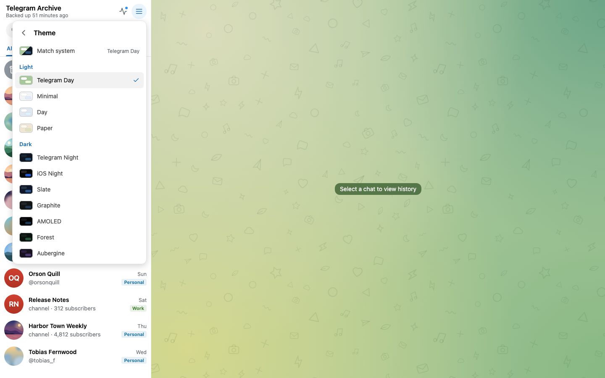

## The themes

| Id | Label | Kind |
|----|-------|------|
| `system` | Match system | Telegram Day or Telegram Night, the default |
| `telegram` | Telegram Day | Light, green wallpaper with a line pattern |
| `night` | Telegram Night | Dark |
| `iosnight` | iOS Night | Dark, black lists and blue outgoing messages |
| `slate` | Slate | Dark |
| `minimal` | Minimal | Light, one colour for every name |
| `graphite` | Graphite | Dark, one colour for every name |
| `amoled` | AMOLED | Dark, true black |
| `forest` | Forest | Dark |
| `aubergine` | Aubergine | Dark |
| `day` | Day | Light |
| `paper` | Paper | Light |

**Match system** follows the light or dark setting of the device. It shows Telegram Day on a light system and Telegram Night on a dark one, and it switches while the page is open when the system does.

Every theme keeps text at a contrast of at least 4.5:1, including the times, the quotes and the names in group chats.

Each screenshot below shows the same group chat in one theme. Telegram Day comes first because Match system shows it on a light system.

=== "Telegram Day"

    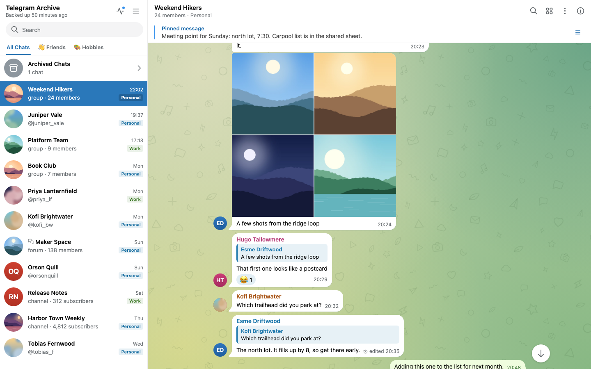

=== "Telegram Night"

    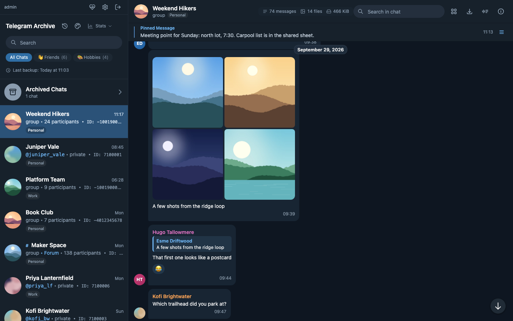

=== "iOS Night"

    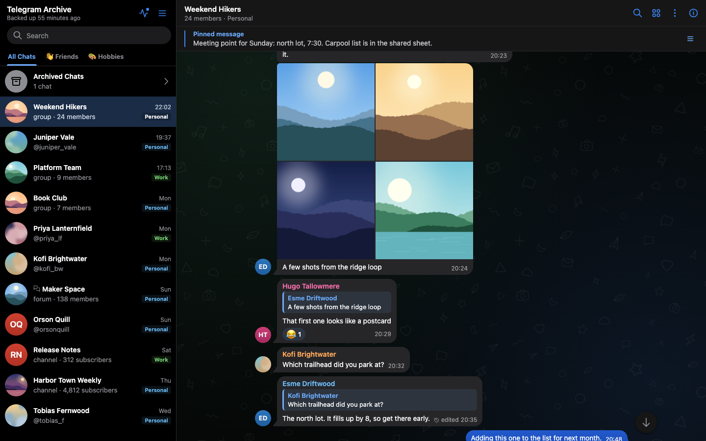

=== "Slate"

    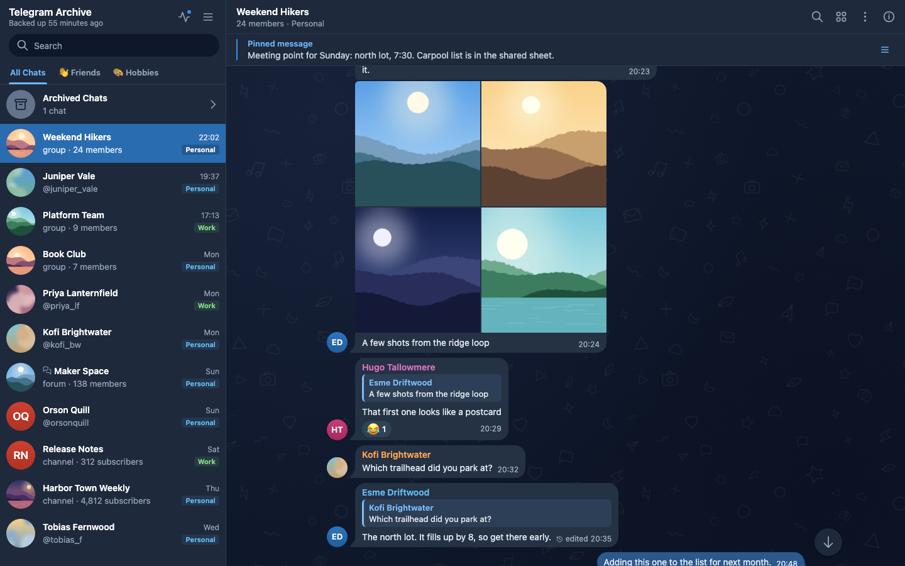

=== "Minimal"

    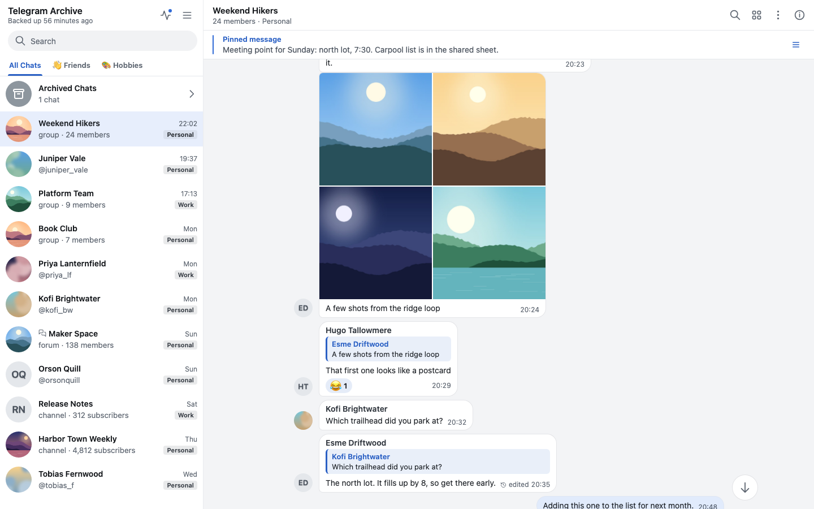

=== "Graphite"

    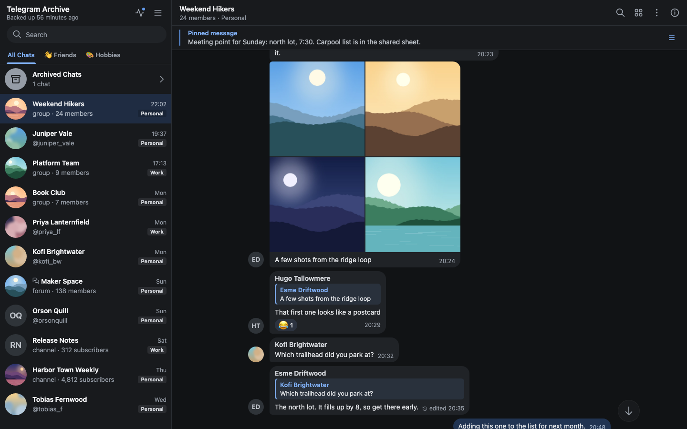

=== "AMOLED"

    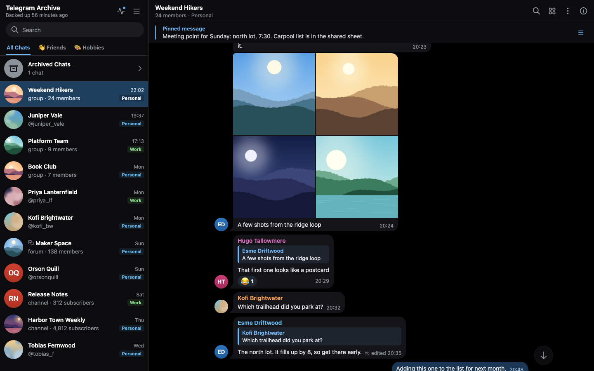

=== "Forest"

    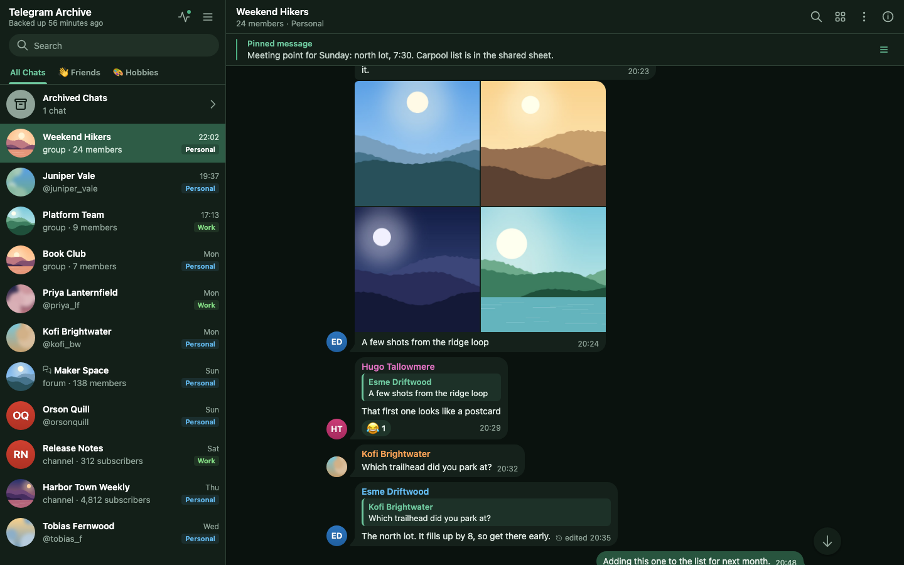

=== "Aubergine"

    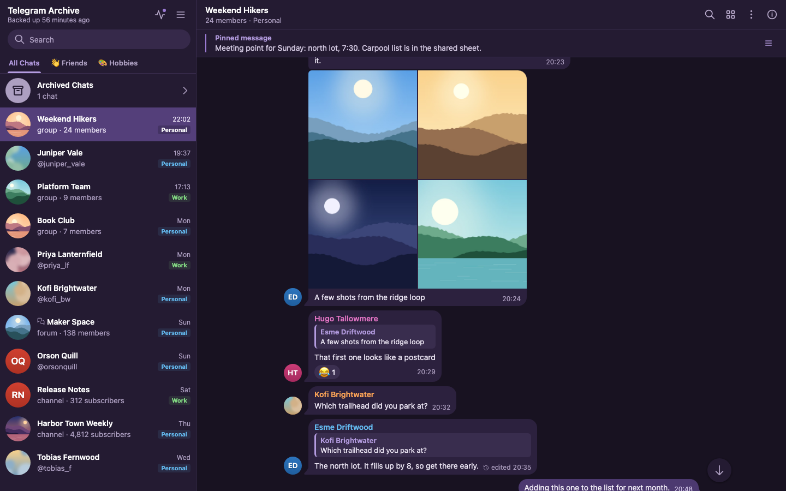

=== "Day"

    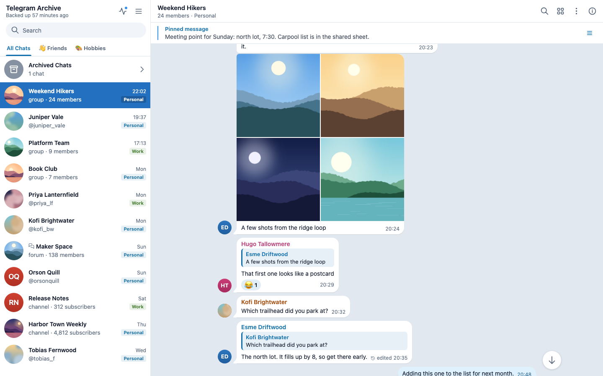

=== "Paper"

    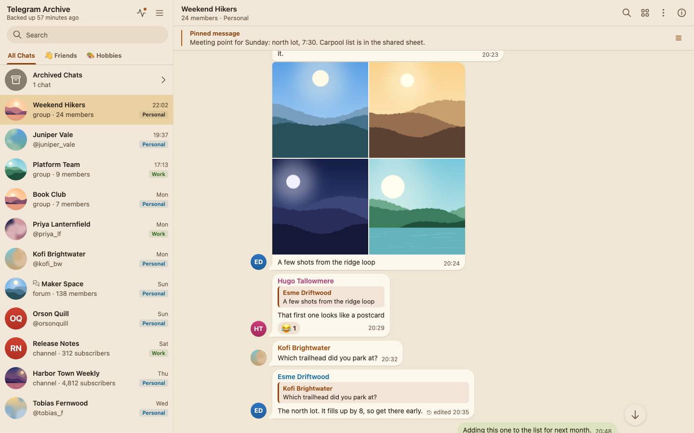

## Which theme a browser gets

When the page loads, the viewer takes the first of these that holds a known theme id:

1. `?theme=<id>` in the URL. The viewer saves it as the browser's choice, then removes it from the address bar.
2. The theme this browser saved from the picker or from an earlier `?theme=` link.
3. `VIEWER_DEFAULT_THEME` on the server.
4. Match system.

The choice is stored in the browser. It does not follow a user to another browser or another device. A browser that never picked a theme stores nothing, so it follows the default.

To open the viewer in Day for someone else, send them a link with `?theme=day`, for example `https://archive.example.com/?theme=day`. Their browser keeps Day until they pick something else.

## Set a default for all browsers

`VIEWER_DEFAULT_THEME` sets the theme for every browser that has no saved choice. The value is lowercased and must be one of the ids in the table. Any other value is ignored and the viewer falls back to Match system.

The viewer applies the default before the page first paints, so nobody sees a flash of another theme first.

The variable is already in the viewer's `environment` block of the stock `docker-compose.yml`. Set it in your `.env`:

```bash
VIEWER_DEFAULT_THEME=night
```

Then recreate the viewer:

```bash
docker compose up -d telegram-viewer
```

## Add a chat wallpaper

Telegram Day and iOS Night draw their own wallpaper, a line pattern over a gradient. The other themes use a flat colour.

`VIEWER_CHAT_BACKGROUND` names an image file that the viewer shows behind the messages in every theme, in place of the theme's own wallpaper.

The value is a bare file name inside the viewer's static directory:

- Allowed characters: letters, digits, dots, underscores and hyphens.
- The first character is a letter or a digit.
- The name is at most 128 characters long.

The viewer ignores any other value and logs a warning. If the file is not in the static directory, the viewer logs a warning and the message pane keeps its plain background.

Message bubbles are opaque in every theme, so text stays readable over the picture. When a wallpaper is set, the date and service labels over it turn opaque too. The viewer tints the image with the current theme's canvas colour, so one picture works under light and dark themes.

!!! warning "The wallpaper is public"
    The viewer serves the image without a login, like its other static files. Anyone who can reach the viewer can load it. Do not use a private picture.

=== "Docker"

    Mount the single image file read-only into the static directory, and add the variable to the viewer's `environment` block. The viewer runs with a read-only root filesystem, so a bind mount is the only way to add the file. Keep the mount in your compose file so it survives image updates.

    In `docker-compose.yml`, on the `telegram-viewer` service:

    ```yaml
    services:
      telegram-viewer:
        environment:
          VIEWER_CHAT_BACKGROUND: wallpaper.jpg
        volumes:
          - ./data:/data
          - ./wallpaper.jpg:/app/telegram_archive/web/static/wallpaper.jpg:ro
    ```

    The file name in the mount and in `VIEWER_CHAT_BACKGROUND` must match. The stock compose file already passes `VIEWER_CHAT_BACKGROUND` from `.env`, so you can set it there instead.

    !!! danger "Mount the file, not a directory"
        Never mount a directory over the static directory. It hides the viewer's own scripts and styles, and the page comes up blank.

=== "Native install"

    Copy the image into the `web/static` directory of the installed `telegram_archive` package. This command prints that directory:

    ```bash
    python -c "import pathlib, telegram_archive; print(pathlib.Path(telegram_archive.__file__).parent / 'web' / 'static')"
    ```

    Copy the file there, set `VIEWER_CHAT_BACKGROUND=wallpaper.jpg` in the viewer's environment, and restart the viewer.

## What themes do not change

- If you add the viewer to a phone's home screen, the colour of its start-up screen stays the same in every theme. The browser bar colour does follow the theme.

For the rest of the viewer, see [Using the viewer](using-the-viewer.md). [Environment variables](../reference/environment-variables.md) lists every viewer variable.
