# Using the viewer

This page walks through the web viewer screen by screen. For signing in and sharing, see [Logins, viewer accounts and share links](access.md). For colours, see [Themes and wallpaper](themes.md). For notifications, see [Live updates and notifications](live-updates.md).

## Layout

The viewer has three panes:

- The **sidebar** on the left holds the chat list and search.
- The **chat pane** in the middle shows the messages of the open chat.
- The **info panel** on the right opens when you click the chat information button in the chat header.

The viewer only reads the archive. It never contacts Telegram. The interface is in English only.

`VIEWER_TIMEZONE` sets the time zone for every time the viewer shows. It defaults to `Europe/Madrid`. If the zone name is unknown, the viewer logs a warning and uses UTC.

On a desktop you can resize the sidebar and the info panel. Drag the handle between two panes, or focus the handle and press <kbd>Left</kbd> or <kbd>Right</kbd> to move it 16 px at a time.

| Pane | Width |
|------|-------|
| Chat list | 300 to 960 px, a quarter of the window by default |
| Info panel | 260 to 640 px, 320 px by default |
| Messages | always at least 360 px |

Each browser remembers its own widths.

## Chat list

The top of the sidebar shows folder tabs under the search field. **All Chats** comes first, then one tab per Telegram folder, with the folder's emoji when it has one. Hover a folder tab to see its chat count; a screen reader reads it with the tab's name. The tabs only appear when the archive holds at least one folder. In All Chats, an **Archived Chats** row appears when you have archived chats in Telegram. Inside Archived Chats the tabs hide, a row at the top names the list and counts its chats, and its back arrow returns to the list.

Chats load 50 at a time. Scroll down and the next 50 load. Each row shows the chat's name and the date of its last message. Under the name, a group or a channel shows what kind of chat it is and its member count, for example `group · 24 members`, and a private chat shows the person's username, or `private chat` when there is none. A group's username and the chat's Telegram id are in the info panel.

When you can see more than one Telegram account, each row carries a tag with the account's label, in the style of Telegram's folder tags: each account keeps its own colour. The chat header names the account after the member count. When more than one archived account holds or writes in the open chat, an incoming message names its account at the right end of the sender's name, and an outgoing one before its time. See [Multiple accounts](../configuration/multiple-accounts.md).


Under the archive's name the sidebar says how fresh the archive is:

| Line | Means |
|------|-------|
| Backed up today at 17:42 | the time of the last backup |
| Live · backed up today at 17:42 | the [listener](../configuration/listener.md) is running, so new messages arrive as they are sent |
| Backing up… | a backup is running now |
| Last backup did not finish | the master login only: the last run stopped before its statistics step. Click the line to open [Archive status](#archive-status). |
| No backup yet | no backup has run |

The pulse button beside it opens [What changed](#what-changed). The three lines open the [main menu](#main-menu).

## Search

One field at the top of the sidebar searches chats and messages together. Results appear 300 ms after you stop typing.

- **Chats** match on title, first name, last name or username.
- **Messages** use full-text search that matches the start of words. The newest match comes first. Results load 20 at a time as you scroll, and the list stops at 5,000 with "Showing the first 5,000 matches".

Use <kbd>Up</kbd> and <kbd>Down</kbd> to move through both sections, <kbd>Enter</kbd> to open a result, and <kbd>Esc</kbd> to clear the field. A second <kbd>Esc</kbd> leaves the field.

A hit found in a voice transcript carries a small transcript mark and the word "transcript". A hit on a message deleted in Telegram carries a trash mark and "deleted".

If the archive has no full-text index yet, the message section says so. The index is created by the database migrations, which shipped in 8.3.0. The backup image applies them when its container starts. On a pip install, run `telegram-archive migrate`. A SQLite build without FTS5 keeps the older substring search.

You can paste a Telegram link into the field. A `t.me/c/<id>/<msg>` or `t.me/<username>/<msg>` link opens that message when the chat is in the archive. Otherwise the sidebar says "That link points at a chat this archive does not hold".

Inside an open chat, the search button in the chat header opens a field that searches that chat only, with the same 300 ms delay. On a phone the field covers the header. Press <kbd>Esc</kbd> or the close button to clear it.

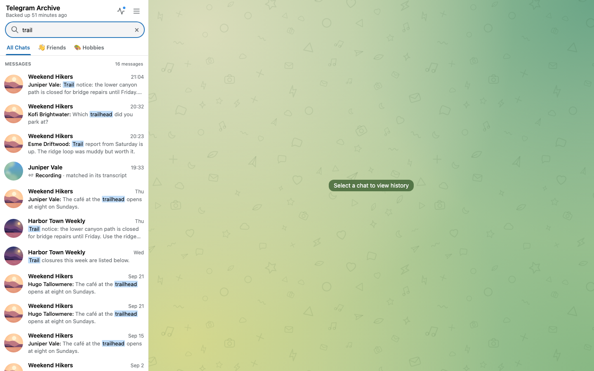

## Reading messages

The chat header shows the member count, for example `24 members` or `4,812 subscribers`. When the archive has no count, it shows what kind of chat it is, such as `private chat`.

Messages from one sender in a row form a run. In a group, the sender's name sits on the first bubble and their photo beside the last. A run ends when someone else writes, at a new day, or when the same sender writes again more than 15 minutes later.

### Text

Messages keep their Telegram formatting: bold, italic, underline, strikethrough, code, preformatted blocks, quotes and spoilers. Click a spoiler, or focus it and press <kbd>Enter</kbd> or <kbd>Space</kbd>, to reveal it.

Only `http`, `https` and `tg` links are clickable. Mentions are highlighted. Web addresses that start with `http://` or `https://` become links even without formatting. Email addresses become links when Telegram marked them as such.

A `#hashtag` or `$CASHTAG` opens a tag view with three tabs: **This chat**, **My messages** and **All chats**.

### Replies and forwards

A reply shows a quote of the message it answers: the sender's name and one line of the text, beside a bar in the quote colour. Click the quote to jump to the original. When the original was deleted in Telegram, a small trash follows the name; the archive still has its text, so the quote shows it.

A forward shows "Forwarded from" and the source on two plain lines. When the source chat is also in the archive, a link icon follows its name. Click the header to open the original message.

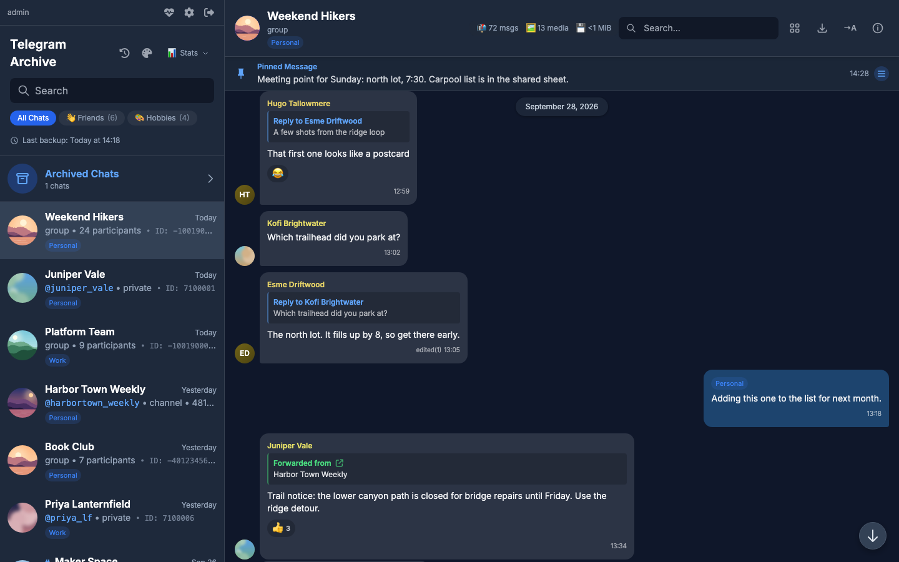

### Albums

Photos and videos sent together render as one grid:

| Items | Grid |
|-------|------|
| 2 | two columns |
| 3 | two on top, one below |
| 4 | two by two |
| 5 or more | three columns |

The caption comes from whichever item carries it. The viewer renders only the first message of an album and does not show reactions on the other messages.


### Media

- **Round videos** play in place as a circle, muted, while they are on screen. Click one to turn the sound on or off. They never open in the lightbox.
- **GIFs** loop while they are on screen and pause when you scroll away.
- **Stickers** in `.webp` show as images up to 200 px wide. Other stickers show the text "Animated Sticker".
- **Polls and quizzes** show each answer with a percentage bar and the total votes.
- **Dice, venues, invoices, stories, giveaways, live locations and games** show as a chip.
- **Link previews** show the archived card with site name, title, description and image.

When a file is not in the archive, a placeholder takes its place in the same shape: a photo or a video keeps its proportions, a round video its circle, and a voice message, an audio or a document its file row. A ring in the middle holds a sign for the reason, and two lines say what it is and why, with its size when the archive knows it, for example `24 MB · over the download limit`. The ring is not a button: nothing downloads from here. A file missing from the archive disk, the one fault among the reasons, shows an amber disc instead. [Why media is missing in the viewer](../configuration/media.md#why-media-is-missing-in-the-viewer) lists each reason and the setting behind it.

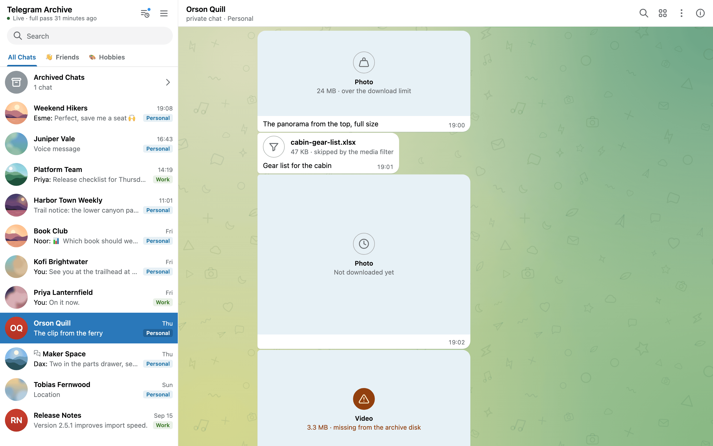

Voice messages and other audio can carry a transcript that opens under the player. See [Voice transcription](../configuration/transcription.md).

### Reactions, edits and deletions

Reactions show as chips with the emoji and, when above one, the count.

An edited message shows "edited" before its time, as Telegram does. When the archive kept earlier texts, a small history mark comes before the word and the word is a button; its tooltip gives the edit time and how many earlier versions were kept. When the archive did not see the earlier text, the tooltip says so. Click the button to open the **Edit history**. It shows the original, each edit and the current text as bubbles, oldest first, each labelled with its time, and with its day when that is not the day the message was sent. The words each edit added are marked in the quote colour and the words it removed are struck through. It lists up to 100 earlier texts. On a phone it opens as a page with a back arrow.

=== "Telegram Day"

    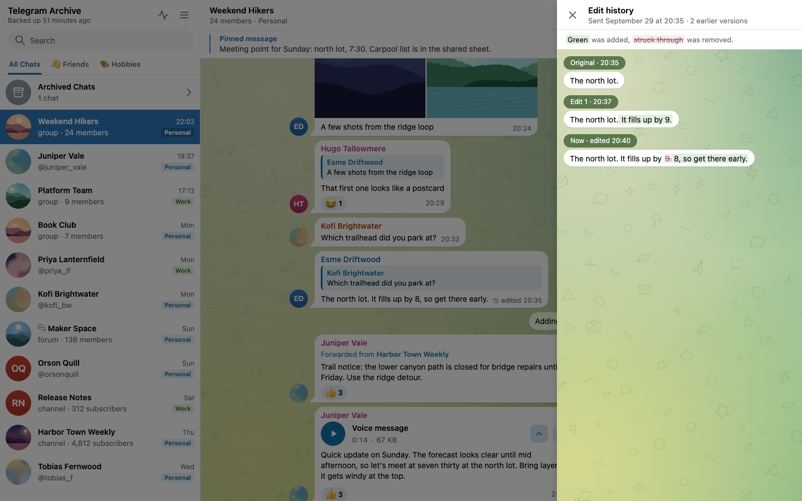

=== "Telegram Night"

    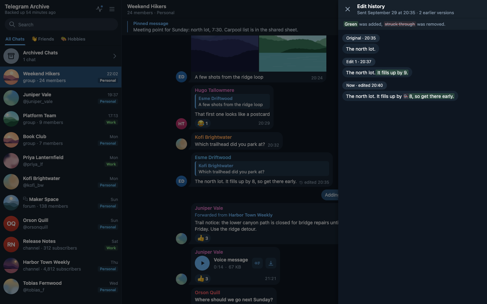

=== "Phone"

    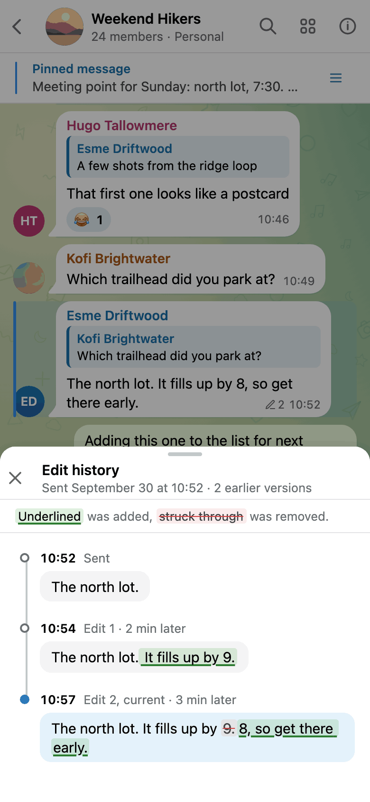{ width="300" }

### Deleted messages

A deleted message stays in place with its text in full. A faint wash of a calm red marks the bubble, and before its time the meta line reads "deleted" with a trash mark. The tooltip says when Telegram deleted it; the time beside it is still the time it was sent. On a photo with nothing else, the trash rides the time over the corner. An album carries one mark on its caption bubble when any of its pictures was deleted. The info panel shows the deletion as a fact, "Deleted in Telegram" with its date. The archive only learns about deletions when the listener runs with `LISTEN_DELETIONS=true` or the backup runs with `SYNC_DELETIONS_EDITS=true`. Both are off by default. With `DELETION_MODE=soft`, the default, the row is kept and marked. With `hard` it is removed.

=== "Telegram Day"

    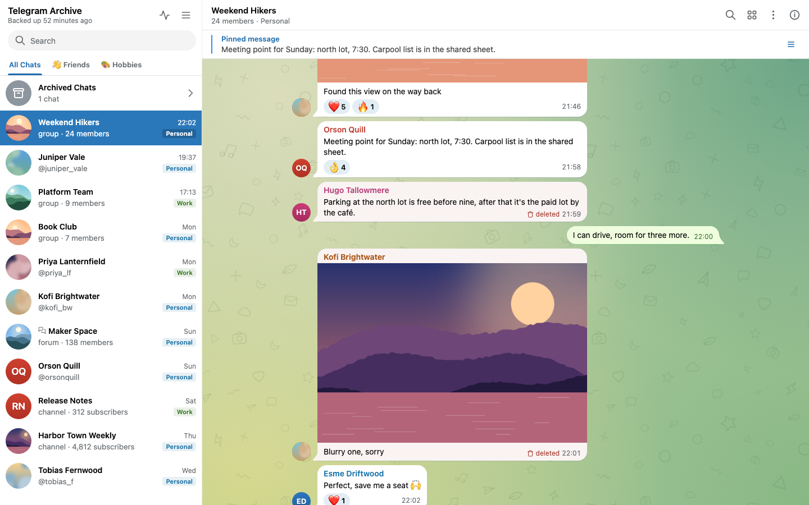

=== "Telegram Night"

    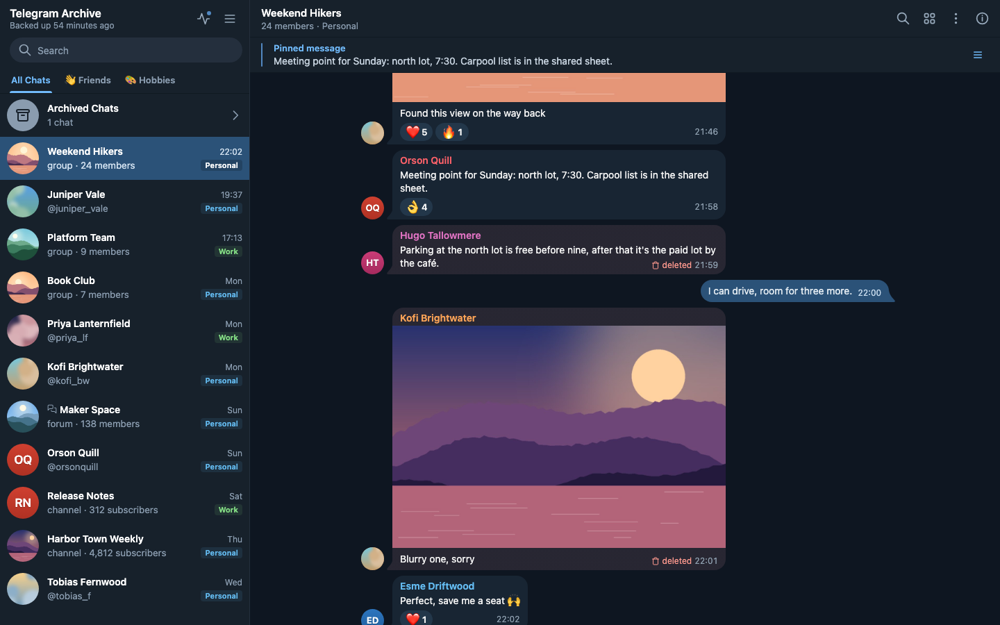

=== "Phone"

    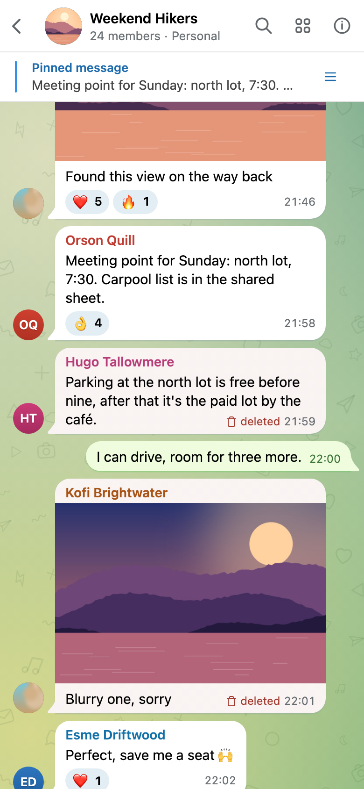{ width="300" }

### Service messages

Joins, title changes and other chat events show as centred pills. Click the name of the person who did it to open their details. An event deleted in Telegram ends with "· deleted".

When a group was converted to a supergroup, a banner says "This group continues as a supergroup" or "Migrated from <title>".

## Moving through time

### Pinned messages

A bar under the chat header shows the current pinned message. When more than one message is pinned, it reads "Pinned message #2" and its line splits into one segment per pin, up to four, with the one shown in the accent colour. A pinned photo or file with no text reads "Photo", "Video" and so on. Click the text to scroll to that message and move the bar to the next pin. This only works for a pinned message already loaded in the pane. For older pins, click the list button to open the view of every pinned message, titled for example "3 pinned messages".

### Jump to the newest message

A round button with a down arrow appears in the bottom right corner. It shows when you scroll more than 200 px above the newest message, or when new messages arrive that you have not seen. A badge counts the unseen messages, up to 99+. Click it to return to the newest message. New messages that arrive while you read never move the view.

### Jump to a date

While you scroll, a pill at the top of the pane shows the day you are looking at. It fades away 1.2 seconds after you stop. Click it, or any date separator, to open **Jump to date**, a month calendar. Days that have messages are in bold text; days without are grey. A grey day still opens: the jump lands on the next message after it and says so. Today has a ring and the day you are viewing is filled. One click on a day jumps there and closes the calendar. Click the month's name to see the year's twelve months, with the year between two arrows, and pick a month from there. **First message** jumps to the oldest message the archive holds. The latest date you can pick is today in `VIEWER_TIMEZONE`.

The arrow keys move between days, <kbd>Page Up</kbd> and <kbd>Page Down</kbd> between months, and with <kbd>Shift</kbd> between years. <kbd>Enter</kbd> jumps and <kbd>Esc</kbd> closes. While the calendar checks which days hold messages, it says "Checking dates…". If the check fails, it says so. On a phone the calendar is a bottom sheet.

=== "Desktop"

    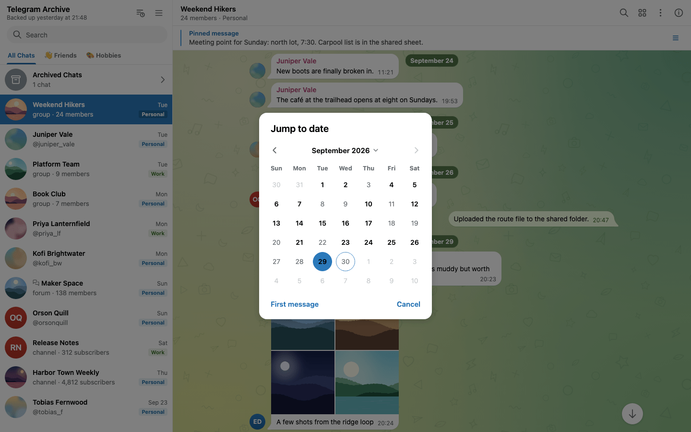

=== "Phone"

    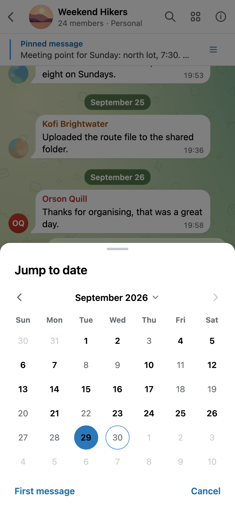{ width="300" }

At the top of the loaded history the pane says "Nothing older in the archive", and when the archive knows it, the date of the first message. The archive can start later than the chat itself.

### Links to a message

Every message has an address of the form `/?chat=<ref>&msg=<id>`. Opening it loads the chat around that message.

To get the link, select the message with the info panel open, or open the sender's details, and click **Copy message link**. A notice says "Link copied". On a plain `http` address the browser does not allow copying, so the link appears in the notice instead.

The link names the chat by its chat ref, not its Telegram chat id. A chat ref is a random 22-character handle that never changes.

## Forum topics

Opening a forum shows its topics first, under a row with the forum's name and how many topics it has. Each topic has its icon and its message count. A closed topic has a lock before its title, and a pinned one a pin at the right end of its second line, as in Telegram. Topic 1 is **General**. When the archive holds no topics for the forum, **View all messages** opens the whole chat.

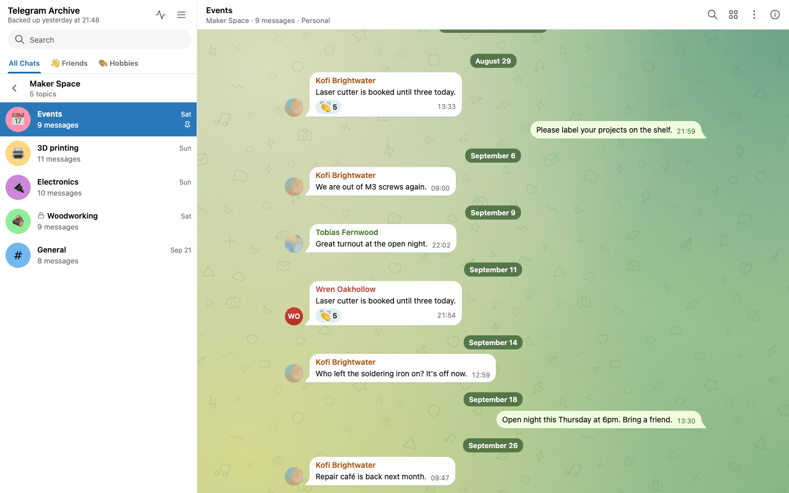

## Shared media

The **Shared Media Gallery** button in the chat header opens the chat's files in three tabs:

| Tab | Holds |
|-----|-------|
| Photos & Videos | photos, videos, GIFs and round videos, as a grid |
| Voice | voice messages and audio, with a filter box that matches the file name or the transcript |
| Files | documents, each with its type, size and day, and download and show-in-chat buttons |

A tab with nothing in it is left out.

Items load 50 at a time, and the next 50 load as you reach the end. A **Load more** button at the end does the same, for when the Voice filter hides a whole page.

A photo or video whose message was deleted in Telegram carries a small trash in the deleted colour on a white disc in its tile's corner.

Photos, videos and GIFs open in the lightbox. It shows the sender, the date and the caption, and "deleted" after the date when Telegram deleted the message, whether you opened it from the chat or from here. **Show in chat** closes it and goes to the message in the chat around it, leaving the pinned-only view or an in-chat search if one is open. A round video tile jumps to its message. Press <kbd>Esc</kbd> to close the lightbox and <kbd>Left</kbd> or <kbd>Right</kbd> to move between items. Files have a download button and a go-to-message button. Download buttons are hidden for [no-download logins](access.md#no-download-logins).

How thumbnails are made and cached is on [Media downloads](../configuration/media.md).

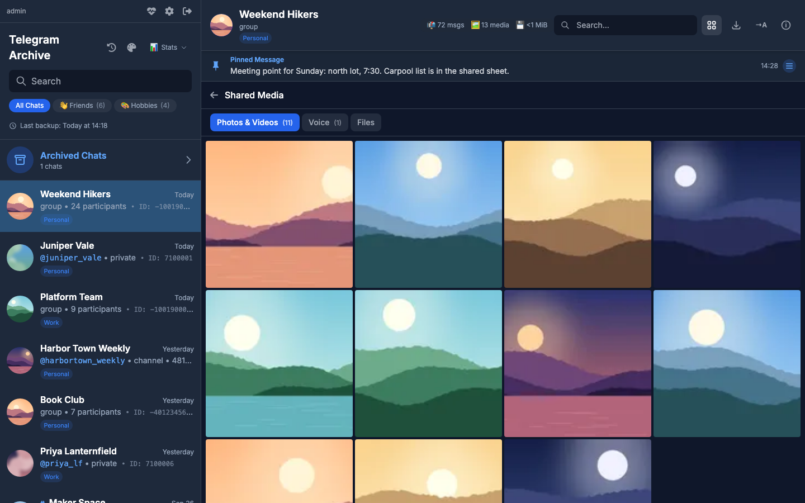

## Info panel

The info panel shows the open chat, in rows the way Telegram's info page writes them:

- avatar, name, and member or subscriber count
- **Earlier photos**: the profile photos the archive recorded before the current one. Each circle's tooltip says when the archive saw it. Click one, or the avatar, to page through them all in the lightbox, the current photo first.
- description or bio, username and Telegram ID
- the account tags, when more than one account is visible
- **In the archive**: messages, media files, disk use, how many messages were deleted in Telegram or edited, which the archive kept, and the oldest message. Click the oldest message to jump to it.
- shortcuts into the shared media

With the panel open, click a message to select it. On a touch screen, or in a window under 768 px wide, tap a message's time or its "deleted" mark instead: the panel opens on that message. The panel then also shows:

- sender and sent time
- when it was edited; with earlier versions the row opens the edit history
- when Telegram deleted it, with "The archive kept this message."
- pinned state
- the message it replies to and the forward source
- where its transcript came from
- **Copy message link**
- **Technical details**, closed until you open it: the message id, the album id and the sender id
- its files, each with a thumbnail, its type, length and size, the reason when the archive does not have it, and a download button

With the panel open, <kbd>Up</kbd> and <kbd>Down</kbd> move the selection to the next message, and <kbd>Esc</kbd> closes the panel.

=== "Desktop"

    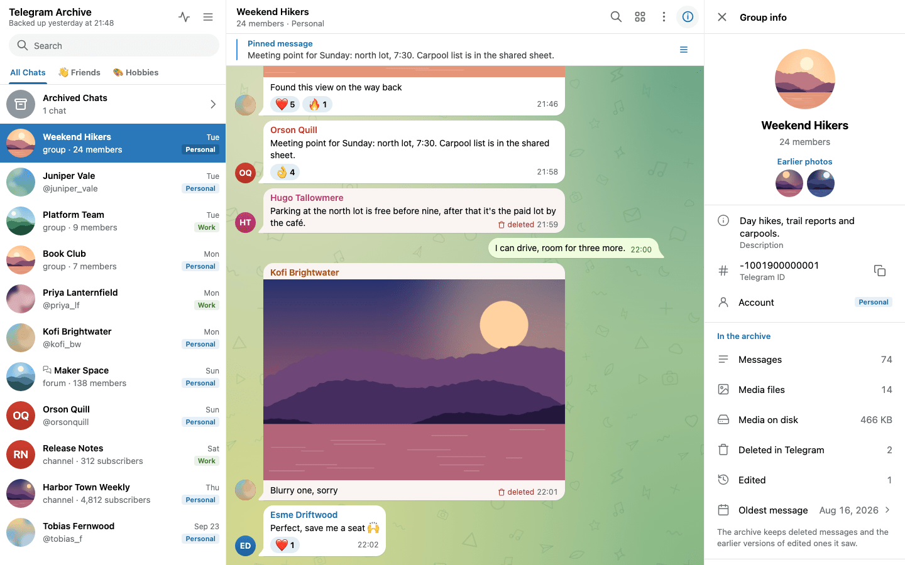

=== "Phone"

    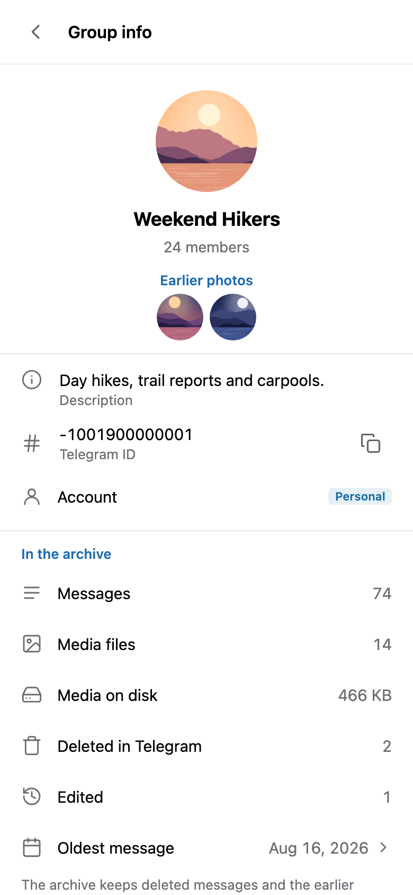{ width="300" }

The master login also sees each file's **Archive path** with a copy button. Other logins do not.

### Open and Show in folder

Two more buttons, **Open** and **Show in folder**, appear for the master login when the viewer host sets `MEDIA_OPEN_CMD` or `MEDIA_OPEN_PATH_CMD`. Use them only when the viewer runs directly on your own computer, outside Docker.

Each variable holds a shell command. The viewer replaces `%PATH%`, `%DIR%` and `%FILENAME%` with the shell-quoted file path, its folder and its name. **Open** only accepts images, videos, audio and PDF files.

```bash
# macOS example for a native run
export MEDIA_OPEN_CMD='open %PATH%'
export MEDIA_OPEN_PATH_CMD='open -R %PATH%'
```

!!! warning "These buttons run a shell command on the viewer host"
    Anyone who can use them runs that command. See [Commands that run on the viewer host](exposing.md#commands-that-run-on-the-viewer-host).

## Audio player

Playing a voice message or an audio file opens one player bar for the whole app. It has previous and next buttons, a seek bar and speeds of 0.5x, 1x, 1.5x and 2x. The speed buttons are hidden on screens narrower than 640 px.

Voice and music each keep their own speed. Playback continues when you switch chats. When one item ends, the player moves on to the next audio in the chat.

[No-download logins](access.md#no-download-logins) cannot play audio. Their play buttons are dimmed, the duration line says "playback off for this login", and the player bar does not appear.

## What changed

The pulse button in the sidebar header opens **What changed**, after Telegram's Recent Actions. A dot on the button means there are entries newer than the last time you opened it in this browser, and the main menu's **What changed** row counts them. On a wide screen the feed takes the chat's place and the chat list stays usable: opening a chat leaves the feed. On a phone it is a page with a back arrow.

The feed lists deletions, edits and new voice transcripts, newest first, grouped by day. Each entry is a line such as "Deleted in Weekend Hikers · 17:57" over the message, drawn as a bubble with its sender's name. The line always names the chat; for a private chat that is the other person, even when they sent the message. A deleted message carries its deleted mark. An edited one shows its earlier text as a quote above the current text, and with more than one earlier version, a button that opens the edit history. A transcript shows its text under a recording row. Click a bubble to open the message in its chat, or the chat's name to open the chat. Older entries load as you reach the end.

The filter button in the feed's header picks what to show, **Deleted**, **Edited** and **Transcripts**, and the period: **Last 24 hours**, **Last 7 days**, **Last 30 days** or **All time**. The browser remembers both. With nothing ticked, nothing loads. When few entries match, the feed stops loading by itself after three pages that add nothing, and **Load older** carries on. [No-download logins](access.md#no-download-logins) see no transcripts.

=== "Desktop"

    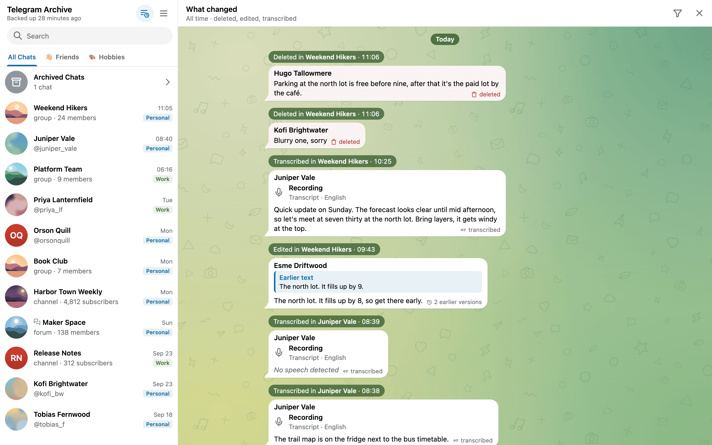

=== "Phone"

    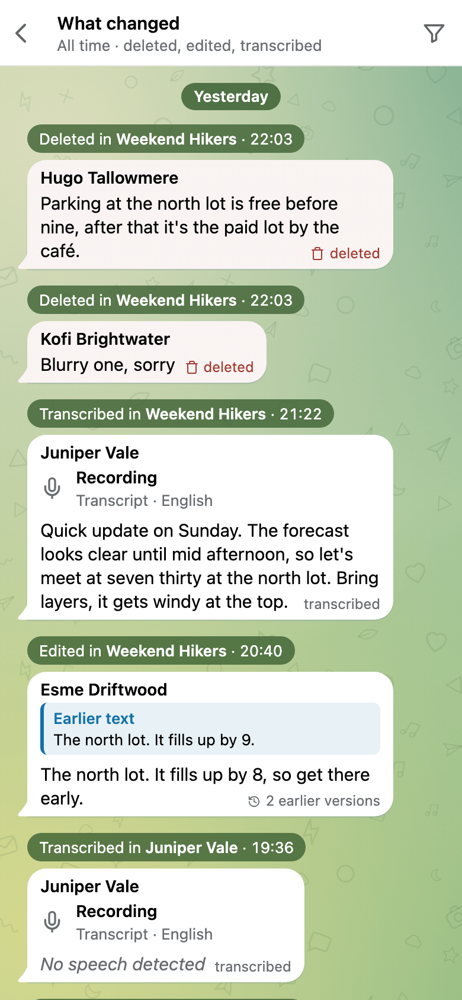{ width="300" }

Deletions appear here only when the archive learns about them: the listener runs with `LISTEN_DELETIONS=true` or the backup runs with `SYNC_DELETIONS_EDITS=true`. Both are off by default. With `DELETION_MODE=hard` a deleted row is removed instead of kept.

## Export a chat

**Export chat**, in the chat header's **More actions** menu, downloads the open chat as a JSON file. On a phone it is in the info panel. **From** reads "First message" and **To** reads "Today" until you click one and pick a day in the calendar; the cross beside a day clears it. Both days are included. The file downloads in place.

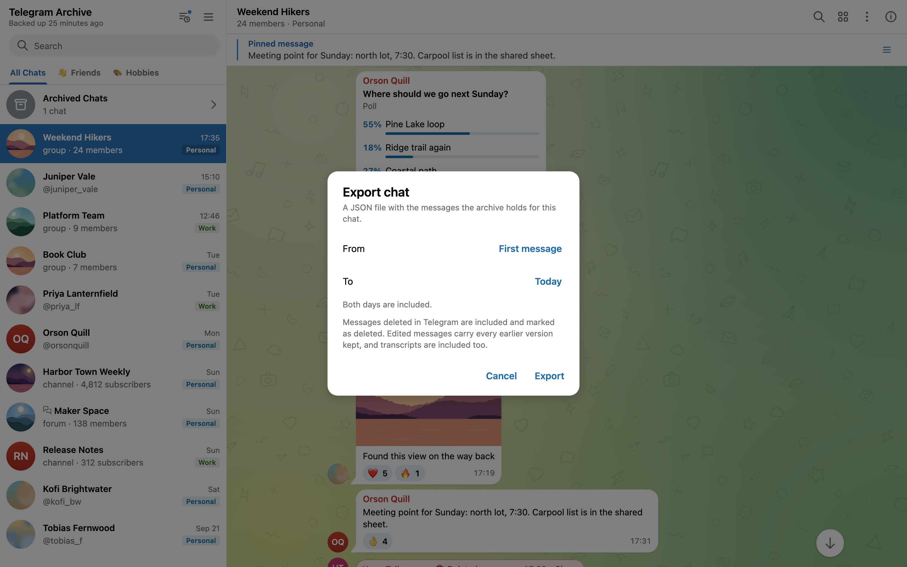

The file is named `<title>_export.json`. It holds the chat, the filters you used, the messages and their earlier versions. It holds no media files.

[No-download logins](access.md#no-download-logins) cannot export, and have no **More actions** menu.

## Main menu

The three lines at the top of the sidebar open the main menu. It names the signed-in login and its role (Owner for the master login, Viewer, or Shared link), with "downloads off" for a [no-download login](access.md#no-download-logins). Then come **What changed**, **Statistics**, **Theme** (see [Themes and wallpaper](themes.md)), **Notifications** (see [Live updates and notifications](live-updates.md)), and for the master login **Archive status** and **Admin settings**. **Log out** ends the menu. On a phone the menu is a bottom sheet. The arrow keys move between its rows and <kbd>Esc</kbd> closes it.

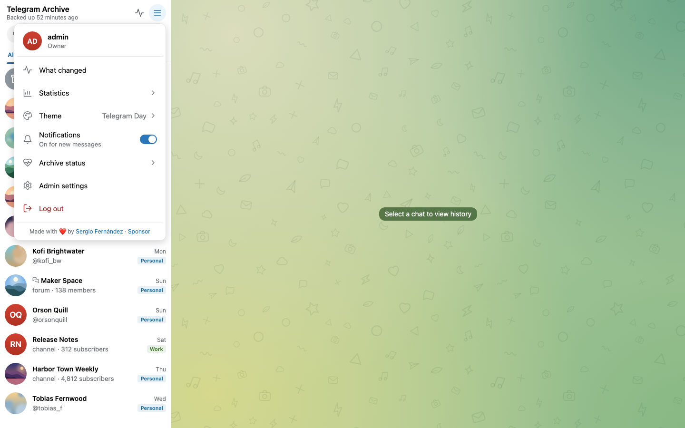

## Statistics

**Statistics**, in the main menu, shows the number of chats, messages and media files, the size of the media on disk and when the numbers were calculated, as Telegram's Storage Usage lists its figures. Counts show every digit, and sizes read in KB, MB and GB. For the master login the last row is **Total on disk**, the media and the database together, and it opens Archive status. A login restricted to some chats reads "For the chats you can see." Before the numbers are first calculated, the page says so.

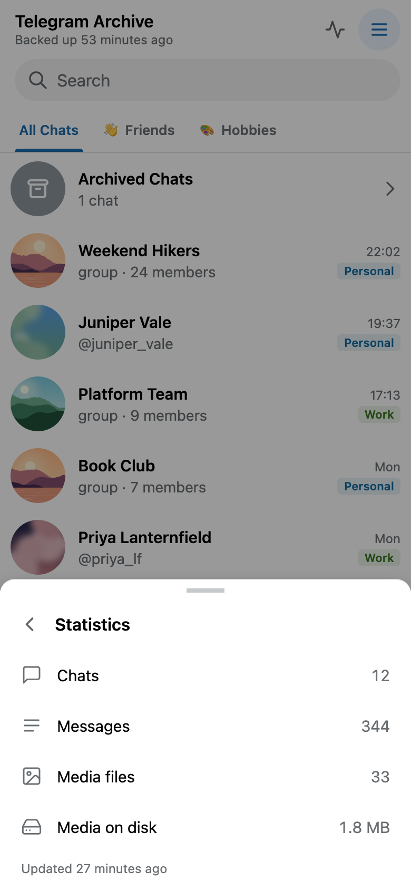{ width="300" }

The numbers are cached. These recalculate them:

- The viewer, once a day at `STATS_CALCULATION_HOUR` in `VIEWER_TIMEZONE`. The default hour is 3.
- The viewer, once at startup, if the numbers were never calculated.
- The backup, after each run.
- The master login, on request, through `POST /api/stats/refresh`.

Logins restricted to some chats see counts for their own chats only. The message, media and size figures in a chat's info panel are cached for 60 seconds.

`SHOW_STATS=false` hides the Statistics row. The statistics API still answers.

!!! note "Setting the stats hour under Docker"
    The stock `docker-compose.yml` does not pass `STATS_CALCULATION_HOUR` to the viewer. Add it to the viewer's `environment:` block. See [Environment variables](../reference/environment-variables.md).

### Archive status

The master login has **Archive status** in the main menu. It opens with one line: "Nothing needs attention", or the problem, for example "The last backup did not finish". A second line says what runs now, for example "Backup idle · transcripts off". Something switched off is a choice, not a fault, so it never turns the first line amber. Then:

| Section | Shows |
|---------|-------|
| Backup | when the last run started, and whether one is running now |
| Live sync | one row per Telegram account: on since when, or off. See [Listener](../configuration/listener.md). |
| Media | files downloaded, and when there are any, files waiting, files given up after retries, and files skipped by settings |
| Transcription | Voice transcripts: off, no server set (with a link to set one up), server not found yet, or the server's name and version |
| Disk use | the database (SQLite or PostgreSQL) and its size, the media on disk, and the total on disk |
| Statistics | when they were last calculated |

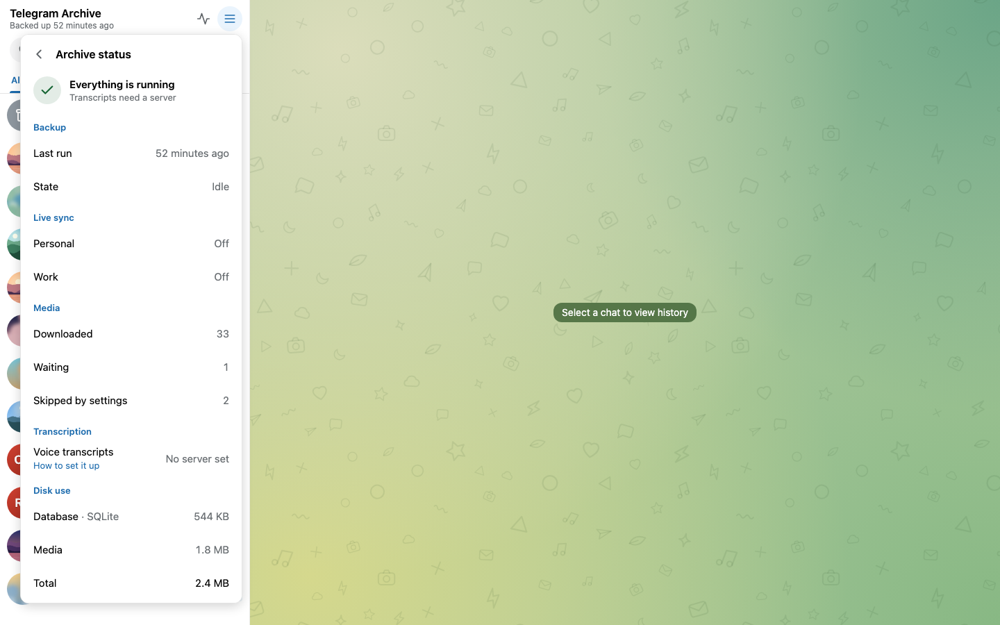

## On a phone

Below 768 px wide, the layout changes:

- The sidebar hides once a chat is open, and the chat takes the full width.
- A back button in the chat header returns to the chat list.
- The info panel covers the whole screen.
- Header buttons get 44 px touch targets, and the menus and dialogs open as bottom sheets.
- The resize handles are hidden.

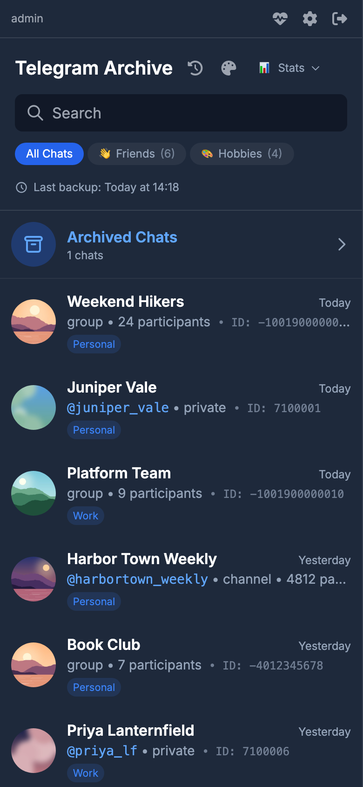{ width="300" }

## Install as an app

Browsers that support it can install the viewer as an app. It then opens in its own window without the browser toolbar.

It does not work offline. The app needs the viewer to be reachable, as the web page does.

After you upgrade the viewer, reload any open tabs or app windows. An open page keeps using the old version until it reloads.

## Keyboard

| Key | Where | Does |
|-----|-------|------|
| <kbd>Esc</kbd> | search field | clears the field, then leaves it |
| <kbd>Esc</kbd> | info panel, lightbox, edit history, Jump to date, sender details, What changed, main menu, More actions, dialogs | closes it |
| <kbd>Up</kbd> <kbd>Down</kbd> | main menu, More actions | moves between rows |
| <kbd>Up</kbd> <kbd>Down</kbd> | search results | moves between chats and messages |
| <kbd>Up</kbd> <kbd>Down</kbd> | open info panel | selects the previous or next message |
| <kbd>Left</kbd> <kbd>Right</kbd> | lightbox | previous or next item |
| arrow keys | Jump to date | moves between days |
| <kbd>Page Up</kbd> <kbd>Page Down</kbd> | Jump to date | the previous or next month |
| <kbd>Left</kbd> <kbd>Right</kbd> | focused resize handle | resizes the pane by 16 px |
| <kbd>Enter</kbd> | search results | opens the highlighted result |
| <kbd>Enter</kbd> <kbd>Space</kbd> | spoiler, round video | reveals the spoiler, toggles the sound |
| <kbd>Tab</kbd> | Jump to date, sender details, edit history, lightbox | stays inside the dialog |

There are no single-letter shortcuts such as `j` and `k`.
